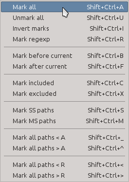
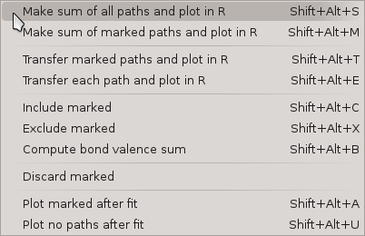

`The Artemis Users' Guide <./index.html>`__

+--------------------------------------+--------------------------------------+
| «\ `DEMETER <http://bruceravel.githu |
| b.io/demeter/>`__\ »                 |
|                                      |
| «\ `IFEFFIT <https://github.com/newv |
| ille/ifeffit>`__\ »                  |
|                                      |
| «\ `xafs.org <http://xafs.org>`__\ » |
|                                      |
| Back: `Starting                      |
| Artemis <./startup/index.html>`__    |
|    Next: `The Atoms/Feff             |
| window <./feff/index.html>`__        |
+--------------------------------------+--------------------------------------+

| |[Artemis logo]|
|  `Home <./index.html>`__
|  `Introduction <./intro.html>`__
|  `Starting Artemis <./startup/index.html>`__
|  The Data window
|  `The Atoms/Feff window <./feff/index.html>`__
|  `The Path page <./path/index.html>`__
|  `The GDS window <./gds.html>`__
|  `Running a fit <./fit/index.html>`__
|  `The Plot window <./plot/index.html>`__
|  `The Log & Journal windows <./logjournal.html>`__
|  `The History window <./history.html>`__
|  `Monitoring things <./monitor.html>`__
|  `Managing preferences <./prefs.html>`__
|  `Worked examples <./examples/index.html>`__
|  `Crystallography for EXAFS <./atoms/index.html>`__
|  `Extended topics <./extended/index.html>`__

The Data window
===============

After importing data from an ATHENA project file, several things happen:

#. A new Data window is created for interacting with that data set and
   the various controls are set to values taken from the ATHENA project
   file or from ARTEMIS' defaults.

#. A message is written to the status bar in the Main window.

#. The data are plotted in k-space.

#. The data are transferred to the plotting list in the Plot window.

#. An entry is placed in the Data list on the main window.

Here is the Plot window as it initially appears:

|image1|

The Artemis data window, immediately after data import.

#. This button is used to transfer this data set into the plotting list
   in the `Plot window <plot/index.html>`__.

#. This is the `characteristic value <extended/cv.html>`__ of this data
   set. Typically, this is just incremented for each data set as it is
   imported. The CV can be used as a special parameter in math
   expressions.

#. This text box shows where this data set came from. Typically, this
   shows the fully resolved file name for an ATHENA project file,
   followed by the index of the data from that project file.

#. These five buttons generate special plots using this data set. Each
   of the special plots types is explained below. Like the Fit button
   from the main window, these buttons are recolored after a fit
   according to the value of the fit's `happiness
   parameter <fit/happiness.html>`__.

#. This text box contains any title lines associated with the data.

#. These controls are used to set the functional form of the windows for
   forward and backward Fourier transforms. The R\ :sub:`min` and
   R\ :sub:`max` values are also used as the fitting range. The menus
   for selecting the windows functions are only displayed when the
   ♦Artemis → window\_function is set to “user”.

#. These check buttons are used to set the k-weight values used to
   evaluate the fit. Note that these are *check* buttons and *radio*
   buttons not – more than one can be selected at a time. The default is
   that all of 1, 2, and 3 checked, resulting in a multiple k-weight
   fit. The default can be changed by editing the ♦Fit → k1, ♦Fit → k2,
   and ♦Fit → k3 parameters.

#. This area contains several other parameters related to this data set.
   When the first check button is checked, this data will be included in
   the fitting model. Unchecking it is a way of removing a data set from
   a multiple data set fit without actually disposing of the data. The
   second check button instructs ARTEMIS to automatically transfer this
   data set to the `plotting list <plot/index.html>`__ at the end of a
   fit. The third check button turns on background co-refinement. The ε
   text box allows you to specify a measurement error fit this data set.
   Finally, the last check button turns phase corrected plotting on and
   off. See `the discussion of phase corrected
   plots <path/plot.html#phasecorrectedplots>`__.

#. This status bar is used to display messages specifically related to
   this data set. These messages are logged in `the status
   buffer <./monitor.html#thestatusbuffer>`__.

#. The paths list will become populated as paths are associated with
   this data set. How that works will be explained in `the next
   chapter <path/index.html>`__.

#. When no paths have yet been associated with a data set, this default
   page is displayed. The lines of blue text are sensitive to mouse
   clicks and initiate the import of certain kinds of data. All of those
   import options will be explained elsewhere in this document.

After one or more paths have been associated with this data set, the
Data window looks something like this.

|image2|

The Artemis data window, with imported paths.

Note that the paths list is populated with the paths assigned to these
data and that the right hand side of the Data window displays the
details about a particular path. Clicking on an item in the paths list
causes that path to be displayed on the right.

Note that each path in the path list has a check button associated with
it. These check buttons are involved in much of the functionality
described below.

Some vocabulary: The highlighted path is displayed on the right and is
said to be *selected*. When a paths check button is checked, it is said
to be *marked*. In this example, the first path is selected and no paths
have yet been marked.

--------------

 

Special plots
-------------

The five plot buttons on the Data window make special plots of that data
set along with its fit (if a fit has been run). Each of these is an
elaborate, multi-component plot that cannot be made using the tools on
the Plot window. The examples shown here are for a fit to gold metal out
to the fourth coordination shell.

--------------

The k123 plot
^^^^^^^^^^^^^

|image3|

k123 plot

This is the “k123” plot. It shows the data and fit as χ(k). Each
k-weighting from 1 to 3 is shown. The data with k-weighting of 2 is
plotted normally. The other two k-weightings are scaled by the
appropriate number such that all three k-weighting appear to be about
the same size in the plot. The Fourier transform window function is
drawn over the k-weight of 1 spectrum.

--------------

The R123 plot
^^^^^^^^^^^^^

|image4|

R123 plot

This is the “R123” plot. It shows the data and fit as χ(R). The Fourier
transform has been done with each k-weighting from 1 to 3. The data with
k-weighting of 2 is plotted normally. The other two k-weightings are
scaled by the appropriate number such that all three k-weighting appear
to be about the same size in the plot. The back-Fourier transform window
function is drawn over the k-weight of 1 spectrum to indicate the range
over which the fit was evaluated (assuming the fit space is R, as is the
default). The radio button in the `Plot window <plot/index.html>`__ for
selecting the part of χ(R) is respected when this plot is made.

--------------

The Rmr plot
^^^^^^^^^^^^

|image5|

Rmr plot

The “Rmr” plot is the plot displayed by default after a fit. It shows
the magnitude and real part of χ(R) using the value of k-weighting
selected in the Plot window. The back-Fourier transform window function
is drawn over the magnitude spectrum to indicate the range over which
the fit was evaluated (assuming the fit space is R, as is the default).

--------------

The Rk plot
^^^^^^^^^^^

|image6|

Rk plot

The “Rk” plot is a stacked plot with the “Rmr” on the bottom and χ(k) on
the top. The value of k-weighting selected in the `Plot
window <plot/index.html>`__ is used. Fourier transform windows are drawn
over the χ(k) and \|χ(R)\| spectra.

This is Bruce's favorite way of presenting data for publication. It is a
compact representation of the data and the fit. All the interesting ways
of visualizing the data and fit are presented on equal footing.

--------------

The kq plot
^^^^^^^^^^^

|image7|

kq plot

The “kq” plot shows the data and fit as χ(k) and χ(q). The value of
k-weighting selected in the `Plot window <plot/index.html>`__ is used.
The Fourier transform windows are drawn over the χ(k) spectra.

--------------

 

Data menu bar
-------------

--------------

 

The Data menu
~~~~~~~~~~~~~

|data-datamenu.png| This menu displays functions that can act on the
data set displayed in that window.

 Rename
    Change the name of this data set. This is the name displayed next to
    the transfer button, in the plotting list, in the log file, and in
    plot legends.
 Replace
    Change the χ(k) by importing new data from an ATHENA project file.
    This is used to apply the current fitting model to a new data set.
 Discard
    Throw away this data set and its window. Also remove this data set
    from the Data list in the Main window.
 Save data
    Write this data set to a column data file. The χ(k) output option
    will write a file with columns for k, χ(k), k⋅χ(k), k²⋅χ(k),
    k³⋅χ(k), and the window function. The χ(R) output option will write
    a file with columns for R, the real part, the imaginary part, the
    magnitude, the phase, and the window function. The χ(q) option is of
    the same form a the χ(R) option.
 Save data and fit
    Write the data, the fit, and several other arrays to a data file in
    one of various forms of k, R, or q. This will have columns for the
    abscissa, the selected form of the data, and the corresponding forms
    of the fit, the background (if co-refined), the residual, the
    running R-factor, and the window.
 Save data and paths
    This will save the data along with each marked path to a column data
    file. The columns will be the same as for the data+fit output.
 Other fitting standards
    This submenu allows you to import a variety of special path types,
    including `quick first shell paths <extended/qfs.html>`__ and
    `empirical standards <extended/empirical.html>`__. (Structural units
    have not yet been implemented in Artemis.)
 Balance interstitial energies
    (This feature has not yet been implemented in Artemis.)
 Set all degeneracies
    These two options allow you to control the degeneracy values of all
    the paths in the fit. The choices are to set them all to 1 or to
    have them all use their degeneracies from their respective FEFF
    calculations.
 Set window function
    When the ♦Artemis → window\_function parameter is not set to “user”,
    this submenu will be displayed. It allows the user to change the
    window function to be used for both forward and backward Fourier
    transforms. Note that setting the window function in this way uses
    the same functional form for transforms in both directions. If you
    want to control the two functions independently (for some
    inscrutable reason), you must set ♦Artemis → window\_function to
    “user”.
 Export parameters
    In a multiple data set fit, this allows you to constrain the data
    sets to have the same choice of Fourier transform parameters. (This
    feature has not yet been implemented in Artemis.)
 Set kmax to Ifeffit's suggestion
    Use IFEFFIT's suggestion for an appropriate value of k\ :sub:`max`.
 Show epsilon
    Show the value of ε computed from the noise in this data set. The
    value will be displayed in the Data window status bar.
 Show Nidp
    Show the number of independent points computed from the Fourier
    transform and fitting range. The will be displayed in the Data
    window status bar.

--------------

 

The Path menu
~~~~~~~~~~~~~

|data-pathmenu.png| This menu displays various functions that can be
appied to the paths associated with this data set.

 Transfer
    Transfer the displayed path to the plotting list in the `Plot
    window <plot/index.html>`__.
 Rename
    Change the name of the displayed path. This is the name displayed
    next to the transfer button, in the plotting list, in the log file,
    and in plot legends.
 Show
    Post a dialog box with IFEFFIT's current evaluation of all path
    parameters for the displayed path.
 Save path
    Write the displayed path to a column data file. The χ(k) output
    option will write a file with columns for k, χ(k), k⋅χ(k), k²⋅χ(k),
    k³⋅χ(k), and the window function. The χ(R) output option will write
    a file with columns for R, the real part, the imaginary part, the
    magnitude, the phase, and the window function. The χ(q) option is of
    the same form as the χ(R) option.
 Clone
    Make a copy of the displayed path and insert it into the path list.
    The degeneracies of the original and cloned path will be half the
    original degeneracy.
 Add path parameter
    |addparam.png|
    Post the dialog on the right, which is used to add a path parameter
    math expression to multiple paths associated with this or other data
    sets. This is a convenience allowing you to edit the path parameters
    for many paths at the same time.
 Export path parameters
    Push the math expressions of each path parameter from the displayed
    path to other paths. This submenu has options for pushing these
    values to the other paths from the same FEFF calculation, to the
    marked paths, to all paths in this data set, or to all paths in all
    data sets.
 Quick 4 parameter fit
    This is a convenience function for setting up a simple, one-shell
    fit. Selecting this menu item will create 4 parameters in the GDS
    window and use those four parameters as the math expressions for
    S²₀, E₀, ΔR, and σ² for each path assigned to this data set. This is
    intended only for a one-path, one-shell fit. While it may be
    tempting to expect broader utility out of this function – don't. It
    really only serves this narrow purpose.
 Discard
    Discard the displayed path, removing its window, and removing it
    from the path list.

--------------

 

The Marks menu
~~~~~~~~~~~~~~

|data-marksmenu.png| Much of ARTEMIS' functionality revolves around
groups of marked paths. This menu contains a number of shortcuts for
marking paths. Note that each of these has a keyboard shortcut given on
the right side of the menu. Learning the shortcuts for marking functions
that you use frequently is key to the effective use of ARTEMIS.

Marking via these functions is cumulative. That is, most of them only
add to the set of marked paths. Choosing to mark, say, all single
scattering paths will not unmark any marked multiple scattering paths.

Several of these functions will post a dialog for receiving input.
Marking by regular expression (regex) will prompt for a perl-style
regular expression to match against the labels in the path list. The
pattern you provide will be used only if it can be successfully parsed
as a valid perl regular expression.

Marking either greater than or less than an A value will prompt for a
cutoff in path ranking.

Marking either greater than or less than an R value will prompt for that
R value.

Marking before or after the current path will mark those above or below
the displayed path in the path list. Included and excluded refers to
whether a path is selected as being included in a fit.

--------------

|Caution!| When using regular expression marking, you have access to
perl's entire regular expression functionality. If you know what a “(?{
code })” extended expression is and you use it foolishly, you only have
yourself to blame.

--------------

 

The Actions menu
~~~~~~~~~~~~~~~~

|data-actionsmenu.png| Every item in this menu operates either on the
set of included paths or the set of marked paths. Again, keyboard
shortcuts are given in the menu.

The first two options will make `a VPath <plot/vpaths.html>`__ out of
either all the paths for this data set or the marked paths. The VPath
will be placed in the plotting list in the `Plot
window <plot/index.html>`__ and a plot will be made in R. The option to
make the sum of all paths is particularly useful for comparing the
fittingmodel to the data without actually running the fit.

The next two options will transfer paths to the plotting list, then make
a plot in R.

The next two options will cause the set of marked paths to be included
in or excluded from the fit. The next item computes the value of `a bond
valence sum <extended/bvs.html>`__ using the set of marked paths. You
will be prompted for some information about the absorber and scatterer.

The next item causes all marked paths to be discarded from your fitting
project and removed from the path list.

The final two items are about controlling what gets transferred into the
plotting list after a fit. The next to last item causes all marked paths
to be transferred. The last item removes all paths from the list of
things transferred

--------------

 

The Debug menu
~~~~~~~~~~~~~~

|data-debugmenu.png| This menu displays various dialog boxes showing
aspects of the current state if IFEFFIT or ARTEMIS. These are mostly
used for debugging purposes. This menu is only displayed if the
♦Artemis → debug\_menus configuration parameter is set to a true value.

--------------

 

The Data help menu
~~~~~~~~~~~~~~~~~~

|data-helpmenu.png| This menu is used to display the sections on the
Data window or the Path page from the document.

| 

--------------

--------------

| DEMETER is copyright © 2009-2015 Bruce Ravel — This document is
copyright © 2015 Bruce Ravel

|image16|    

| This document is licensed under `The Creative Commons
Attribution-ShareAlike
License <http://creativecommons.org/licenses/by-sa/3.0/>`__.
|  If DEMETER and this document are useful to you, please consider
`supporting The Creative
Commons <http://creativecommons.org/support/>`__.

.. |[Artemis logo]| image:: ./../images/Artemis_logo.jpg
   :target: ./diana.html
.. |image1| image:: ../images/datawindow.png
.. |image2| image:: ../images/datawindow_withpaths.png
.. |image3| image:: ../images/plot_k123.png
.. |image4| image:: ../images/plot_r123.png
.. |image5| image:: ../images/plot_rmr.png
.. |image6| image:: ../images/plot_rk.png
.. |image7| image:: ../images/plot_kq.png
.. |data-datamenu.png| image:: ../images/data-datamenu.png
   :target: ../images/data-datamenu.png
.. |data-pathmenu.png| image:: ../images/data-pathmenu.png
   :target: ../images/data-pathmenu.png
.. |addparam.png| image:: ../images/addparam.png
   :target: ../images/addparam.png

.. |Caution!| image:: ../images/alert.png

.. |data-debugmenu.png| image:: ../images/data-debugmenu.png
   :target: ../images/data-debugmenu.png
.. |data-helpmenu.png| image:: ../images/data-helpmenu.png
   :target: ../images/data-helpmenu.png
.. |image16| image:: ../images/somerights20.png
   :target: http://creativecommons.org/licenses/by-sa/3.0/
