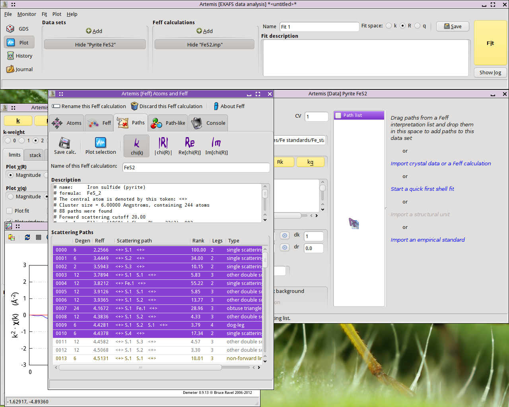
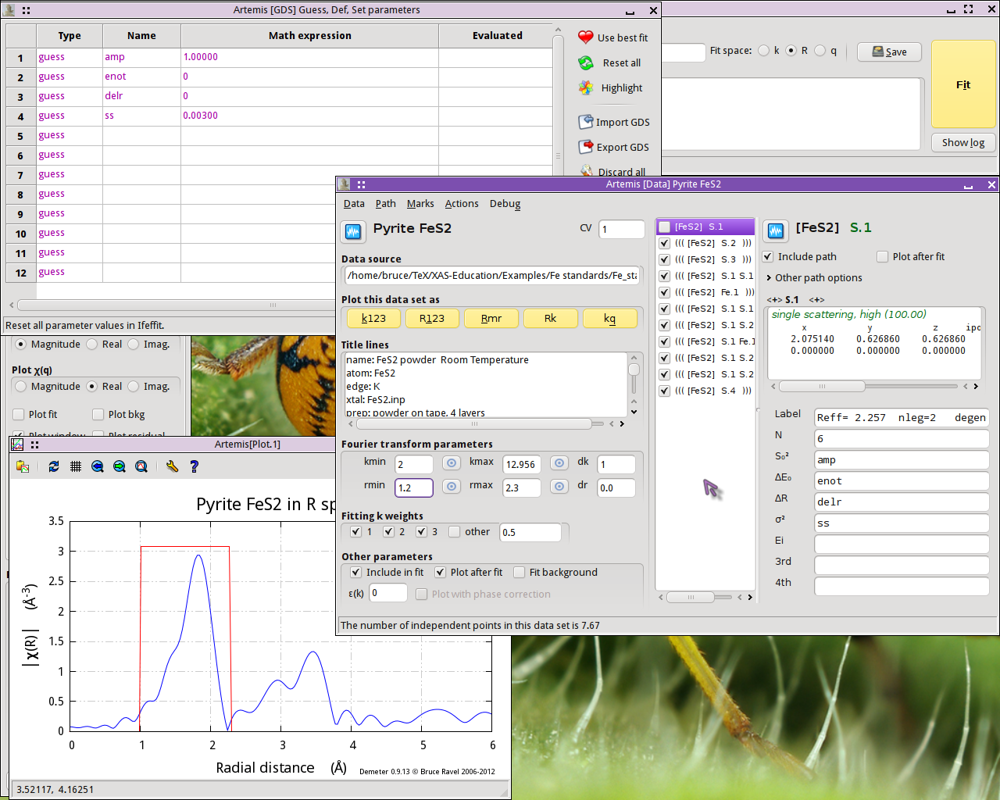
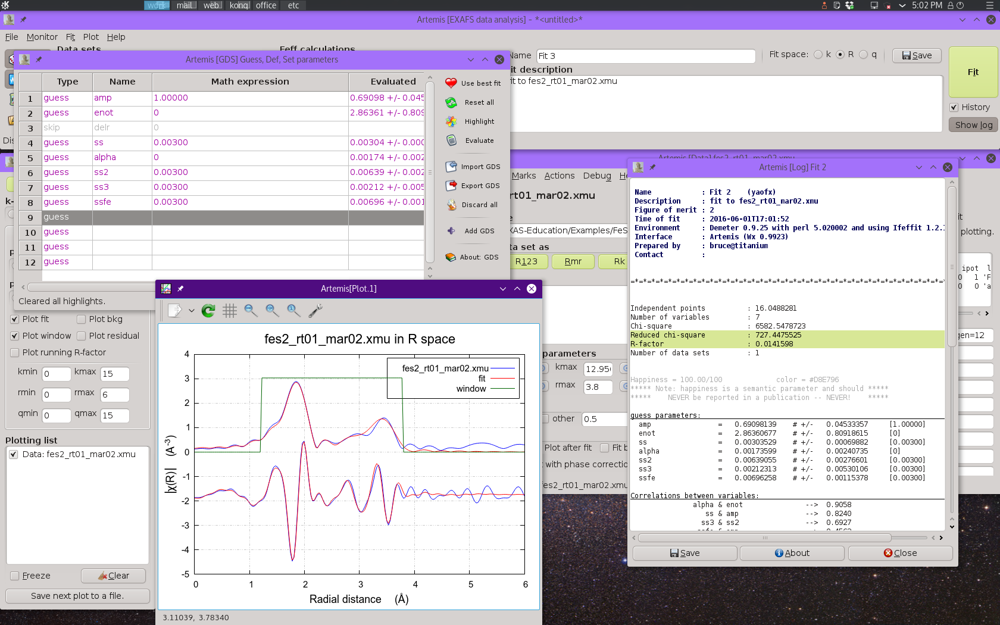
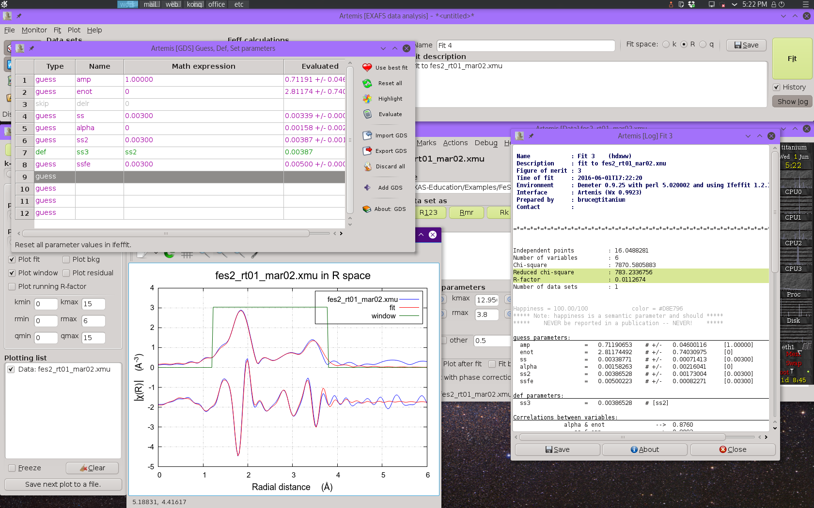

..
   Artemis document is copyright 2016 Bruce Ravel and released under
   The Creative Commons Attribution-ShareAlike License
   http://creativecommons.org/licenses/by-sa/3.0/

.. |transfer button| image:: ../../_static/plot-icon.png

.. role:: guess
.. role:: def
.. role:: set
.. role:: restrain
.. role:: after

Example 1: FeS2
===============

Iron pyrite, FeS\ :sub:`2`, is my favorite teaching example which I
use to introduce people to fitting with :demeter:`artemis`.  It is a
crystal with a well-known structure.  I have beautiful data.  And I am
able to create a very successful fitting model.  As a cubic crystal,
the structure is not too complicated.  However, there is some internal
structure in the unit cell, making this a much less trivial example
than, say, an FCC metal.

While this example certainly does not represent a typical research
problem, it is an excellent introduction to the mechanics of using
:demeter:`artemis` and it results in a very satisfying fit.

You can find example EXAFS data and crystallographic input data at `my
XAS Education site
<https://github.com/bruceravel/XAS-Education/tree/master/Examples/FeS2>`_.
Import the |mu| (E) data into :demeter:`athena`.  When you are content
with the processing of the data, save an :demeter:`athena` project
file and dive into this example.

Import data
-----------

After starting :demeter:`artemis`, :mark:`leftclick,..` click on the
:button:`Add,light` button at the top of the :guilabel:`Data sets`
list in the Main window. This will open a file selection dialog.
Click to find the :demeter:`athena` project file containing the data
you want to analyze. Opening that project file displays the project
selection dialog.

.. _fig-fes2importdata:
.. figure:: ../../_images/fes2-importdata.png
   :target: ../_images/fes2-importdata.png
   :width: 50%
   :align: center

   Import data into :demeter:`artemis`

The project file used here has several iron standards. Select
FeS\ :sub:`2` from the list. That data set gets plotted when selected.

Now :mark:`leftclick,..` click the :button:`Import,light` button. That
data set gets imported into :demeter:`artemis`.  An entry for the FeS\
:sub:`2` is created in the Data list, a window for interacting with
the FeS\ :sub:`2` data is created, and the FeS\ :sub:`2` data are
plotted as |chi| (k).

The next step is to prepare for the :demeter:`feff` calculation using
the known FeS\ :sub:`2` crystal structure.  :mark:`leftclick,..`
Clicking on the line in the Data window that says :guilabel:`Import
crystal data or a Feff calculation` will post a file selection dialog.
Click to find the :file:`atoms.inp` file containing the FeS\ :sub:`2`
crystal structure.

.. _fig-fes2importatoms:
.. figure:: ../../_images/fes2-importatoms.png
   :target: ../_images/fes2-importatoms.png
   :width: 50%
   :align: center

   Import crystal data into :demeter:`artemis` 

With the FeS\ :sub:`2` crystal data imported, run :demeter:`atoms` by
:mark:`leftclick,..` clicking the :button:`Run Atoms,light` button on
the :demeter:`atoms` tab of the :demeter:`feff` windows. That will
display the :demeter:`feff` tab containing the :demeter:`feff` input
data.  :mark:`leftclick,..` Click the :button:`Run Feff,light` button
to compute the scattering potentials and to run the pathfinder.

Once the :demeter:`feff` calculation is finished, the path
intepretation list is shown in the Paths tab. This is the list of
scattering paths, sorted by increasing path length. Select the first
11 paths by :mark:`leftclick,..` clicking on the path
:guilabel:`0000`, then :button:`Shift`-:mark:`leftclick,..` clicking
on path :guilabel:`0010`.  The selected paths will be highlighted.
:mark:`leftclick,..` Click on one of the highlighted paths and,
without letting go of the mouse button, :mark:`drag,..` drag the paths
over to the Data window and drop them onto the empty Path list.

.. _fig-fes2pathsdnd:

   :mark:`drag,..` Drag and drop paths onto a data set

:mark:`drag,..` Dropping the paths on the Path list will associate those
paths with that data set. That is, that group of paths is now
available to be used in the fitting model for understanding the FeS\
:sub:`2` data.

Each path will get its own Path page. The Path page for a path is
displayed when that path is clicked upon in the Path list. Shown below
is the FeS\ :sub:`2` data with its 11 paths. The first path in the list,
the one representing the contribution to the EXAFS from the S single
scattering path at 2.257 |AA|, is currently displayed.

.. _fig-fes2pathsimported:
.. figure:: ../../_images/fes2-pathsimported.png
   :target: ../_images/fes2-pathsimported.png
   :width: 50%
   :align: center

   Paths associated with a data set 

Examine the scattering paths
----------------------------

The first chore is to understand how the various paths from the
:demeter:`feff` calculation relate to the data. To this end, we need
to populate the Plotting list with data and paths and make some plots.

First let's examine how the single scattering paths relate to the
data.  Mark each of the first four single scattring paths |nd| the
ones labeled :guilabel:`S.1`, :guilabel:`S.2`, :guilabel:`S.3`, and
:guilabel:`Fe.1` |nd| by :mark:`leftclick,..` clicking on their check
buttons.  Transfer those four paths to the Plotting list by selecting
:menuselection:`Actions --> Transfer marked`.

With the Plotting list poluated as shown below, :mark:`leftclick,..`
click on the :button:`R,light` plot button in the Plot window to make
the plot shown.

.. _fig-fes2sspaths:
.. figure:: ../../_images/fes2-sspaths.png
   :target: ../_images/fes2-sspaths.png
   :width: 50%
   :align: center

   FeS\ :sub:`2` data plotted with the first four single scattering paths

The first interesting thing to note is that the first peak in the data
seems to be entirely explained by the path from the S atom at 2.257
|AA|.  None of the other single scattering paths contribute
significantly to the region of R-space.

The second interesting thing to note is that the next three single
scattering paths are not so well separated from one another. While it
may be tempting to point at the peaks at 2.93 |AA| and 3.45 |AA| and assert
that they are due to the second shell S and the fourth shell Fe, it is
already clear that the situation is more complicated. Those three single
scattering paths overlap one another. Each contriobutes at least some
spectral weight to both of the peaks at 2.93 |AA| and 3.45 |AA|.

The first peak shold be reather simple to interpret, but higher shells
are some kind of superposition of many paths.

What about the multiple scattering paths?

To examine those, first clear the Plotting list by
:mark:`leftclick,..` clicking the :button:`Clear,light` button at the
bottom of the Plot window. Transfer the FeS\ :sub:`2` data back to the
Plotting list by :mark:`leftclick,..` clicking its transfer button:
|transfer button|. Mark the first three multiple scattering paths by
:mark:`leftclick,..` clicking their mark buttons.  Select
:menuselection:`Actions --> Transfer marked`.

With the Plotting list newly populated, make a new plot of \| |chi|\ (R)\|.

.. _fig-fes2mspaths1:
.. figure:: ../../_images/fes2-mspaths1.png
   :target: ../_images/fes2-mspaths1.png
   :width: 50%
   :align: center

   FeS2 data plotted with the first three multiple scattering paths

The two paths labeled :guilabel:`S.1 S.1`, which represent two
different ways for the photoelectron to scatter from a S atom in the
first coordination shell then scatter from another S atom in the first
coordination shell, contribute rather little spectra weight. Given
their small size, it seems possible that we may be able to ignore
those paths when we analyze our FeS\ :sub:`2` data.

The :guilabel:`S.1 S.2` path, which first scatters from a S in the
first coordination shell then from a S in the second coordination
shell, contributes significantly to the peak at 2.93 |AA|. It seems
unlikely that we will be able to ignore that path.

To examine the next three multiple scattering paths, clear the Plotting
list, mark those paths, and repopulate the Plotting list.

.. _fig-fes2mspaths2:
.. figure:: ../../_images/fes2-mspaths2.png
   :target: ../_images/fes2-mspaths2.png
   :width: 50%
   :align: center

   FeS2 data plotted with the next three multiple scattering paths

The :guilabel:`S.1 Fe.1` path, which scatters from a S atom in the
first coordination shell then scatters from an Fe atom in the fourth
coordination shell, is quite substantial. It will certainly need to be
considered in our fit. The other two paths are tiny.

Fit to the first coordination shell
-----------------------------------

We begin by doing an analysis of the first shell. As we saw above, we
only need the first path in the path list. To prepare for the fit, we do
the following:

#. Exclude all but the first path from the fit. With the first path
   selected in the path list and displayed, select
   :menuselection:`Marks --> Mark after current`. This will mark all
   paths except for the first one. Then select :menuselection:`Actions
   --> Exclude marked`. This will exclude those paths from the
   fit. That is indicated by the triple parentheses in the path list.

#. Set the values of R\ :sub:`min` and R\ :sub:`max` to cover just the
   first peak.

#. For this simple first shell fit, we set up a simple, four-parameter
   model. The parameters ``amp``, ``enot``, ``delr``, and ``ss`` are
   defined in the GDS window and given sensible initial :guess:`guess`
   values.

#. The path parameters for the first shell path are set. S\ :sup:`2`\
   :sub:`0` is set to ``amp``, E\ :sub:`0` is set to ``enot``, |Delta|
   R is set to ``delr``, and |sigma|\ :sup:`2` is set to ``ss``.

Note that the current settings for k- and R-range result in a bit more
than 7 independent points, as approximated using the Nyquist
criterion.  With only 4 :guess:`guess` parameters, this should be a
reasonable fitting model.

.. _fig-fes21stshell:

   Setting up for a first shell fit

Now hit the :button:`Fit,light` button. Upon completion of the fit,
the following things happen:

#. An :quoted:`Rmr` plot is made of the data and the fit.

#. The log Window is displayed with the results of the fit

#. The :button:`Fit,light` and plot buttons are recolored according to
   the evaluation of the happiness parameter.

#. The Plotting list is cleared and repopulated with the data.

#. The fit is entered into the History window (which is not in the
   screenshot below).

.. _fig-fes2firstshellfit:
.. figure:: ../../_images/fes2-firstshellfit.png
   :target: ../_images/fes2-firstshellfit.png
   :width: 50%
   :align: center

   Results of the first shell fit

This is not a bad result. The value of ``enot`` is small, indicating
that a reasonable value of E\ :sub:`0` was chosen back in
:demeter:`athena`. ``delr`` is small and consistent with 0, as we
should expect for a known crystal. ``ss`` is a reasonable value with a
reasonable error bar. The only confusing parameter is ``amp``, which
is a bit smaller than we might expect for a S\ :sup:`2`\ :sub:`0`
value.

The correlations between parameters are of a size that we expect. The
R-factor evaluates to about 2% misfit. |chi|\ :sup:`2`\ :sub:`v` is
really huge, but that likely means that |epsilon| was not evaluated
correctly. All in all, this is a reasonable fit.

Extending the fit to higher shells
----------------------------------

Although we know that we will need to include some multiple scattering
paths in this fit, we'll start by including the next three single
scattering paths, adjusting the fitting model accordingly.

This fit will include the peaks in the range of 3 |AA| to 3.5 |AA|, so
set R\ :sub:`max` to 3.8.  Next :mark:`leftclick,..` click on each of
next three single scattering paths |nd| the ones labeled
:guilabel:`S.2`, :guilabel:`S.3`, and :guilabel:`Fe.1`, then
:mark:`leftclick,..` click on the :guilabel:`Include path` button for
each path.

At this point we need to begin considering the details of our fitting
model more carefully.  S\ :sup:`2`\ :sub:`0` and E\ :sub:`0` should be
the same for each path, so we will use the same :guess:`guess`
parameters for each path.

This is a cubic material.  Ignoring the possibility that fractional
coordinate of the S atom in the original crystal data might be a
variable in the fit and considering only the prospect of a `volumetric
lattice expansion
<../extended/delr.html#volumetric-expansion-coefficient>`_, we define
a :guess:`guess` parameter ``alpha`` and set the |Delta| R for each
path to ``alpha*reff``.

Finally, we set independent |sigma|\ :sup:`2` parameters for each
single scattering path.  This gives a total of 7 :guess:`guess`
parameters, compared to the Nyquist evaluation of about 16.5, given
the new value of R\ :sub:`max`.

Things now look like this:

.. _fig-fes2fourshellfit_SS:
.. figure:: ../../_images/fes2-fes2fourshellfit_SS.png
   :target: ../_images/fes2-fes2fourshellfit_SS.png
   :width: 50%
   :align: center

   Preparing to run the four-shell fit with only single scattering paths.

At this point we can run the fit and see how things go!

.. _fig-fes2fourshellfit_SS_result:

   Result of the four-shell fit using on the single scattering paths.
   Note the misfit around 3.2 |AA|.

This fit isn't bad.  It does a good job of representing the data, with
the exception of some misfit around 3.2 |AA|.  Most of the fitting
parameters are pretty reasonable, with the exception of the result for
``ss3``.  This is discussed in some detail in the 
`lecture notes
<https://speakerdeck.com/bruceravel/discussion-of-the-fes2-exafs-analysis-example>`_,
but the bottom line is that the signal from these two S scatterers,
while a significant contributor of Fourier components to the fit, is
not large enough to support its own robust |sigma|\ :sup:`2`
parameter.  We will make ``ss3`` into a :def:`def` parameters, setting
it equal to ``ss2``.

.. _fig-fes2defss3:
.. figure:: ../../_images/fes2-defss3.png
   :target: ../_images/fes2-defss3_result.png
   :align: center

   Making ``ss3`` a :def:`def` parameter.

At this point we need to introduce the two significant multiple
scattering paths.  Start by :mark:`leftclick,..` clicking the
:guilabel:`Include path` button for the :guilabel:`S.1 S.2` and
:guilabel:`S.1 Fe.1` paths.

Make sure each of those paths has their S\ :sup:`2`\ :sub:`0`, E\
:sub:`0`, and |Delta| R path parameters set to ``amp``, ``enot``, and
``alpha*reff``, respectively.

As discussed in the `lecture notes
<https://speakerdeck.com/bruceravel/discussion-of-the-fes2-exafs-analysis-example>`_,
we don't necessarily want to give these multiple scattering paths
independent |sigma|\ :sup:`2` parameters.  Indeed, they are unlikely
to be robust fitting parameters for the same reason that ``ss3``
proved not to be a robust parameter.  Instead, we will approximate
these two |sigma|\ :sup:`2` parameters using :guess:`guess` parameters
already in the fit.  

Consider these two triangular paths on a leg-by-leg basis.  For the
:guilabel:`S.1 Fe.1` path, the first and last leg are of the distance
between the absorber and the first shell S.  The remaining leg is the
distance of Fe scatterer in the fourth shell.  In terms of length,
this path covers the full distance of the first shell path and half
the distance of the fourth shell path.  Thus we will approximate its
|sigma|\ :sup:`2` as ``ss+ssfe/2``.

The :guilabel:`S.1 S.2` triangle is a bit more ambiguous, since we do
not have a parameter describing the leg that goes from the first shell
S atom to the second shell S atom.  In the absence of a better
approximation, we will use ``ss*1.5``, i.e. something a bit bigger
than the first shell |sigma|\ :sup:`2`.  Neither of these are quite
right, but neither is ridiculously wrong.  And parameterizing them in
this way allows us to avoid introducing a weak :guess:`guess`
parameter into the fitting model.

.. _fig-fes2fourshellfit:

   Result of the four-shell fit including four single scattering paths
   and the two largest multiple scattering paths.

This fit does a much better job in the region around 3.2 |AA|, however
the last bit of the fitting range is not quite right.  The fitting
parameters are all quite reasonable and the percentage misfit within
the fitting range is quite small |nd| around 1%.

The final fitting model
-----------------------

To clean up the last bit of the fitting range, we can include a set of
three multiple scattering paths that represent collinear paths
involving the first shell S atoms.  An :demeter:`artemis` project file
for the final fitting model can be found among the examples at my `XAS
Education site
<https://github.com/bruceravel/XAS-Education/tree/master/Examples/FeS2>`_.
Adding these three paths and extending R\ :sub:`max` to 4.2 |AA|
results in an excellent fit.

.. _fig-fes2finalfit:
.. figure:: ../../_images/fes2-finalfit.png
   :target: ../_images/fes2-finalfit.png
   :width: 50%
   :align: center

   Result of the final fitting model including four single scattering
   paths and five multiple scattering paths.

These three collinear multiple scattering paths are introduced into
the fit without needing to introduce new :guess:`guess` parameters.
The ``alpha*reff`` parameterization for |Delta| R works just as well
for these paths.  Their |sigma|\ :sup:`2` parameters are expressed in
terms of the first shell |sigma|\ :sup:`2` following the example of
Hudson, et al.

.. bibliography:: ../artemis.bib
   :filter: author % 'Hudson'
   :list: bullet

Please review the `lecture notes
<https://speakerdeck.com/bruceravel/discussion-of-the-fes2-exafs-analysis-example>`_
for this fitting example for discussions of all the decisions that
went into creating this successful fitting model.

