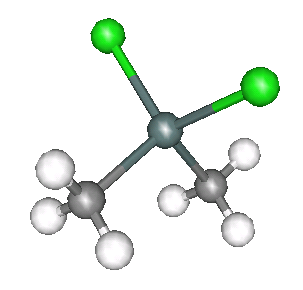
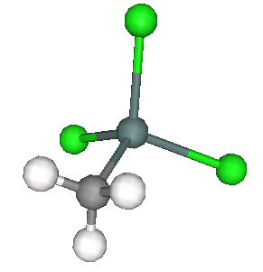
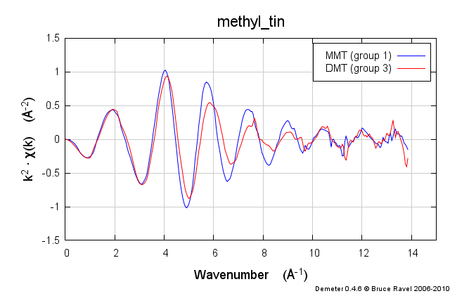
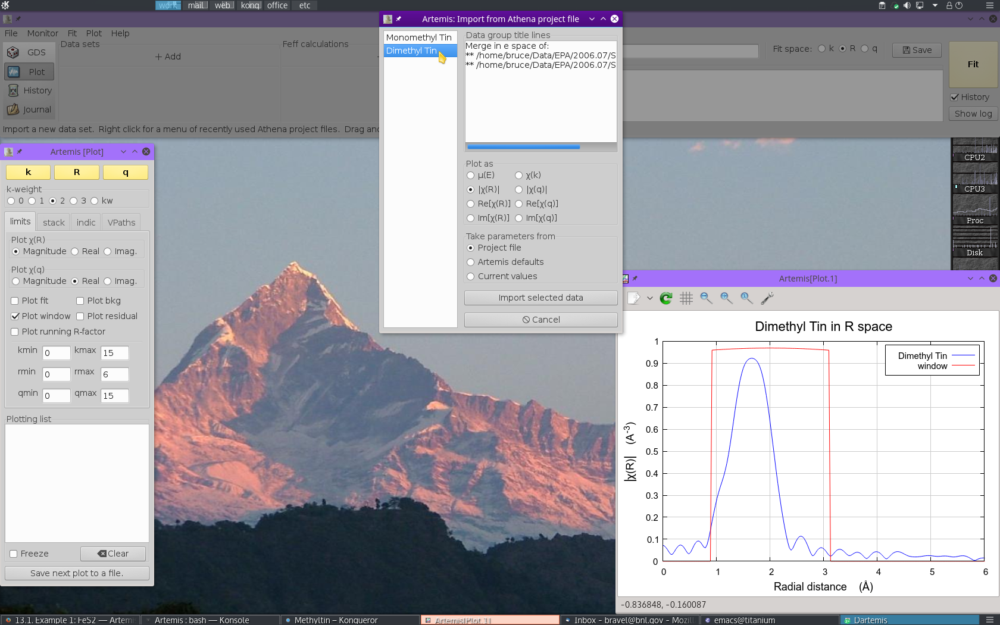
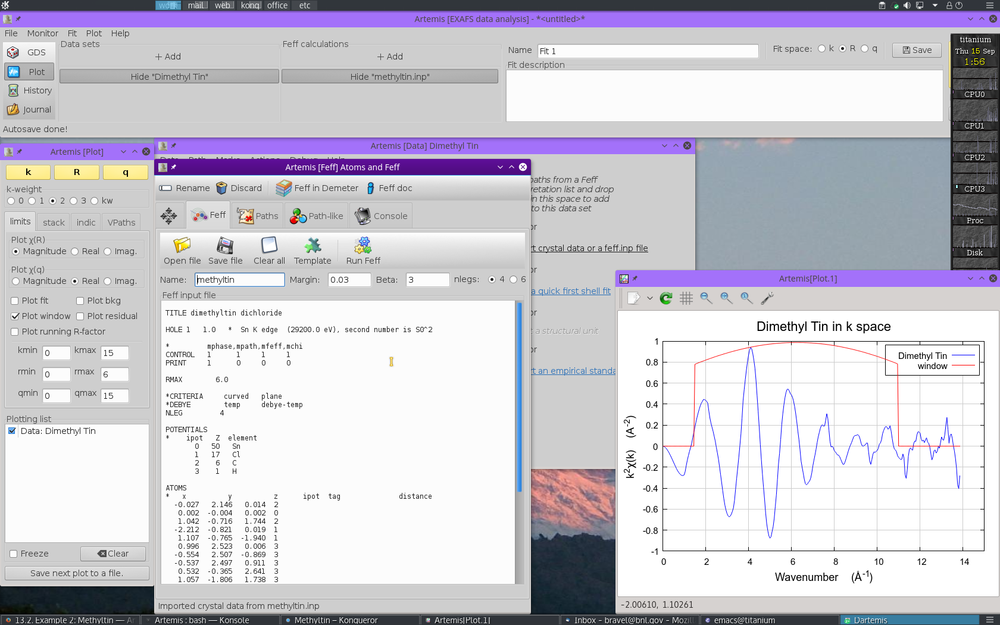
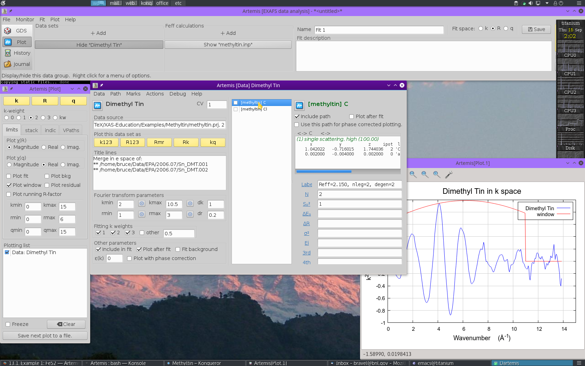

..
   Artemis document is copyright 2016 Bruce Ravel and released under
   The Creative Commons Attribution-ShareAlike License
   http://creativecommons.org/licenses/by-sa/3.0/

.. |transfer button| image:: ../../_static/plot-icon.png

.. role:: guess
.. role:: def
.. role:: set
.. role:: restrain
.. role:: after

Example 2: Methyltin
====================

Some years ago, some colleagues from the U.S. Environmental Protection
Agency came to me with an interesting problem about the fate and
transport of organic tin compounds through sewage systems.  In the
U.S. (and elsewhere), municipal water is carried into homes and office
buildings with copper pipes and waste water is transported to the
water treatment system in polyvinyl chloride (PVC) pipes.  By itself,
PVC is a highly malleable plastic.  Like many plastics, it is made
stiff by the addition of stiffening agents added to the plastic
matrix.  In the case of PVC, organic tin compounds are used.

The folks from the EPA were studying the accumulation of tin in
municipal waste and trying to understand if there was a mechanism of
transport involving leaching from PVC pipes.  We made a series of XAS
measurements on various organic tin standards as well as direct
measurement of PVC pipes produced by three different manufacturers.

.. bibliography:: ../artemis.bib
   :filter: author % "Impellitteri"
   :list: bullet

Two of the standard compounds we measured were methyltin chloride, as
shown below.

.. subfigstart::

.. _fig-dimethyltindichloride:

   Dimethyltin dichloride |nd| one tin atom with two carbon ligands (in
   the form of methyl groups) and two chlorine ligands.

.. _fig-monomethyltintrichloride:

   Monomethyltin trichloride |nd| one tin atom with two carbon ligands
   and two chlorine ligands.

.. subfigend::
   :width: 0.45
   :label: _fig-methyltinchloride

These samples were prepared in solution.  This solution was packed
into a simple transmission sample cell for liquids.  Transmission
EXAFS were measured.  Here is the data:

.. subfigstart::

.. _fig-mtinmu:
.. figure::  ../../_images/mtin_mu.png
   :target: ../_images/mtin_mu.png
   :width: 100%

   |mu|\ (E) data measured on the dimethyltin dichloride and
   monomethyltin trichloride.

   |chi|\ (k) data measured on the dimethyltin dichloride and
   monomethyltin trichloride.

.. figure::  ../../_images/mtin_chir.png
   :target: ../_images/mtin_chir.png
   :width: 100%

   |chi|\ (R) data measured on the dimethyltin dichloride and
   monomethyltin trichloride.

.. subfigend::
   :width: 0.30
   :label: _fig-mtindata

These data are quite similar, but there is a distinct change in the
|chi|\ (R) spectrum between the two.

In this section, we will step through the corefinement of these two
data steps, creating a constrained fitting model that uses the
information content of both data sets to allows excellent measurement
of a number of structural parameters.

You can find example EXAFS data and a structure from which to build
the :file:`feff.inp` file at `my XAS Education site
<https://github.com/bruceravel/XAS-Education/tree/master/Examples/methyltin>`_.
Import the |mu| (E) data into :demeter:`athena`.  When you are content
with the processing of the data, save an :demeter:`athena` project
file and dive into this example.

Import data
-----------

After starting :demeter:`artemis`, :mark:`leftclick,..` click on the
:button:`Add,light` button at the top of the :guilabel:`Data sets`
list in the Main window. This will open a file selection dialog.
Click to find the :demeter:`athena` project file containing the data
you want to analyze.  Opening that project file displays the project
selection dialog.

.. _fig-methyltinimportdata:

   Import data into :demeter:`artemis`

The project file used here has the data from both methyltin standards.
Select :quoted:`Dimethyl Tin` from the list.  That data set gets
plotted when selected.

Now :mark:`leftclick,..` click the :button:`Import,light` button. That
data set gets imported into :demeter:`artemis`.  An entry for the
dimethyl tin is created in the Data list, a window for interacting
with the dimethyl tin data is created, and the dimethyl tin data are
plotted as |chi| (k).

The next step is to import some structural data that can be used to
make the :demeter:`feff` calculation.  Since this is a solution
standard, there is obviously not an :file:`atoms.inp` file.  So we
need to find another way to create the :file:`feff.inp` file.

A bit of searching on Google eventually turned up the following
structural information for dimethyltin dichloride in the form of a
Protein Data Bank file.  PDB is a format that is usually used to store
structural data for large macromolecules, but is also quite suitable
to tiny molecules like our methyl tin sample.  This example has some
chaff that is not of interest to us for our EXAFS analysis problem,
but among the chaff is **all** the information we need.

.. code-block:: text

   COMPND    5261536
   HETATM    1  C1  LIG     1      -0.027   2.146   0.014  1.00  0.00
   HETATM    2 SN2  LIG     1       0.002  -0.004   0.002  1.00  0.00
   HETATM    3  C3  LIG     1       1.042  -0.716   1.744  1.00  0.00
   HETATM    4 CL4  LIG     1      -2.212  -0.821   0.019  1.00  0.00
   HETATM    5 CL5  LIG     1       1.107  -0.765  -1.940  1.00  0.00
   HETATM    6 1H1  LIG     1       0.996   2.523   0.006  1.00  0.00
   HETATM    7 2H1  LIG     1      -0.554   2.507  -0.869  1.00  0.00
   HETATM    8 3H1  LIG     1      -0.537   2.497   0.911  1.00  0.00
   HETATM    9 1H3  LIG     1       0.532  -0.365   2.641  1.00  0.00
   HETATM   10 2H3  LIG     1       1.057  -1.806   1.738  1.00  0.00
   HETATM   11 3H3  LIG     1       2.065  -0.339   1.736  1.00  0.00
   END

Note that columns 6, 7, and 8 contain the Cartesian coordinates of the
tin, chlorine, carbon, and hydrogen atoms that make up the dimethyltin
dichloride molecule.  The third column identifies which atomic species
lives at each of the sites.  Perfect!

A bit of cutting and pasting into en empty template for a
:file:`feff.inp` file, resulted in the following:

.. code-block:: text

   TITLE dimethyltin dichloride

   HOLE 1   1.0   *  Sn K edge  (29200.0 eV), second number is S0^2

   *         mphase,mpath,mfeff,mchi
   CONTROL   1      1     1     1
   PRINT     1      0     0     0

   RMAX        6.0

   *CRITERIA     curved   plane
   *DEBYE        temp     debye-temp
   NLEG         4

   POTENTIALS
   *    ipot   Z  element
         0   50   Sn        
         1   17   Cl
         2    6   C
         3    1   H

   ATOMS
   *   x          y          z      ipot  tag              distance
     -0.027   2.146   0.014  2
      0.002  -0.004   0.002  0
      1.042  -0.716   1.744  2
     -2.212  -0.821   0.019  1
      1.107  -0.765  -1.940  1
      0.996   2.523   0.006  3
     -0.554   2.507  -0.869  3
     -0.537   2.497   0.911  3
      0.532  -0.365   2.641  3
      1.057  -1.806   1.738  3
      2.065  -0.339   1.736  3

This was saved to disk, then imported into :demeter:`artemis` by
:mark:`leftclick,..` left clicking on the line in the Data window that
says :guilabel:`Import crystal data or a Feff calculation`, then
selecting our :file:`feff.inp` file from the column selection dialog.

.. _fig-methyltinimportfeff:

   Importing information for making the :demeter:`feff` calculation.

With the methyltin structural data imported, run :demeter:`feff` by
:mark:`leftclick,..` clicking the :button:`Run Feff,light` button
to compute the scattering potentials and to run the pathfinder.

Once the :demeter:`feff` calculation is finished, the path
intepretation list is shown in the Paths tab. This is the list of
scattering paths, sorted by increasing path length. Select the first
2 paths by :mark:`leftclick,..` clicking on the path
:guilabel:`0000`, then :button:`Control`-:mark:`leftclick,..` clicking
on path :guilabel:`0002`.  The selected paths will be highlighted.
:mark:`leftclick,..` Click on one of the highlighted paths and,
without letting go of the mouse button, :mark:`drag,..` drag the paths
over to the Data window and drop them onto the empty Path list.

.. _fig-methyltinpathsdnd:
.. figure:: ../../_images/methyltin-pathsdnd.png
   :target: ../_images/methyltin-pathsdnd.png
   :width: 50%
   :align: center

   :mark:`drag,..` Drag and drop paths onto a data set

:mark:`drag,..` Dropping the paths on the Path list will associate
those paths with that data set. That is, that group of paths is now
available to be used in the fitting model for understanding the
methyltin data.

Each path will get its own Path page. The Path page for a path is
displayed when that path is clicked upon in the Path list. Shown below
is the dimethyltin dichloride data with 2 paths.  The first path in
the list, the one representing the contribution to the EXAFS from the
C single scattering path nominally at 2.150 |AA|, is currently displayed.
The second path represents the contribution to the EXAFS from the Cl
single scattering path nominally at 2.360 |AA|.

.. _fig-methyltinpathsimported:

   Paths associated with a data set 

Examine the scattering paths
----------------------------

The first chore is to understand how these two paths from the
:demeter:`feff` calculation relate to the data.  To this end, we need
to populate the Plotting list with data and paths and make some plots.

Mark single scattring paths for the C and Cl by :mark:`leftclick,..`
clicking on their check buttons.  Transfer those two paths to the
Plotting list by selecting :menuselection:`Actions --> Transfer
marked`.

With the Plotting list poluated as shown below, :mark:`leftclick,..`
click on the :button:`R,light` plot button in the Plot window to make
the plot shown.

.. _fig-methyltinsspaths:
.. figure:: ../../_images/methyltin-sspaths.png
   :target: ../_images/methyltin-sspaths.png
   :width: 50%
   :align: center

   Methyltin data plotted with the first four single scattering paths

These two paths reasonably might represent the peak in the dimethyltin
dichloride data, although it is not clear how the lower part of that
peak will be represented by these two paths.  It is instructive also
to look at the data as the real part of the Fourier transform.  To do
so, :mark:`leftclick,..` click the :guilabel:`Real` radiobutton under
:guilabel:`Plot`\ |chi|\ :guilabel:`(R)` in the Plotting window.  This
will display the following plot:

.. _fig-methyltinsspathschir:
.. figure:: ../../_images/methyltin-sspaths_chir.png
   :target: ../_images/methyltin-sspaths_chir.png
   :width: 50%
   :align: center

   The data and two paths, plotted as Re[\ |chi|\ (R)].

Viewed this way, it is clear that this :demeter:`feff` calculation is
likely to do a good job fitting these data.  The missing spectral
weight at low R could likely be recovered by a |Delta|\ R shift of the
the C scatterer to lower R.

Fit to the dimethyltin dichloride data
--------------------------------------

As in many fits, we will use a single parameter to represent the 
S\ :sup:`2`\ :sub:`0` for each path.  This is reasonable as this is a
parameter of the absorber and we are making only one :demeter:`feff`
calculation in this fit.  For the same reason, we will use a single 
E\ :sub:`0` parameter for each path.  We don't have any *a priori*
knowledge of how the Sn-C and Sn-Cl bonds might be related.  As a
result, we will float independent |Delta|\ R and |sigma|\ :sup:`2` for
the two ligands.  This results in 6 fitting parameters.

#. Make sure both the C and Cl paths are included in the fit.  That
   is, each should have its :guilabel:`Include path` button checked.

#. Set the values of R\ :sub:`min` and R\ :sub:`max` to cover just the
   first peak.  1 |AA| to 2.4 |AA| is a good choice.

#. We need parameters to represent S\ :sup:`2`\ :sub:`0` and E\
   :sub:`0`.  The parameters ``amp`` and ``enot`` are defined in the GDS
   window and given sensible initial :guess:`guess` values.

#. We need |Delta|\ R and |sigma|\ :sup:`2` for each ligand type.
   The |Delta|\ R parameters are called ``drc`` and ``drcl``.  The
   |sigma|\ :sup:`2` are called ``ssc`` and ``sscl``.

.. _fig-dimethyltinmodel:
.. figure:: ../../_images/methyltin-dmt-model.png
   :target: ../_images/methyltin-dmt-model.png
   :width: 50%
   :align: center

   Six parameters are defined and used as path parameters.

At this point we are ready to :mark:`leftclick,..` click the big fit
button.  Doing so yields the following:

.. _fig-dimethyltinfit:
.. figure:: ../../_images/methyltin-dmt-fit.png
   :target: ../_images/methyltin-dmt-fit.png
   :width: 50%
   :align: center

   Fit to the dimethyltin dichloride data using the simple,
   6-parameter fitting model.

Glancing at the plot window, this looks like a decent enough fit.
Examining the log file, we find that the fit is fairly well
interpretable.

#. The S\ :sup:`2`\ :sub:`0` value is 1.27 |pm| 0.28, which is rather
   larger than expected

#. E\ :sub:`0`

Finish summarizing fit to this point.

Step back and do the fit with a single k-weighting.  Discuss why the
results are so bad.

Import second data set, discuss constraints allowing us to double
information while keeping these 6 parameters.

Fit again.

Incorporate material from post-mortem presentation file.
