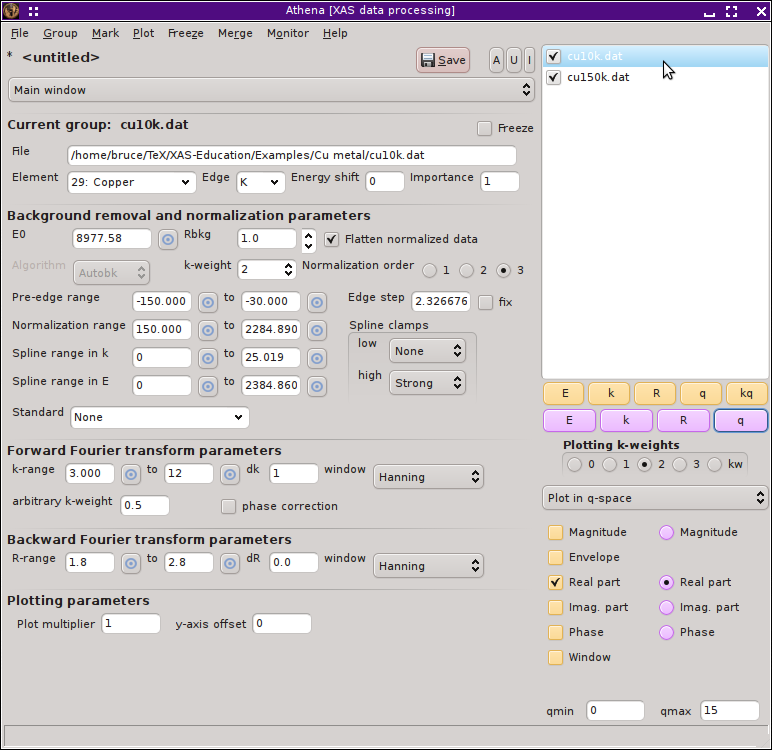
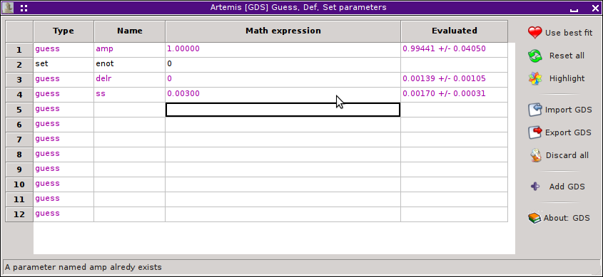

..
   Artemis document is copyright 2016 Bruce Ravel and released under
   The Creative Commons Attribution-ShareAlike License
   http://creativecommons.org/licenses/by-sa/3.0/

Fitting with empirical standards
================================

Let me just say up front that :demeter:`artemis` is intended as a
front-end to :demeter:`feff` for the problem of EXAFS analysis. In
almost all cases, :demeter:`feff` is the right tool for that job and
there are extremely few cases where the use of empirical standards is
preferable to using :demeter:`feff`. As discussed elsewhere in this
manual, there are a situations where the application of
:demeter:`feff` to a particular problem may not be obvious. Any
situation for which the choice of a starting configuration of atomic
coordinates, as needed for :demeter:`feff`'s input data, is not
obvious might fall into that category. In one of those situations, you
might be tempted to puruse empirical standards. You would, however,
usually be better served by adopting one of the strategies that have
been developed for applying :demeter:`feff` calculations to unknown
structures.

That said, there are a small handful of situations where the use of
empirical standards is justified. In fact, I can think of two. The
situation where an absorber and a scatterer are bound by a hydrogen
atom |nd| i.e. there is a hydrogen atom in the space between the
absorber and scatterer from which the photoelectron might scatter |nd|
is poorly handled by :demeter:`feff`. In that case, finding a suitable
empirical standard will likely be an improvement over the systematic
error introduced by :demeter:`feff`'s poor handlng of the
hydrogen. The second example would be a heterogeneous sample |nd| like
a soil |nd| which contains a component which varies little from sample
to sample. In that case, using an emirical standard to represent the
unchanging component and using :demeter:`feff` to model the behavior
of the component(s) which do change across the ensemble of
measurements might be a fruitful strategy.

To this end, :demeter:`demeter` offers a mechanism for generating an
empirical standard from measured data. This is saved in a form that
can be used by :demeter:`artemis` as if it were a normal path imported
into the fit in the normal way.

My example will use the copper foil data at 10 K and 150 K, which can be
found at `at my Github
site <https://github.com/bruceravel/XAS-Education/tree/master/Examples>`__.
In order to demonstrate the gneration and use of an empirical standard,
I will use the uncomplicated example of using the low temperature data
as the standard for the analysis of the higher temperature data. Of
course, a real-world scenario will be much more complicated that this
example, but it should demonstrate the mechanics of making and using the
empirical standard.

Preparing the empirical standard
--------------------------------

It starts by processing the data properly. First, import the two data
sets into :demeter:`athena`. Take care that the data are aligned and
have the same values for E\ :sub:`0`. Choose a k-range over which both
data sets are of good quality. I have chosen a range of 3 |AA|\
:sup:`-1` to 12 |AA|\ :sup:`-1`. Then choose an R-range to enclose and
isolate the first peak, which corresponds to the first coordination
shell. Here, I chose 1.8 |AA| to 2.8 |AA|.

.. _fig-empathena:

   The Cu foil data at two temperatures have been imported into Athena,
   aligned, and processed.

.. subfigstart::

.. _fig-emprplot:

.. figure::  ../../_images/emp_rplot.png
   :target: ../_images/emp_rplot.png
   :width: 100%

   Here are the Cu foil data at the two temperatures plotted in R-space ...

.. _fig-empqplot:

.. figure::  ../../_images/emp_qplot.png
   :target: ../_images/emp_qplot.png
   :width: 100%

   And plotted in back-transform k-space

.. subfigend::
   :width: 0.45
   :label: _fig-empplot

Select the data set from which you wish to make an empirical standard,
in this case the data measured at 10 K. In the File menu is a “Export”.
One of the options is to export an empirical standard.

.. _fig-empexport:
.. figure:: ../../_images/emp_export.png
   :target: ../_images/emp_export.png
   :width: 65%
   :align: center

   Exporting the processed data as an empirical standard.

This will prompt you for a file name using the standard file selection
dialog. The default file is the name of the data group with .es as the
extension. It will then prompt you for the species of the scattering
element using a periodic table dialog. :demeter:`athena` has no way of
knowing the scatterer species, so you have to provide this
information. In this case, you would click on Cu since this is a
copper foil.

.. _fig-empptabel:
.. figure:: ../../_images/emp_ptable.png
   :target: ../_images/emp_ptable.png
   :align: center

   Select the species of the scatterer from the periodic table interface.

Using the empirical standard
----------------------------

Now fire up :demeter:`artemis` and import the 150 K data from the
:demeter:`athena` project file you saved before closing
:demeter:`athena`. (You **did** save your work, didn't you?!) The k-
and R-ranges will be imported as they were set in
:demeter:`athena`. To begin the analysis using the empirical standard,
click on the hot text indicated in the figure below. You can also
import this sort of standard from the :menuselection:`Data --> Other
fitting standards...` menu.

.. _fig-empimportdata:
.. figure:: ../../_images/emp_importdata.png
   :target: ../_images/emp_importdata.png
   :align: center

   The 150 K data have been imported into Artemis and we are ready to
   import the prepared empirical standard.

Once the empirical standard is imported, it will be displayed just
like a normal path. You can tell it is an empirical standard because
its label contains the token :guilabel:`[Emp.]`.

Here I have set up a 4-parameter fit typical for a first shell
analysis, except that I have set the E\ :sub:`0` parameter to 0. The
amplitude, |sigma|\ :sup:`2`, and |Delta| R are guess parameters.

.. _fig-empimportes:
.. figure:: ../../_images/emp_importes.png
   :target: ../_images/emp_importes.png
   :align: center

   The 150 K data and the empirical standard have been imported into
   Artemis.

We are now ready to hit the :button:`Fit,light` button. Shown below
are the results of the fit with the fitting space chosen first as R,
then as q.

.. subfigstart::

.. _fig-empfitr:

.. figure::  ../../_images/emp_fitr.png
   :target: ../_images/emp_fitr.png
   :width: 100%

   The fit with the fitting space selected as R and the plot
   displayed in R.

.. _fig-empgdsr:

.. figure::  ../../_images/emp_gdsr.png
   :target: ../_images/emp_gdsr.png
   :width: 100%

   The parameter values from the fit inR.

.. subfigend::
   :width: 0.45
   :label: _fig-empfit

.. subfigstart::

.. _fig-empfitq:

.. figure::  ../../_images/emp_fitq.png
   :target: ../_images/emp_fitq.png
   :width: 100%

   The fit with the fitting space selected as q and the plot
   displayed in q.

.. _fig-empgdsq:

   The parameter values from the fit in q.

.. subfigend::
   :width: 0.45
   :label: _fig-empfit

The results fitting in R or q are pretty similar, which is reassuring.

The value for the amplitude is consistent with and close to 1, which is
should be since the copper metal is 12-fold coordinate at both
temperatures.

The value for the change in |sigma|\ :sup:`2` is 0.0017 |pm| 3, which
seems reasonable for this change in temperature.

The value for |Delta| R fitted in q space is 0.001 |pm| 1. Fitted in R
space, the uncertainty is 0.002. That's kind of interesting. In either
case, the uncertainty in R is smaller than for a :demeter:`feff`-based
fit for a number of reasons. Probably the most significant is that
both standard and data are of excellent quality. Were the data the
sort of marginal data that comes from most research problems on
difficult materials, the effects of statistical and systematic noise
would be much more dramatic. Also relevant to the small uncertainty is
that this fitting problem has been contrived (by virtue of careful
alignment and choice of E\ :sub:`0` back in :demeter:`athena`) to
remove the fitted change in E\ :sub:`0` from the problem. By removing
the parameter most correlated with |Delta| R, we significantly reduces
the uncertainty in |Delta| R.

I would not interpret all of this to mean that use of empirical
standards is superior to the use of :demeter:`feff`. In the specific
case where the first coordination shell is of known contents and can
be well isolated from higher shells and where you are confident that
your unknown is identical to your standard except for small changes in
N, R, or |sigma|\ :sup:`2`, then empirical standards are a useful tool
for your EXAFS toolbox.

