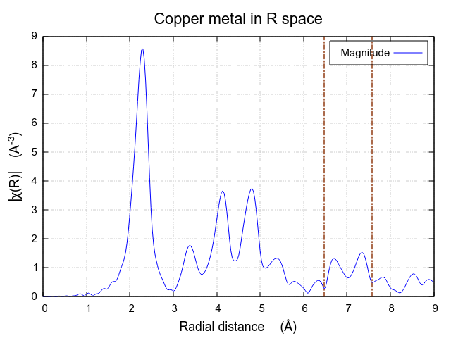
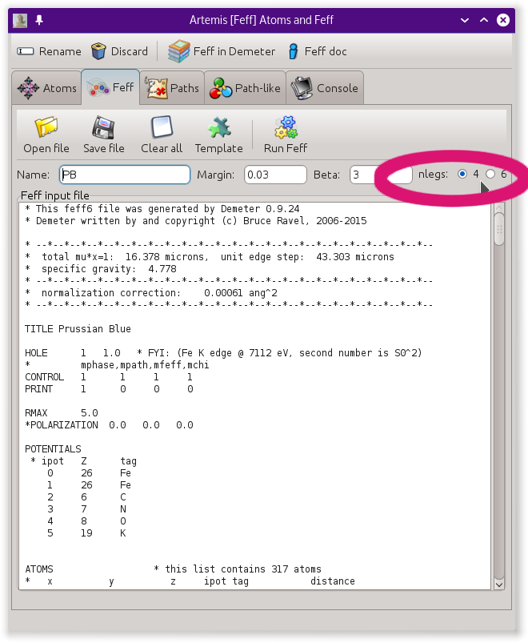

..
   Artemis document is copyright 2016 Bruce Ravel and released under
   The Creative Commons Attribution-ShareAlike License
   http://creativecommons.org/licenses/by-sa/3.0/

5 and 6 legged paths
====================

Examples of situations requiring consideration of higher order paths
--------------------------------------------------------------------

Normally, the `pathfinder <../feff/paths.html>`__ in
:demeter:`artemis`'s implementation of :demeter:`feff` only considers
up to triple scattering (4-legged) paths. This is for two
reasons. First, :demeter:`artemis`'s pathfinder is a bit slow. Second,
it is rather uncommon to need higher order paths in an EXAFS
analysis. Here are a few examples.

Paradibromobenzene is a benzene molecule |nd| a ring of 6 carbon atoms
|nd| with two of the hydrogen ligands replaced by bromine. The bromine
atoms are in the para (1-4) arrangement, i.e. on opposite corners of
the benzene ring.

Being the only heavy scatterer in a rigid structure, the second bromine
atom is quite evident in the EXAFS, giving rise to the large peak just
above 6 |AA| in the |chi| (R) data shown below.

.. subfigstart::

.. _fig-fivesixparadibromobenzene:

.. figure::  ../../_images/fivesix-paradibromobenzene.png
   :target: ../_images/fivesix-paradibromobenzene.png

   The paradibromobenzene molecule

.. _fig-fivesixbrchir:

.. figure::  ../../_images/fivesix-br-chir.png
   :target: ../_images/fivesix-br-chir.png

   |chi| (R) data for paradibromobenzene.

.. subfigend::
   :width: 0.45
   :label: _fig-paradibromobenzene

That big peak resulting from the second bromine atom includes not just
the single scattering contribution, but a number of collinear multiple
scattering paths. This includes the 5-legged paths that scatter from
both carbon atoms on the way to (or from) the bromine atoms, and the
6-legged path that includes forward scattering from both carbon atoms in
both directions.

5- and 6-legged paths are, in general, only important in EXAFS for
structures that are both rigid and have 4 collinear atoms. This is
pretty high bar, which is why examples are few and far between. That
said, here are a couple more examples.

.. _fig-fivesixprussianblue:

.. figure:: ../../_images/fivesix-prussian-blue.png
   :target: ../_images/fivesix-prussian-blue.png
   :align: center

   Prussian blue

Prussian blue, ferric ferrocyanate, represents a class of
framework-structured materials that have metal atoms at corner
positions in the unit cell. These metal atoms are bridged by cyanide
molecules. This is much like a rocksalt structure, but with the cation
replaced by a cyanide molecule oriented in the direction of the bond.

The metal anions are separated by about 5.1 |AA|, thus are at a
distance that can easily be resolved and analyzed with good EXAFS
data. To interpret that part of the EXAFS signal, however, it is
necessary to consider all the multiple scattering paths involving the
C, N, and Fe atoms. This includes significant, collinear 5- and
6-legged paths.

The final example is good ol' copper metal, which is often analyzed out
to about 5 |AA|, a distance which includes 5 coordination shells and a
number of double and triple scattering paths. To analyze farther in R,
one eventual gets to the single scattering path which includes the face
center atom in the diagonally adjacent cell. In the figure below, the
absorber is represented by the pink atom. The distant neighbor is the
farthest lavender-colored atom. To analyze the single scattering
contribution from that distance would require consideration of all the
multiple scattering among the pink and lavender atoms, which are
collinear along that unit cell diagonal.

.. subfigstart::

.. _fig-fivesixcu7A:

.. figure::  ../../_images/fivesix-cu7A.png
   :target: ../_images/fivesix-cu7A.png

   4 unit cells of FCC copper with the collinear atoms contributing at
   about 7 |AA| highlighted in lavender.

.. _fig-fivesixchir:

   On the right is χ(R) data for copper
   metal. The signal from the various SS and MS involving the lavender
   atoms paths contributes to the the peaks around 7 |AA|.

.. subfigend::
   :width: 0.45
   :label: _fig-fivesixcopper

 

5 and 6 legged paths in Artemis
-------------------------------

.. caution:: Enabling the calculation of 5- and 6-legged paths
   significantly slows down the pathfinder calculation in
   :demeter:`artemis`. If you are unsure whether you need 5- and
   6-legged paths, you almost certainly **do not** want to do so!

The default behavior in :demeter:`artemis` is to compute up to
4-legged paths. For any FEFF calculation, this can be extended to
include 5- and 6-legged paths by selecting the “6” button, as
indicated in the screenshot below.  Note that this sets the order of
scattering paths only for the current :demeter:`feff` calculation. The
default for all subsequent FEFF calculations will again be 4-legged
paths. The `aggregate calculation <../feff/aggregate.html>`__ is
always made with up to 4-legged paths.

.. _fig-fivesixatoms:

   The Feff tool showing the check box for selecting order of multiple
   scattering. 
	    

Besides being slow, the other consequence of setting the upper order
of multiple scattering to 6 is that the `path list
<../feff/paths.html>`__ will be much longer and possibly more
confusing. Really, truly! Don't use this feature of :demeter:`artemis`
unless you have a very good reason to do so.

Some `configuration parameters <../prefs.html>`__ that relate to choice
of the order of multiple scattering:

#. :configparam:`Pathfinder,suppress_5_6_not_straight`: When true,
   only consider 5- and 6-legged paths that have scattering angles
   within :configparam:`Pathfinder,fs_angle` (typically 20 degrees) of
   0 or 180 degrees.  That is, suppress all paths with angles far from
   forward and backward scattering.

#. :configparam:`Atoms,suppress_nleg_warning`: When true, this will
   suppress the dialog box posted by :demeter:`atoms` when you select
   the :guilabel:`6` button warning you against considering 5- and
   6-legged paths.

#. :configparam:`Pathfinder,eta_suppress`: If you need to consider
   nearly collinear paths in a structure with buckling of atomic
   planes, you may need to set this parameter to false. When true, it
   suppresses any path with a non-zero Eulerian |eta| angle. In most
   cases, this is a good heuristic for removing irrelevant paths from
   the path list, however for orders of scattering above 4 and nearly
   collinear paths, this filter might remove desirable paths. Use this
   with caution as it will greatly expand the size of the path list.
