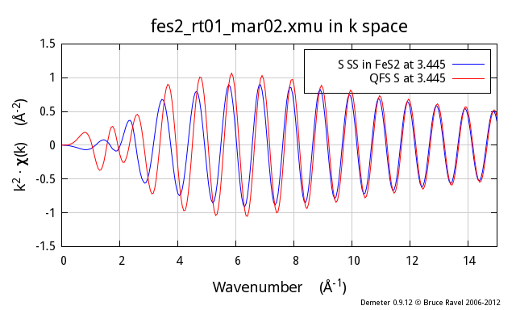

..
   Artemis document is copyright 2016 Bruce Ravel and released under
   The Creative Commons Attribution-ShareAlike License
   http://creativecommons.org/licenses/by-sa/3.0/

Quick first shell
=================

:demeter:`artemis` offers several ways to get information from 
:demeter:`feff` into a fitting model.  One of these is called a *quick
first shell* path.  It's purpose is to provide a structureless way of
computing the scattering amplitude and phase shift well enough to be
used for a quick analysis of the first coordination shell. 

The way it works is quite simple. Given the species of the absorber
and the scatterer, the absorption edge (usually K or L\ :sub:`III`),
and a nominal distance between the absorber and the scatterer,
:demeter:`artemis` constructs input for :demeter:`feff`. This input
data assumes that the absorber and scatterer are present in a `rock
salt structured
<http://en.wikipedia.org/wiki/Cubic_crystal_system#Rock-salt_structure>`__
crystal. The lattice constant of this notional cubic crystal is such
that the nearest neighbor distance is the nominal distance supplied by
the user. :demeter:`feff` is run and the scattering path for the
nearest neighbor is retained. The rest of the :demeter:`feff`
calculation is discarded. The nearest neighbor path is imported into
:demeter:`artemis` with the degeneracy set to 1.

The assumption here is that the notional crystal will produce a
scattering amplitude and phase shift for the nearest neighbor path that
is close enough to what would be calculated by :demeter:`feff` were the local
structure actually known. Does this really work?

Using the quick first shell tool to model first shell data
----------------------------------------------------------

To demonstrate what QFS does and to explain the constraints on the
situations in which it can be expected to work, let's take a look at my
favorite teaching example, FeS\ :sub:`2`. Anyone who has attended one of
my XAS training courses has seen this example.

These three figures show the S atom in the first coordination shell
computed using the known crystal structure for FeS\ :sub:`2`. This
calculation is the blue trace. The red trace is the contribution from a
S atom at the same distance as computed using the quick first shell
tool. These calculations are plotted as |chi| (k), \| |chi| (R)\|, and Re[|chi| (R)].

.. subfigstart::

.. _fig-qfs1stk:

.. figure::  ../../_images/qfs-1st_k.png
   :target: ../_images/qfs-1st_k.png
   :width: 100%

   First shell |chi| (k)

.. _fig-qfs1strmag:

.. figure::  ../../_images/qfs-1st_rmag.png
   :target: ../_images/qfs-1st_rmag.png
   :width: 100%

   First shell magnitude of |chi| (R)

.. _fig-qfs1strre:

.. figure::  ../../_images/qfs-1st_rre.png
   :target: ../_images/qfs-1st_rre.png
   :width: 100%

   First shell real part of |chi| (R)

.. subfigend::
   :width: 0.31
   :label: _fig-qfs1st

As you can see, these two calculations are identical. You cannot even
see the blue trace underneath the red trace. It is clear that the QFS
calculation can be substituted for the more proper :demeter:`feff`
calculation of the contribution from the nearest neighbor.

Why does this work?

:demeter:`feff` starts by calculating neutral atoms then placing these neutral
atoms at the positions indicated by :demeter:`feff`'s input data. Each neutral atom
has an associated radius |nd| the radius within which the :quoted:`cloud` of
electrons has the same charge as the nucleus of the atom. The
neutral-atom radii are fairly large. When placed at the positions in the
:demeter:`feff` input data, these neutral-atom radii overlap significantly. This is
a problem for :demeter:`feff`'s calculation of the atomic potentials in the
material because it means that electrons in the overlapping regions
cannot be positively identified as belonging to a particular atom.

To address this situation, :demeter:`feff` uses an algorithm called the Mattheis
prescription, which inscribes spheres in `Wigner-Seitz
cells <http://en.wikipedia.org/wiki/Wigner%E2%80%93Seitz_cell>`__, to
reduce the radii of all atoms in the material together until the reduced
radii are just touching and never overlapping. These smaller radii are
called the muffin-tin radii. The electron density within one muffin-tin
radius is associated with the atom at the center of that sphere. All of
the electron density that falls outside of the muffin-tin spheres is
volumetrically averaged and treated as interstitial electron density.
All the details are explained in 

.. bibliography:: ../artemis.bib
   :filter: author % "Albers"
   :list: bullet

The scattering amplitude and phase shift is then computed from atoms
that have a specific size |nd| the size of the muffin-tin spheres |nd| and
with the electron density associated with those spheres.

The reason that the two calculations shown above are so similar is
because the muffin-tin radii of the Fe and S atoms are almost identical.
This should not be surprising. Either way of constructing the muffin
tins |nd| using the proper FeS\ :sub:`2` structure or using the rock-salt
structure |nd| start with Fe and S atoms separated by the same amount. The
application of the algorithm for producing muffin-tin sizes ends up with
nearly identical values. As a result the scattering amplitudes and phase
shifts are nearly the same and the resulting |chi| (k) functions are nearly
the same.

(Mis)Using the quick first shell tool beyond the first shell
------------------------------------------------------------

This is awesome! It would seem that we have a model independent way to
generate fitting standards for use in :demeter:`artemis`.  No more
mucking around with :demeter:`atoms`, no more looking up
metalloprotein structures. Just use QFS!

If you think that seems too good to be true |nd| you get a gold star. It
most certainly is.

Following the example above, I now show the second neighbor from the
proper FeS\ :sub:`2` calculation, which is also a S atom and which is at
3.445 |AA|. The red trace is a QFS path computed with a nominal distance of
3.445 |AA|. As you can see, there are substantial differences, particularly
at low k, between the two.

.. subfigstart::

.. _fig-qfs2ndk:

   Second shell |chi| (k)

.. _fig-qfs2ndrmag:

.. figure::  ../../_images/qfs-2nd_rmag.png
   :target: ../_images/qfs-2nd_rmag.png
   :width: 100%

   Second shell magnitude of |chi| (R)

.. _fig-qfs2ndrre:

.. figure::  ../../_images/qfs-2nd_rre.png
   :target: ../_images/qfs-2nd_rre.png
   :width: 100%

   Second shell real part of |chi| (R)

.. subfigend::
   :width: 0.31
   :label: _fig-qfs2nd

So, why does this not work so well? In the proper calculation, the size
of the S muffin-tin has been determined in large part by the Fe-S
nearest neighbor distance. This same muffin-tin radius is used for all
the S atoms in the cluster. Thus, in the real calculation, the
contribution from the second neighbor S atom is determined using the
same well-constrained S muffin-tin radius as in the first shell
calculation.

In contrast, the QFS calculation has been made with an unphysically
large Fe-S nearest neighbor distance. Remember, the QFS algorithm works
by putting the absorber and scatterer in a rock-salt crystal with a
lattice constant such that the nearest neighbor distance is equal to the
distance supplied by the user. In this case, that nearest neighbor
distance is 3.445 |AA|!

The algorithm for constructing the muffin tins requires that the
muffin-tin spheres touch. Supplied with a distance of 3.445 |AA|, the
muffin-tin radii are much too large, the electron density within the
muffin tins is much too small, and the scattering amplitude and phase
shift are calculated wrongly.

The central problem here is not that the red line is different from
the blue line |nd| although that is certainly the case and it is
certainly a problem. The central problem is that, by misusing the QFS
tool in this way, you introduce a large systematic error into your
data analysis.  This systematic error affects both amplitude and phase
(as you can clearly see in the figures above). What's worse, you have
no way of quantifying this systematic error. Your results for
coordination number, |Delta| R, and |sigma|\ :sup:`2` **will** be
wrong. And you have **no way of knowing** by how much.

.. caution:: In short, if you misuse the QFS tool in this way, you
   cannot possibly report a defensible analysis of your data.

To add even more ill cheer to this discussion, the problem gets worse
and worse as the nominal distance of the QFS calculation gets larger.
Here I show the same comparison, this time for the fifth coordination
shell in FeS\ :sub:`2`, another S scatterer at 4.438 |AA|:

.. subfigstart::

.. _fig-qfs4thk:

.. figure::  ../../_images/qfs-4th_k.png
   :target: ../_images/qfs-4th_k.png
   :width: 100%

   Fourth shell |chi| (k)

.. _fig-qfs4thrmag:

.. figure::  ../../_images/qfs-4th_rmag.png
   :target: ../_images/qfs-4th_rmag.png
   :width: 100%

   Fourth shell magnitude of |chi| (R)

.. _fig-qfs4thrre:

.. figure::  ../../_images/qfs-4th_rre.png
   :target: ../_images/qfs-4th_rre.png
   :width: 100%

   Fourth shell real part of |chi| (R)

.. subfigend::
   :width: 0.31
   :label: _fig-qfs4th

.. |image8| image:: ../../_images/qfs-4th_k.png
   :target: ../../_images/qfs-4th_k.png
.. |image9| image:: ../../_images/qfs-4th_rmag.png
   :target: ../../_images/qfs-4th_rmag.png
.. |image10| image:: ../../_images/qfs-4th_rre.png
   :target: ../../_images/qfs-4th_rre.png

Executive summary
-----------------

The quick first shell tool is given that name because it is only valid
for first shell analysis.

If you attempt to use the QFS tool at larger distances, you introduce
large systematic error into your data analysis. Don't do that!

So, what should you do?
-----------------------

Presumably, you have measured EXAFS on your sample because you because
you do not know its structure. The point of the EXAFS analysis is to
determine the structure. The upshot of this discussion would seem to be
that you need to know the structure in order to measure the structure.
That's a
`catch-22 <http://en.wikipedia.org/wiki/Catch-22_%28logic%29>`__, right?

Not really. As I often say in my lectures during XAS training courses:
you never know nothing. It is rare that you cannot make an educated
guess about what your unknown material might resemble. With that guess,
you can run :demeter:`feff`, parameterize your fitting model, and determine the
extent to which that guess is consistent with your data.

**Crystalline analogs**
    In the paper below,
    Shelly Kelly demonstrates how to use :demeter:`feff` calculations on
    crystalline materials as the basis for interpreting the EXAFS of
    uranyl ions adsorbed onto biomass. In that paper, she shows the pH
    dependence of the fractionation of the uranyl ions among phosphoryl,
    carboxyl, and hydroxyl binding sites. Obviously, there is no way to
    make :demeter:`feff` input data for uranyl ions on organic goo. However, Shelly
    realized that the basic structure of the uranyl-phosphoryl or
    uranyl-carboxyl ligands are very similar in the organic and
    inorganic cases. Thus she ran :demeter:`feff` on the inorganic structure and
    pulled out those paths that describe the uranyl ion in its similar
    ligation environment in the organic case.

    The great advantage of using the inorganic structures is that the
    muffin-tin radii are very likely to be computed well. The paths that
    describe the uranyl ligation environment have thus been computed
    reliably and with good muffin tin radii.

    There is yet another advantage to this over attempting to use QFS
    for higher shells |nd| consideration of multiple scattering paths. In
    the example from Shelly's paper, there are several small but
    non-negligible MS paths to be considered for both carboxyl and
    phosphoryl ligands. Neglecting those in favor of a
    single-scattering-only model introduces further systematic
    uncertainty into the determination of coordination number, |Delta| R, and
    |sigma|\ :sup:`2`.

    .. bibliography:: ../artemis.bib
       :filter: author % "Fein"
       :list: bullet

    

**SSPaths**
    :demeter:`artemis` offers another tool called `an
    SSPath <../feff/pathlike.html#sspaths>`__. An SSPath is a way of
    using well-constructed muffin tins to compute a scattering path that
    is not represented in the input structure provided for the :demeter:`feff`
    calculation. For example, suppose you run a :demeter:`feff` calculation on
    LaCoO\ :sub:`3`, a trigonal perovskite-like material with 6 oxygen
    scatterers at 1.93 |AA|, 8 La scatterers at 3.28 |AA| or 3.34 |AA|, and 6 Co
    scatterers at 3.83 |AA|. Suppose you have some reason to consider a Co
    scatterer at 3 |AA|. You can tell :demeter:`artemis` to compute that using the
    muffin-tin potentials from the LaCoO\ :sub:`3` calculation, but with
    a Co scatterer at that distance, which is not represented in the
    LaCoO\ :sub:`3` structure. Unlike an attempt to use a QFS Co path at
    that distance, the SSPath uses a scattering potential with a
    properly calculated muffin tin.
    The advantage of the SSPath is that it it results in a much more
    accurate calculation than QFS. The disadvantage is that it can only
    be calculated on a scattering element already present in the :demeter:`feff`
    calculation.

    .. bibliography:: ../artemis.bib
       :filter: title % "Muffin"
       :list: bullet
    

Reproducing the plots above
---------------------------

To start, I imported the FeS\ :sub:`2` data and crystal structure into
:demeter:`artemis`.  `(You can find them here.)
<https://github.com/bruceravel/XAS-Education/tree/master/Examples/FeS2>`__
I ran :demeter:`atoms`, then :demeter:`feff`. I then :mark:`drag,..`
dragged and dropped the nearest neighbor path onto the Data page. At
this stage, :demeter:`artemis` looks like this:

.. _fig-qfsstartqfs:
.. figure:: ../../_images/qfs-start_qfs.png
   :target: ../_images/qfs-start_qfs.png
   :width: 50%
   :align: center

   Getting started with the comparison

I begin a QFS calculation by selecting that option from the menu on
the Data page:

.. _fig-qfspath:
.. figure:: ../../_images/qfs-path.png
   :target: ../_images/qfs-path.png
   :align: center

   Compute the QFS path

The nearest neighbor path in FeS\ :sub:`2` is a S atom at 2.257 |AA|.

.. _fig-qfsmakeqfs:
.. figure:: ../../_images/qfs-make_qfs.png
   :target: ../_images/qfs-make_qfs.png
   :align: center

   Set the QFS parameters

Clicking :button:`OK,light`, the QFS path is generated.  I set the
degeneracy of the QFS path to 6 so that I can directly compare the
normally calculated path (there are 6 nearest neighbor S atoms in FeS\
:sub:`2`) to the QFS path.  I mark both paths and transfer them to the
plotting list. I am now ready to compare these two calculations. To
examine another single scattering path, I :mark:`drag,..` drag and
drop that path from the :demeter:`feff` page to the Data page and redo
the QFS calculation at that distance.

.. _fig-qfscompare:
.. figure:: ../../_images/qfs-compare.png
   :target: ../_images/qfs-compare.png
   :width: 50%
   :align: center

   Ready to plot the comparison

