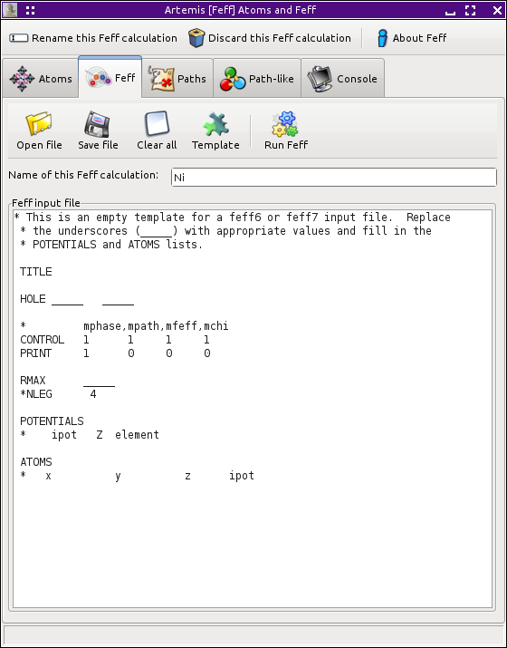

..
   Artemis document is copyright 2016 Bruce Ravel and released under
   The Creative Commons Attribution-ShareAlike License
   http://creativecommons.org/licenses/by-sa/3.0/

The Feff tab
============

The :demeter:`feff6` document can be `found
here <http://www.feffproject.org/FEFF/Docs/feff6/feff6.html>`__.

The :demeter:`feff9` document can be `found
here <http://leonardo.phys.washington.edu/feff/wiki/index.php>`__.

When you click the :button:`Run Atoms,light` button on the
:demeter:`atoms` tab, the resulting input data for :demeter:`feff`,
which constists of a list of Cartesian coordinates for the atoms in
the cluster, is written to the :demeter:`feff` tab. The
:demeter:`feff` tab is then displayed.

.. _fig-fefffeff:
.. figure:: ../../_images/feff-feff.png
   :target: ../_images/feff-feff.png
   :align: center

   The Feff tab.

The box containing the :demeter:`feff` input data is a simple text
entry box. If you wish to make any modifications to the input data for
the :demeter:`feff` calculation, you can edit the text directly.
Although it is most common to run the :demeter:`feff` calculation
straight away, there are a number of situations where directly editing
the input data prior to running :demeter:`feff` is desirable.

The :button:`Open,light` button can be used to import a different
:file:`feff.inp` file.  *Right clicking* that button posts the
recently used file dialog. The :button:`Save,light` button will post
the standard column selection dialog for choosing a file name for
saving the current :demeter:`feff` input data. The
:button:`Clear,light` button will remove all text from the big text
box.

The :demeter:`feff` calculation is started by clicking the
:button:`Run Feff,light` button.

Above the box containing the :file:`feff.inp` file are three text
controls. The first contains the name of this :demeter:`feff`
calculation. The other two set the parameters used for `fuzzy
degeneracy <../extended/fuzzy.html>`__.

See `the discussion of 5- and 6-legged paths
<../extended/finesix.html>`__ before telling :demeter:`artemis` to
compute paths of higher order than triple scattering.

Feff documentation
------------------

This page allows you to link directly to :demeter:`feff`'s
documentation.  Right clicking on the text window containing the
:file:`feff.inp` usually posts the standard :guilabel:`cut/copy/paste`
menu. However, if you right click on one of :demeter:`feff`'s keywords
(or :quoted:`cards`), you will get a small menu which will link you to
the documentation for that keyword. Clicking on the posted menu will
open a browser and display the appropriate document page from `The
Feff Project website <http://feffproject.org>`__.

.. _fig-feffdoc:
.. figure:: ../../_images/feff-doc.png
   :target: ../_images/feff-doc.png
   :align: center

   Right clicking on a Feff card for a direct link to Feff's
   documentation.

Feff input templates
--------------------

The :guilabel:`Template` button is used to put boilerplate for
:demeter:`feff` input data into the big text box. This is useful if
your list of Cartesian coordinates comes from some other source. In
that case, you might cut and paste that text from the other source and
fill in the indicated blanks and the ``POTENTIALS`` list as
appropriate for your calculation.

.. _fig-fefftemplate:

   A Feff template.

