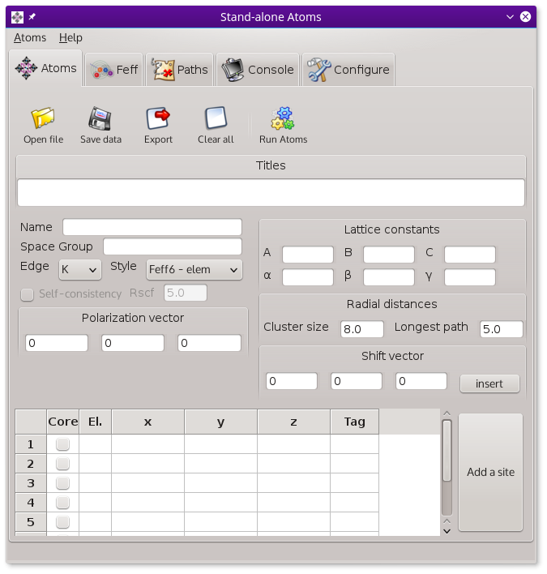

..
   Artemis document is copyright 2016 Bruce Ravel and released under
   The Creative Commons Attribution-ShareAlike License
   http://creativecommons.org/licenses/by-sa/3.0/

The stand-alone Atoms application
=================================

:demeter:`atoms` can be run as a stand-alone application separate from
:demeter:`artemis`.  On Windows, there is a menu in the Start Menu
labeled "Demeter with Strawberry Perl".  In that menu is an item
labeled "Stand-alone Atoms".  Selecting that will start the
:demeter:`atoms` application.  By default, no desktop icon is made for
the stand-alone version of :demeter:`atoms`, but you can drag-and-drop
a shortcut from the Start Menu to the desktop.

:demeter:`atoms` can be launched from the command line on any
platform.  This command will read from a named CIF file and write the
output :demeter:`feff` file to :file:`myfeff.inp`.

.. code-block:: bash

   datoms myxtal.cif -o myfeff.inp

You can launch the stand-alone GUI application with

.. code-block:: bash

   datoms --wx

.. _fig-standaloneatoms:

   The stand-alone :demeter:`atoms` application.

As a stand-alone application, :demeter:`atoms` is very similar in
appearance and functionality to the :demeter:`atoms` window in
:demeter:`artemis`.  There are a few small differences:

#. There is a :guilabel:`Configuration` tab which contains a tool very
   similar to :demeter:`artemis`'s `configuration tool
   <../prefs.html>`_.

#. The :guilabel:`Path-like` tab is absent.  Without a fitting
   project on which to drag-and-drop the path-like objects, the
   content of that tab is not so useful

#. The stand-alone app has its own menu bar.
