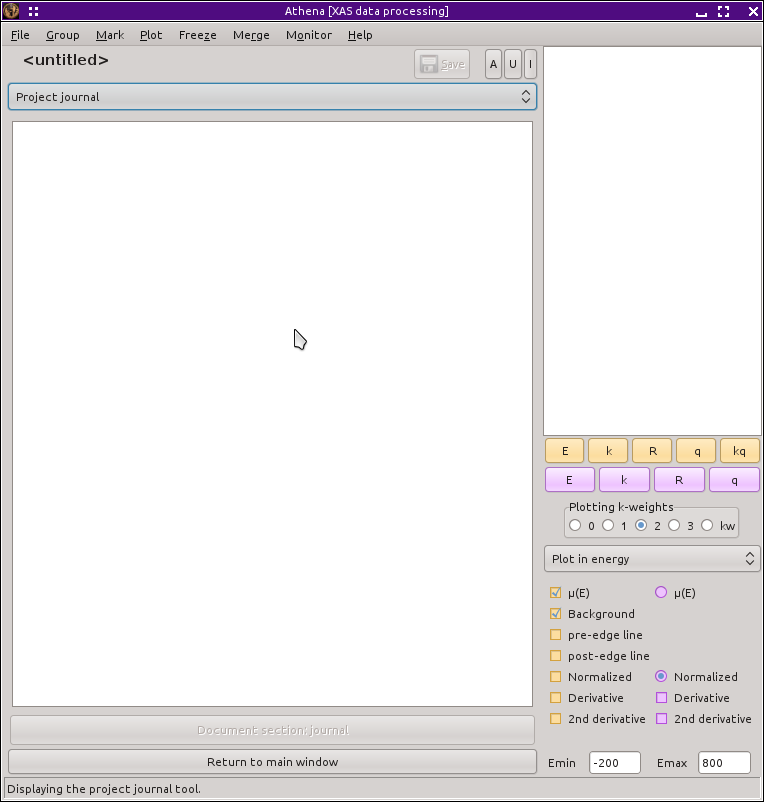

`The Artemis Users' Guide <./index.html>`__

+--------------------------------------+--------------------------------------+
| «\ `DEMETER <http://bruceravel.githu |
| b.io/demeter/>`__\ »                 |
|                                      |
| «\ `IFEFFIT <https://github.com/newv |
| ille/ifeffit>`__\ »                  |
|                                      |
| «\ `xafs.org <http://xafs.org>`__\ » |
|                                      |
| Back: `The Plot                      |
| window <./plot/index.html>`__        |
| Next: `The History                   |
| window <./history.html>`__           |
+--------------------------------------+--------------------------------------+

| |[Artemis logo]|
|  `Home <./index.html>`__
|  `Introduction <./intro.html>`__
|  `Starting Artemis <./startup/index.html>`__
|  `The Data window <./data.html>`__
|  `The Atoms/Feff window <./feff/index.html>`__
|  `The Path page <./path/index.html>`__
|  `The GDS window <./gds.html>`__
|  `Running a fit <./fit/index.html>`__
|  `The Plot window <./plot/index.html>`__
|  The Log & Journal windows
|  `The History window <./history.html>`__
|  `Monitoring things <./monitor.html>`__
|  `Managing preferences <./prefs.html>`__
|  `Worked examples <./examples/index.html>`__
|  `Crystallography for EXAFS <./atoms/index.html>`__
|  `Extended topics <./extended/index.html>`__

The Log and Journal windows
===========================

--------------

 

The Log window
--------------

After the fit completes and the result of the fit is plotted, the Log
window is displayed. The “Log” button on the bottom left of the Main
window is used to display and hide this window.

|log.png| All of the details of the fit are recorded in the text
displayed in this window. Below the descriptive fitting properties
displayed at the top in blue text are the main fitting statistics,
including χ², χ²\ :sub:`ν`, the R-factor, ε(k), ε(R), and counts of the
number of independent points and the number of guess parameters. Those
are followed by the details of `the happiness
evaluation <fit/happiness.html>`__. Two lines of the fitting statistics
are colored with the same color determined from the happiness and used
for the Fit button and the various plotting buttons.

Following the statistical parameters are tables of the guess, def, set,
restraint, and after parameters. Error bars are given for the guess
parameters. Correlations between guess parameters follow.

Scrolling down in this, you find tables of evaluated path parameters for
each of the paths and each of the data sets. Note that unceretainties
are **not** propagated through to the path parameters. In the current
version of ARTEMIS, that chore is left for the user.

The text in the log file is identical to the log text from the most
recent fit in `the History window <history.html>`__.

The buttons at the bottom of the Log window can be used to save the log
to a text file or to print its contents.

--------------

 

The Journal window
------------------

|journal.png| Clicking the “Journal” button on the right side of the
Main window displays and hides the Journal window. This is simply a
blank text box in which you can write notes about your fitting project
or love letters to your collaborators. The text found in this box will
be saved to and restored from the project file.

The buttons at the bottom of the Log window can be used to save the
journal to a text file or to print its contents.

| 

--------------

--------------

| DEMETER is copyright © 2009-2015 Bruce Ravel — This document is
copyright © 2015 Bruce Ravel

|image3|    

| This document is licensed under `The Creative Commons
Attribution-ShareAlike
License <http://creativecommons.org/licenses/by-sa/3.0/>`__.
|  If DEMETER and this document are useful to you, please consider
`supporting The Creative
Commons <http://creativecommons.org/support/>`__.

.. |[Artemis logo]| image:: ./../images/Artemis_logo.jpg
   :target: ./diana.html
.. |log.png| image:: ../images/log.png
   :target: ../images/log.png

.. |image3| image:: ../images/somerights20.png
   :target: http://creativecommons.org/licenses/by-sa/3.0/
