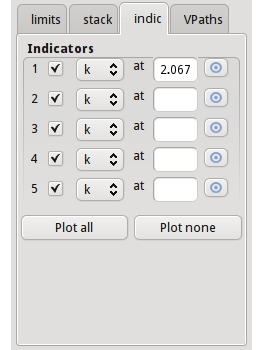

..
   Artemis document is copyright 2016 Bruce Ravel and released under
   The Creative Commons Attribution-ShareAlike License
   http://creativecommons.org/licenses/by-sa/3.0/

Plot Indicators
===============

In :demeter:`demeter`, an indicator is a vertical line used to mark a
specific position on the x-axis.  In this example, it is the dotted
pink line at 2.067 |AA| in :numref:`Fig. %s <fig-indicplot>`.  An
indicator for a position in R is not plotted in k or q.  An indicator
for a position in k or q is not plotted in R.  Inidactors for
positions in k or q are also plotted in q or k.

.. _fig-indictab:

   The Indicator tab

To set an indicator, click the target button, then
:mark:`leftclick,..` double-click on a point in the current plot. Once
set, the position and space can be edited using the associated choice
menu and text control. The check button turns the indicator on or off
in subsequent plots. The buttons at the bottom toggle the check
buttons for each indicator.

.. _fig-indicplot:
.. figure:: ../../_images/indicplot.png
   :target: ../_images/indicplot.png
   :align: center

   Plot with indicator
