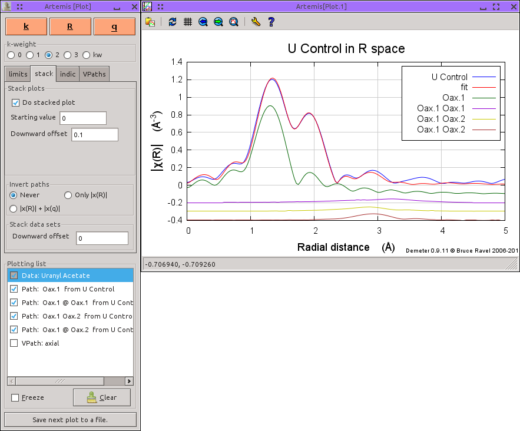

..
   Artemis document is copyright 2016 Bruce Ravel and released under
   The Creative Commons Attribution-ShareAlike License
   http://creativecommons.org/licenses/by-sa/3.0/

Creating and plotting VPaths
============================

A common problem with visualizing the paths that contribute to a fit
occurs when several single and multiple scatteriung paths contribute
spectral wieght in the same region of R space. In a well-ordered
material like these data on a cobalt foil, a distant single scattering
path may be of the same length as two or more important collinear
multiple scattering paths. The fit involves a subtle superposition of
all the paths in the fit. This single scattering path and its related
multiple scattering paths all contribute spectral weight in the same
region of R-space.

.. _fig-plotoverlapping:
.. figure:: ../../_images/plot-overlapping.png
   :target: ../_images/plot-overlapping.png
   :align: center

   A plot of overlapping paths

Plotting them together results in a complicated figure with lots of
overlapping traces. It is hard to see how each path contributes to the
fit. Indeed, it is hard to ascertain much beyond the fact that these
three paths have a complicated phase relationship between them.

:demeter:`artemis` offers a handy visualization tool called a virtual
path, or VPath. A VPath is simply a group of paths which are added
together after being evaluated in a fit. The sum of these paths is
then plotted as a single item in a fit. Here is the plot made with the
VPath constructed from the three paths in the previous figure. While
this plot hides the individual contributions of the three path, it
shows how those three affect the fit when added together.

.. _fig-plotvpath:
.. figure:: ../../_images/plot-vpath.png
   :target: ../_images/plot-vpath.png
   :align: center

   A plot with the overlapping paths made into a single VPath

The VPath is made by marking the contributing paths, then choosing
:menuselection:`Actions --> Make VPath`. You will be prompted for a
name for the VPath. This name will be used to identify the VPath in a
plot. The VPath is then inserted into the list of the VPaths tab.

.. _fig-plotmakevpath:
.. figure:: ../../_images/plot-makevpath.png
   :target: ../_images/plot-makevpath.png
   :align: center

   The make VPath dialog

Here is another example of how a VPath can help visualize the
components of a fit.  The data in the following figures are of uranium
L\ :sub:`III` edge EXAFS of uranyl acetate in solution. Uranyl
compounds are notable for having two, very short double-bonded oxygen
atoms in a trans configuration and at a distance of about 1.78 |AA|.
The remaining oxygen atoms lie in an equatorial plane.  These are
single-bonded and at a distance of around 2.4 |AA|.

.. _fig-uranyl:
.. figure:: ../../_images/uranyl.png
   :target: ../_images/uranyl.png
   :align: center

   A schematic of the uranyl moiety.

The two axial oxygen atoms usually have a rather small |sigma|\
:sup:`2` and contribute very strongly at low R in the Fourier
transform. Because those oxygen atoms are at such a short distance,
there are a few multiple scattering paths that contribute significant
spectral weight just beyond the region dominated by single scattering
from the equatorial oxygen atoms.

Here is the plot the fit to the uranyl acetate data along with each of
the single and multiple scattering paths that involve the axial oxygen
atoms.  Again, it is hard to appreciate how the various multiple
scattering paths contribute to the fit.

.. _fig-plotuaceox:

   A plot of the axial oxygen paths in uranyl acetate

In this case, it is nice to combine all these paths into a VPath which
represents the entire contribution to the EXAFS from the axial oxygen
atoms.

.. _fig-plotuacevpath:
.. figure:: ../../_images/plot-uace_vpath.png
   :target: ../_images/plot-uace_vpath.png
   :align: center

   A plot with the axial oxygen paths made into a VPath
