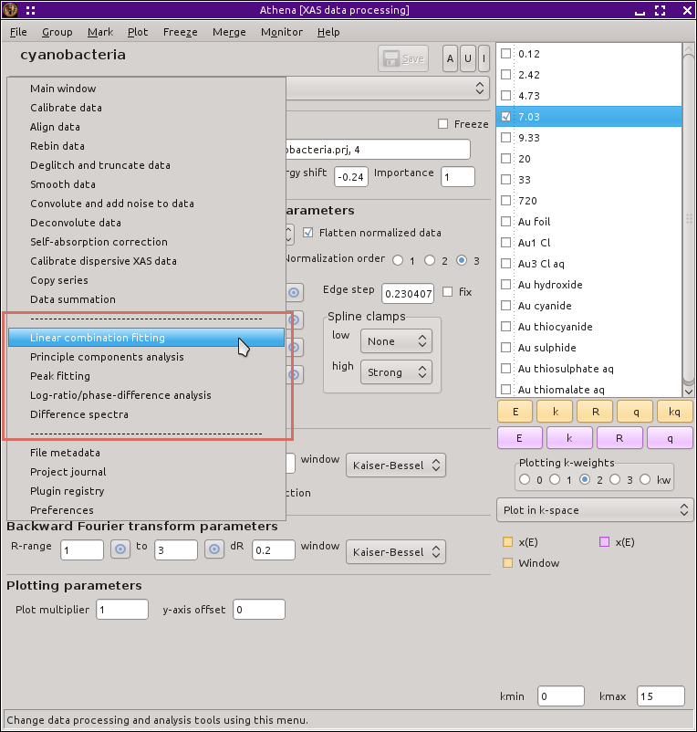

..
   Athena document is copyright 2016 Bruce Ravel and released under
   The Creative Commons Attribution-ShareAlike License
   http://creativecommons.org/licenses/by-sa/3.0/

Data analysis
=============

:demeter:`athena` provides various kinds of data analysis. None of the
data analysis capabilities in :demeter:`athena` require the use of
:demeter:`feff`. Analysis of data using :demeter:`feff` is a huge
topic and is the purpose of the :demeter:`artemis` program. The data
analysis techniques included in :demeter:`athena` are all purely
empirical. While there is no substitute for careful, sophisticated
analysis of EXAFS data using theory from :demeter:`feff`, often the
empirical techniques described in this chapter are adequate to answer
the questions you have about your data.

:demeter:`athena`'s analysis tools are accessed from the analysis
section of the main menu, as shown below.

.. _fig-analysis:

   The data analysis tools in the main menu.

----------------

.. toctree::
   :maxdepth: 2

   lcf
   pca
   peak
   lr
   diff
