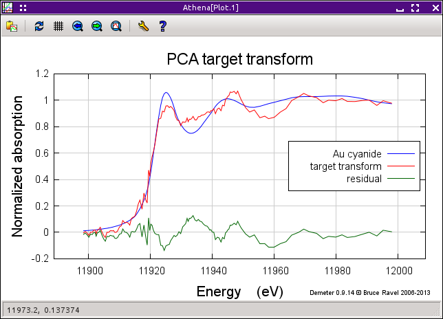

Principle component analysis
============================

Abstract decomposition of a data sequence
-----------------------------------------

|To do!| Document all the buttons and whatnot. Explain what useful
features are still missing. Explain what PCA means, what it does, and
what it does not do.

Here, I have imported a project file containing well-processed data on a
time series of samples in which gold chloride is being reduced to gold
metal. The project file includes 8 time steps and 9 standards. I cannot
stress strongly enough the importance of doing a good job of aligning
and normalizing your data before embarking on PCA. This is truly a case
of garbage-in/garbage-out.

I then select the PCA tool from the main menu.

.. figure:: ../images/pca.png
   :target: ../images/pca.png
   :width: 65%
   :align: center

   The PCA tool.

The operational concept for the PCA tool makes use of the standard
Athena group selection tools. The ensemble of marked groups are used as
the data on which the PCA will be performed. The selected group (i.e.
the one highlighted in the group list) can be either reconstructed or
target transformed. The relevant controls will be enabled or disabled
depending on whether the selected group is marked (and therefore one of
the data sets in the PCA) or not (and therefore a subject for target
transformation).

Clicking the “Perform PCA” button will perform normalization on all the
data as needed, then perform the components analysis. Upon completion,
some results are printed to the text box and several buttons become
enabled.

After the PCA completes, a plot is made of the extracted components.
This plot can be recovered by clicking the “Components” button under the
“Plots” heading. The number spinner is used to restrict which components
are plotted. Because the first component is often so much bigger than
the rest, it is often useful to set that number to 2, in which case the
first (and largest) component is left off the plot.

Other plotting options include a plot of the data stack, as interpolated
into the analysis range, a scree plot (i.e. the eigenvalues of the PCA)
or its log, and the cumulative variance (i.e. the running sum of the
eigenvalues, divided by the size of the eigenvector space). The cluster
analysis plot is not yet implemented.

Once the PCA has been performed, you can reconstruct your data using 1
or more of the principle components. Here, for example, is the
reconstruction of an intermeidate time point using the top 3 components.

.. subfigstart::

.. _pca_components:
   
.. figure:: ../images/pca_components.png
   :target: ../images/pca_components.png
   :width: 100%

.. _pca_recon:
   
.. figure:: ../images/pca_recon.png
   :target: ../images/pca_recon.png
   :width: 100%

.. subfigend::
   :width: 0.4
   :label: pca

   (Left) The principle components of this data ensemble. (Right) PCA
   reconstruction

Selecting one of the standards in the group list enables the target
transform button. Clicking it shows the result of the transform and
displays the coefficients of the transform in the smaller text box.

.. figure:: ../images/pca_tt.png
   :target: ../images/pca_tt.png
   :width: 65%
   :align: center

Performing a target transform against a data standard

.. figure:: ../images/pca_recon.png
   :target: ../images/pca_recon.png
   :width: 65%
   :align: center

(Left) A successful target transform on Au foil. Au foil is certainly a
constituent of the data ensemble used in the PCA. (Right) A unsuccessful
target transform on Au cyanide. Au cyanide is certainly not a
constituent of the data ensemble used in the PCA.

The list of chores still undone for the PCA tool can be found at `my
Github
site <https://github.com/bruceravel/demeter/blob/master/todo.org>`__.

.. |image5| image:: ../../images/pca_tt.png
.. |image6| image:: ../../images/pca_tt_good.png
   :target: ../../images/pca_tt_good.png

