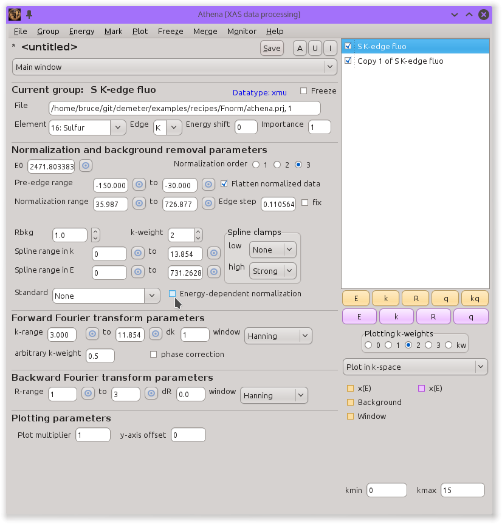

..
   Athena document is copyright 2016 Bruce Ravel and released under
   The Creative Commons Attribution-ShareAlike License
   http://creativecommons.org/licenses/by-sa/3.0/

.. _ednorm_sec:

Energy-dependent normalization
==============================

When measuring fluorescence data at low energy, the data might have an
unusual overall shape as shown in the S K-edge data in the figure below.
This behavior is due to the energy dependence of the signal on the
gas-filled I\ :sub:`0` chamber.

As the energy of the incident beam increases, the absorption of the
gasses in I\ :sub:`0` significantly decreases. Since the fluorescence
signal if I\ :sub:`f`/I\ :sub:`0`, the |mu| (E) grows with energy. Since
the edge-step normalization of the data is made by dividing out a
constant edge-step value, the energy-dependence of I\ :sub:`0` results
in a |chi| (k) signal that is somewhat amplified.

.. subfigstart::

.. _fig-bkgsmu:

.. figure::  ../../_images/bkg_s_mu.png
    :target: ../_images/bkg_s_mu.png
    :width: 100%

    Sulfur K edge spectrum measured in fluorescence.

.. _fig-bkgschi:

.. figure::  ../../_images/bkg_s_chi.png
    :target: ../_images/bkg_s_chi.png
    :width: 100%

    The blue trace is the |chi| (k) data extracted directly from the
    |mu| (E) data to the right. The red trace is the same data, but
    with the energy-dependent normalization applied.

.. subfigend::
    :width: 0.45
    :label: _fig-bkgs

This amplification effect can be approximately corrected by an
energy-dependent normalization. This is implemented using the pre- and
post-edge lines. A function is computed as the difference between the
post-edge and pre-edge lines. This difference function, which will be
positive definite so long as the pre- and post-edge lines are
well-behaved, is multiplied by |mu| (E) before performing the background
removal.

The resulting corrected |chi| (k) is shown as the red trace in the right-hand
figure above. The correction is small, but might contribute to the
accuracy of an EXAFS analysis.

.. caution::
   This sort of correction is only valid for low-energy EXAFS data
   measured in fluorescence. Using this tool incorrectly can damage
   your |chi| (k) data in a way that is difficult to understand after the
   fact.  Also, using this tool with poorly chosen pre- or post-edge
   lines will damage the data. It is up to **you** to be sure those
   lines are chosen sensibly.

The control for this energy-dependent normalization is the checkbutton
near the bottom of the background removal section of controls, as seen
in the following screenshot.

.. _fig-bkg_ednorm:

   S K-edge EXAFS data measured in fluorescence. Note that the control
   for turning on the energy-dependent normalization is enabled.

This control is normally disabled. To enable it, you must toggle on the
:configparam:`athena,show\_funnorm` `configuration
parameter <../other/prefs.html>`__. If you import a project file which
has one or more groups using the energy-dependent normalization, then
the control will be turned on automatically.

.. caution:: Enabling this feature makes project files for both
   :demeter:`athena` and :demeter:`artemis` incompatible with versions
   before 0.9.23. If you want to use this feature and share your
   project files with others who are using older version of the
   software, they will not be able to import your project files.

.. caution:: Another word of caution about using this feature of
   :demeter:`athena`.  When you make a plot in energy, the function
   that gets plotted is μ(E) and it's background, **not** the
   corrected μ(E) and *it's* background.  However, |chi| (k), |chi|
   (R), and |chi| (q) are made from the corrected |mu| (E). It is
   possible, paticularly for especially noisy data, that the
   background removal displayed for the raw μ(E) will be substantively
   different from the background calculated for the corrected
   μ(E). Thus it is possible that a plot in energy might look
   sensible, but the plot in k will be garbage. Or vice-versa. Again,
   use this feature of :demeter:`athena` with caution and
   foreknowledge.
