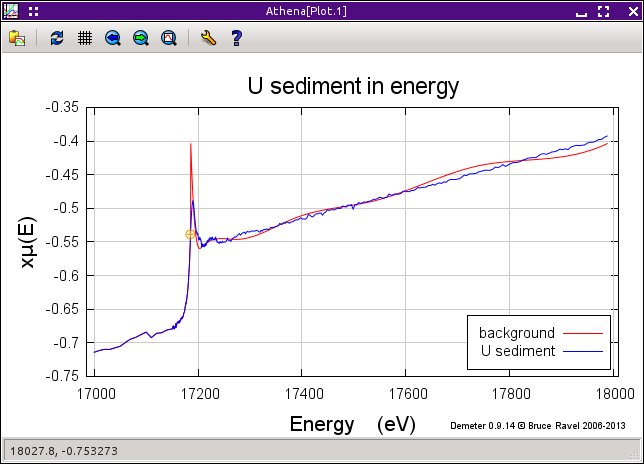

Spline clamps and k-weight in background removal
================================================

--------------

 

Spline clamps
-------------

One of the shortcomings of the use of piece-wise splines to approximate
the background function is that the ends of spline are somewhat
ill-defined by virtue of not having more data preceding or following. At
times, this can result in the end of the spline splaying up or down,
away from the μ(E) data. This results in significant distortion to χ(k)
data.

IFEFFIT provides a tool called *spline clamps*. These work by adding an
additional term to the χ² metric used to fit the spline to the μ(E)
data. The difference between the spline and the data is computed for the
first and last five data points. This sum of differences computed in
energy is multiplied by a user-chosen scaling factor and added to the χ²
computed from the R-range below «rbkg». This has the effect of
“clamping” the spline to the ends of the data range. In other words, we
use the prior knowledge that μ₀(E) is a smooth function through the
oscillatory structure of μ(E) to put a restraint on the fit used to
determine μ₀(E).

The user-selected multiplicative coefficient takes one of six predefined
values: “none”, “slight”, “weak”, “medium”, “strong”, or “rigid”. These
have values of 0, 3, 6, 12, 24, and 96, respectively and serve to set
the strength of the clamp in the evaluation of χ².

|  
| |image1|   |foo|

(Left) EuTiO\ :sub:`3` Ti K-edge data with the background subtracted
using a «k-weight» of 1 and a high-end spline clamp of “none”. Note that
the end of the spline deviates significantly from the end of the data.
(Right) Comparing the effects of different values of the high-end spline
clamp on the EuTiO\ :sub:`3` data with all other parameters equal. The
data using the “rigid” clamp show the most physically reasonable
behavior at the end of the data range.

The default value of the clamp is “none” at the low end of the energy
range and “strong” at the high end. Clamps tend not to help at the low
energy end of the data. Since the μ(E) data is changing so quickly near
the edge, biasing the spline to follow the data closely rarely helps
improve the quality of the χ(k) data. A strong clamp at the high energy
frequently improves the behavior of the spline near the end of the data.

The behavior of the clamping mechanism can be configured using the
`preference tool <../other/prefs.html>`__. The ♦Bkg → nclamp preference
changes the number of points at the end of the data range included in
the calculation of the effect of the clamp. The ♦Bkg → clamp1 and
♦Bkg → clamp2 parameters set the strengths of the two clamps. The
strengths of the clamps can be fine tuned by changing the numeric
values. The parameter ♦Clamp → weak sets the the weak clamp value, and
so on.

--------------

 

The effect of k-weight on background removal
--------------------------------------------

The background removal section has its own «k-weight» parameter which is
distinct from the k-weight used for `plotting and Fourier
transforms <../ui/kweight.html>`__. The background removal «k-weight» is
the value used to evaluate the Fourier transform performed to determine
the background spline. By varying the value of this «k-weight», you can
emphasize the lower or upper end of the data in the determination of the
background.

For clean data with oscillatory structure at high energy that is small
but observable, you may find that a larger value of the background
removal «k-weight» produces a better χ(k) spectrum. In fact, setting
this parameter to 2 or 3 can have a similar impact on the data as the
highest value of the spline clamp shown in the image above.

However, in data which are quite noisy, amplifying the noise by a large
value of «k-weight» can have a dramatic effect leading to a very poor
evaluation of μ₀(E). Indeed, the μ₀(E) evaluated from noisy data with a
large value of «k-weight» will sometimes oscillate wildly, as shown in
the example below.

|image3|

Noisy data with μ₀(E) computed using the default «k-weight» of 2. With a
«k-weight» of 1, the data are still noisy (of course!) but the
background function properly follows the data.

--------------

 

The interaction between spline clamps and k-weight
--------------------------------------------------

The spline clamp and «k-weight» parameters sometimes interact strongly.
The criterion that μ₀(E) follow closely to the end of the data that is
imposed by the spline clamp can have a surprising effect on noisy,
heavily k-weighted data. This is what happened in the data shown in the
previous section. Reducing the strength of the spline clamp can
sometimes help.

|image4|

The same noisy data as in the last figure, also with a background
«k-weight» of 2. However, this time the high-end spline clamp was set to
“none”.

Sometimes your data are well served by a low «k-weight» and a strong
spline clamp. Other times, a large «k-weight» and a weak clamp work
better. Still other times, a strong «k-weight» *and* a strong clamp work
best. How do you know what to do? There are no hard and fast rules,
although you will develop an intuition for how different data will
respond to different parameter values. Don't be shy about trying
different combinations.

| 

--------------

--------------

| DEMETER is copyright © 2009-2015 Bruce Ravel — This document is
copyright © 2015 Bruce Ravel

|image5|    

| This document is licensed under `The Creative Commons
Attribution-ShareAlike
License <http://creativecommons.org/licenses/by-sa/3.0/>`__.
|  If DEMETER and this document are useful to you, please consider
`supporting The Creative
Commons <http://creativecommons.org/support/>`__.

.. |[Athena logo]| image:: ../../images/pallas_athene_thumb.jpg
   :target: ../pallas.html
.. |image1| image:: ../../images/clamp_mu.png
   :target: ../../images/clamp_mu.png
.. |foo| image:: ../../images/clamp_chi.png
   :target: ../../images/clamp_chi.png

.. |image4| image:: ../../images/bkg_badkw_clamp0.png
.. |image5| image:: ../../images/somerights20.png
   :target: http://creativecommons.org/licenses/by-sa/3.0/
