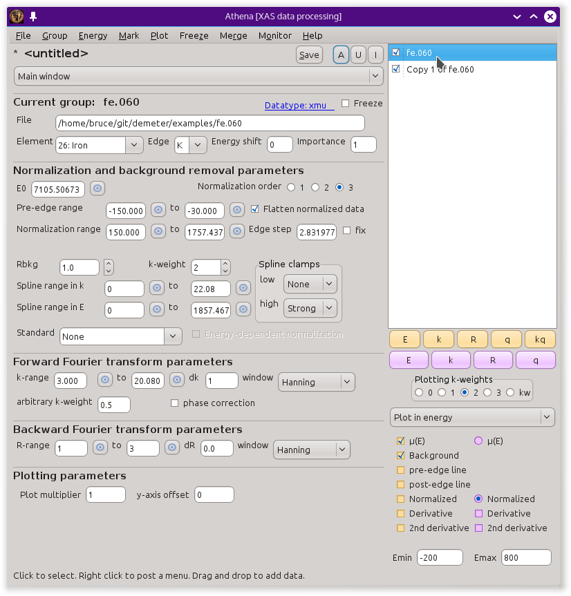
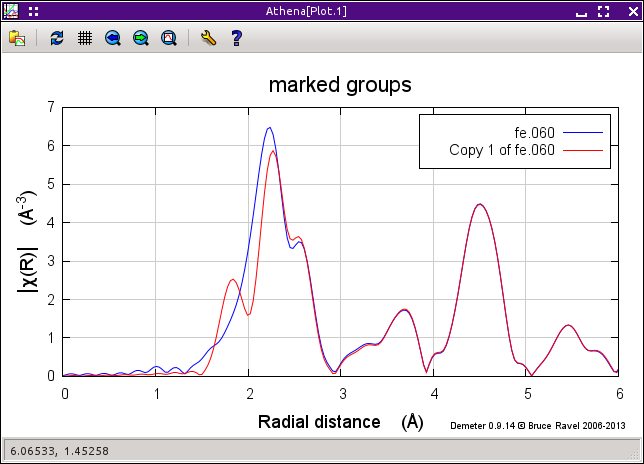

The Autobk Algorithm and the Rbkg Parameter
===========================================

Understanding the most important background removal parameter
-------------------------------------------------------------

The frequency cutoff between the background and the data discussed in
the previous section is determined by the «rbkg» parameter. This is the
second parameter displayed in the background removal section of the main
window.

When data are imported into ATHENA, «rbkg» is set to its `default
value <../params/defaults.html>`__, normally 1.

This example, like many of the examples in this Users' Guide, can be
found at `among the examples at my XAS-Education
site <http://bruceravel.github.io/XAS-Education/>`__.

Among these example files is one called fe.060, which contains a
spectrum from an iron foil measured at 60 K. Import this by selecting
Open file from the File menu or by pressing Control-o. Navigate to the
location of your example files and select fe.060. The `column selection
dialog <../import/columns.html>`__ then appears. For now, just click OK.

The data is imported and «rbkg» is set to its default value of 1. The
data and the background function found using the default parameter
values can be found by pressing the E button. This is shown here on the
left.

|  
| |image1|   |foo|
| |image3|   

(Right) The fe.060 data and its default background function. (Left) The
fe.060 χ(k) data with its default background function. (Bottom) The
fe.060 χ(R) data with its default background function.

The background function is subtracted from the data and normalized,
resulting in a χ(k) function. Press the k button to see χ(k), shown in
the right panel above.

When you press the R button, the Fourier transform is plotted, as in the
bottom panel above.

So «rbkg» is the value below which the AUTOBK algorithm removes Fourier
components. As you can see, below 1 the χ(R) function is essentially 0,
but above 1 the spectrum is non-zero.

Now let's examine the effect of choosing different values for «rbkg».
First, make a copy of the data so we can directly compare different
values. Do that by selecting “Copy current group” from the Group menu or
by pressing Shift-y. ATHENA now looks like this.

|image4|

ATHENA with the original fe.060 data and a copy of that data.

Click on the group *Copy of fe.060* to display its parameters in the
main window. Change «rbkg» to 0.2. Now we want to directly compare these
two ways of removing the background. The way of plotting multiple items
in the groups list involves the row of purple plotting buttons and the
little check buttons next to the items in the group list. Click on the
little check buttons next to *fe.060* and *Copy 1 of fe.060*, as shown
in the screenshot above. Now plot these two items by clicking the R
button. It should look something like this.

|  
| |image5|   |foo|
| |image7|   

(Left) Comparing χ(R) for the data and its copy with «rbkg» values of 1
and 0.2. (Right) Comparing χ(k) for the data and its copy with «rbkg»
values of 1 and 0.2. (Bottom) μ(E) and the background for the copy with
an «rbkg» value 0.2.

I suspect the blue spectrum is something like what you expect EXAFS data
to look like, while the red one seems somehow worse. In fact, it is easy
to understand why the red one looks the way it does. The «rbkg»
parameter specifies the R value below which the data is removed from the
μ(E) spectrum. That is exactly what has happened in the red spectrum --
below 0.2 the signal is very small and the first big peak is, in fact,
above 0.2.

Those two, plotted as χ(k), are shown above on the right.

The blue spectrum oscillates around the zero axis, as one would expect.
The red one has an obvious, long-wavelength oscillation. It is that
oscillation that gives rise to the low-R peak in the χ(R) spectrum.

The background function, computed using 0.2 as the value of «rbkg» and
plotted in energy, is shown above in the bottom panel.

Using an «rbkg» value of 0.2 yields a background function that is not
able to follow the actual shape of the data.

What happens if the value of «rbkg» is set to a very large value? The
χ(R) data for the values 1 and 2.5 are shown here.

|  
| |image8|   |foo|

(Right) Comparing χ(R) for the data and its copy with «rbkg» values of 1
and 2.5. (Left) μ(E) and the background for the copy with an «rbkg»
value 2.5.

Using a very large value of «rbkg» results in significant change to the
first peak in χ(R). We can see why by looking at the background function
in energy . With such a large value of «rbkg», the background function
has enough freedom to oscillate with frequencies that resemble the data.
This results in a reduction of intensity under the first peak.

The spline used to compute the background function has a limited amount
of freedom to oscillate. The number of spline knots is determined by the
Nyquist criterion. This number is proportional to the extent of the data
in k-space multiplied by «rbkg». These knots are spaced evenly in
wavenumber. Thus the spline function can only have frequency components
below «rbkg».

So where does that leave us? We want to make «rbkg» as big as possible
so that the low-R peaks are as well suppressed as possible. On the other
hand, too large of a value will result in damage to the data. The trick
is to find a balance.

A good rule of thumb is that «rbkg» should be about half the distance to
the nearest neighbor. But that is only a rule of thumb. Real data can be
really difficult. Noisy data, data with strong white lines, data
truncated by the appearance of another edge -- all of these require
careful consideration. While «rbkg» is the primary background removal
parameter, several others should be investigated to yield a good
background removal. Several of these are the subjects of the following
sections.

| 

--------------

--------------

| DEMETER is copyright © 2009-2015 Bruce Ravel — This document is
copyright © 2015 Bruce Ravel

|image10|    

| This document is licensed under `The Creative Commons
Attribution-ShareAlike
License <http://creativecommons.org/licenses/by-sa/3.0/>`__.
|  If DEMETER and this document are useful to you, please consider
`supporting The Creative
Commons <http://creativecommons.org/support/>`__.

.. |[Athena logo]| image:: ../../images/pallas_athene_thumb.jpg
   :target: ../pallas.html
.. |image1| image:: ../../images/rbkg_initial.png
   :target: ../../images/rbkg_initial.png
.. |foo| image:: ../../images/rbkg_initial_k.png
   :target: ../../images/rbkg_initial_k.png
.. |image3| image:: ../../images/rbkg_initial_r.png
   :target: ../../images/rbkg_initial_r.png

.. |image5| image:: ../../images/rbkg_1_0_2.png
   :target: ../../images/rbkg_1_0_2.png
.. |foo| image:: ../../images/rbkg_1_0_2k.png
   :target: ../../images/rbkg_1_0_2k.png
.. |image7| image:: ../../images/rbkg_0_2e.png
   :target: ../../images/rbkg_0_2e.png

.. |foo| image:: ../../images/rbkg_2_5e.png
   :target: ../../images/rbkg_2_5e.png
.. |image10| image:: ../../images/somerights20.png
   :target: http://creativecommons.org/licenses/by-sa/3.0/
