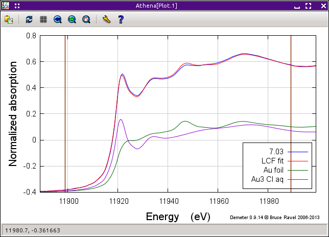
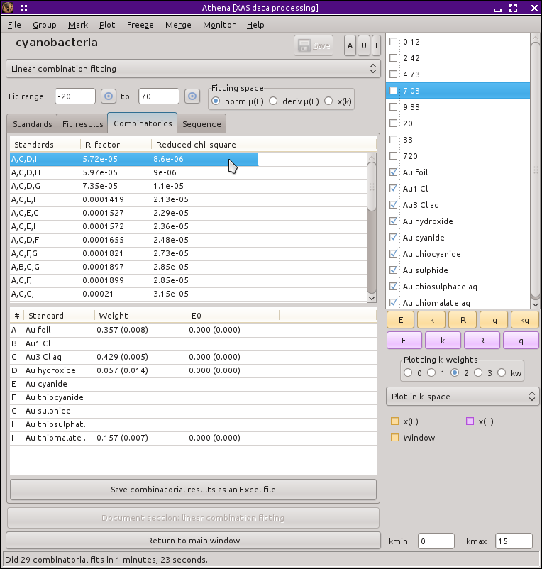
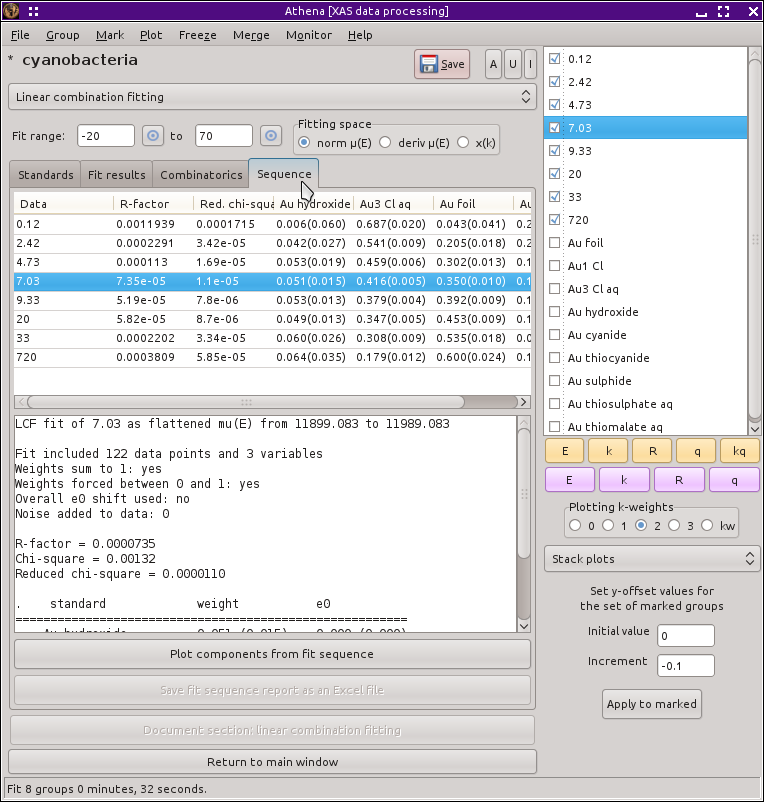

Linear combination analysis
===========================

Using XANES data and LCF to study system kinetics
-------------------------------------------------

This section outlines the linear combination fitting analysis of an
experiment to study the kinetics of the reduction of aqueous
Au\ :sup:`3+` chloride to metallic gold. The experiment is described and
these data are presented in

   .. bibliography:: ../athena.bib
      :filter: author % "Lengke"
      :list: bullet

The experiment probed the mechanism of bioaccumulation of gold by the
interaction of a model cyanobacterium (Plectonema boryanum UTEX 485)
with aqueous Au\ :sup:`3+` chloride. This resembles a common subsurface
environment associated with gold deposits in various locations around
the world. In those environments, Au\ :sup:`3+` chloride bearing fluids
rise from the deep subsurface and wash over bacterial mats. The bacteria
die but their remains interact chemically, reducing metallic gold from
the fluid.

In our experiment, a culture of P. boryanum was sampled and placed in a
Teflon fluid cell appropriate for an XAS measurement. An aliquot of
Au\ :sup:`3+` chloride solution was titrated into the fluid cell and we
exited the hutch as quickly as possible. Overnight, we measured XAS
scans continuously. In the morning we set the sample aside, remeasuring
it every few hours until the end of the experiment. Finally we measured
a similar sample that had been prepared a week earlier. in this way, we
had a time sequence tracking the nearly complete reduction of
Au\ :sup:`3+` chloride to some form of colloidal gold. (The gold is
known to be colloidal from TEM measurements, we could not distinguish
colloidal and bulk gold in our XAS measurements.)

A project file conatining all the data shown here can be found at `my
Github
site <https://github.com/bruceravel/XAS-Education/tree/master/Examples/Au%2BCyanobacteria>`__.

Examining the data
------------------

Import the :demeter:`athena` project file containing the gold standards and
gold/cyanobacteria data. You will see that it contains a subset of the
reduction sequence, including data data from 0.12 hours through 1 week.
Below the cyanobacteria data are several gold standards.

Note that these data have all been carefully calibrated, aligned, and
merged. Each measurement was made using a gold foil as an `alignment
reference <../import/ref.html>`__.

The figure below shows the sequence of data measured on the
cyanobacteria on the left and a variety of gold standards on the right.
The plot on the left also shows the starting material, aqueous
Au\ :sup:`3+` chloride, and the end product, metallic gold. The data
clearly show the transformation over time between these two end members.
In particular, note the reduction of the white line intensity at about
11921.5 eV and the growth of the peak at about 11946.7 eV which is
characteristic of the metallic gold spectrum.

.. subfigstart::

.. _fig-aucldata:

.. figure::  ../../_images/ex_aucl_data.png
   :target: ../_images/ex_aucl_data.png
   :width: 100%

.. _fig-auclstandards:

.. figure::  ../../_images/ex_aucl_standards.png
   :target: ../_images/ex_aucl_standards.png
   :width: 100%

.. subfigend::
   :width: 0.45
   :label: _fig-aucllcf

   (Left) The sequence of measurements from 0.12 through 720
   hours. The top-most trace shows the starting material, aqueous Au\
   :sup:`3+` chloride. The bottom trace shows the end product,
   metallic gold. (Right) All of the standards contained in the
   project file.

The purpose of this experiment is two-fold. One goal is to determine the
reaction kinetics of the reduction. To that end, we will assume that the
data are a linear combination of aqueous Au\ :sup:`3+` chloride and
metallic gold and measure their relative fractions as a function of
time. The second goal is to determine whether the reduction involves an
intermediate state and, if so, to identify that species. Our strategy to
answer that question will involve adding other standard compound to our
mixture of aqueous Au\ :sup:`3+` chloride and metallic gold to see if
the data are better described by a ternary rather than binary mixture of
standard materials.

To begin, select one of the time points in the group list. Most
figures in this section show the data measured at 7.03 hours. Next,
select :quoted:`Linear combination fit` from the main menu. This
replaces the main window with the linear combination fitting tool and
plots the data along with vertical lines indicating the extent of the
fitting range. From the first two drop-down menus, select :quoted:`Au
foil` and :quoted:`Au3 Cl aq`, as shown below.

.. _fig-lcfagain:

.. figure:: ../../_images/lcf.png
   :target: ../_images/lcf.png
   :width: 65%
   :align: center

   The linear combination fitting tool with the end member standard
   compounds selected for the initial fit.

In the operations list, click on :kbd:`Fit this group,light` to perform
the initial fit to these data. After the fit finishes, the result of
the fit, shown below is plotted. The tab labeled :quoted:`Fit results`
becomes active. Clicking on it, we see that the fit tells us that the
data are 51 |pm| 1 percent metallic gold. Given the quality of the fit, it
seems that we are well justified in our assumption that these data can
be modeled by a simple linear combination of the end members.

.. _fig-auclinit:

   The result of the initial fit to the 7.03 hour data using the end
   members as the fitting standards.

Improving the fit
-----------------

As nice as this quick and easy result is, it's not perfect. A close
examination of the plot above shows quite a bit of misfit throughout
the entire fitting range. (Note that you can examine the misfit by
clicking the :kbd:`Plot difference,light` button and replotting the data
by clicking :kbd:`Plot data + sum,light` in the operations list.) This
misfit suggests that our hypothesis of an intermediate state between
Au\ :sup:`3+` chloride and metallic gold may be valid.

As a first guess for what that intermediate state might be, I think
should be something without a strong white line. The fit in the region
of the white line is pretty good. Looking at the various standards on
the right side of the first figure on this page I suspect that the
sulfur ligated species, Au sulfide, Au thiosulfate, or Au thiomalate,
are likely candidates. To test one, we need to add it to the list of
fitting standards on the :quoted:`Standards spectra` tab and rerun the
fit. In the third row, select :quoted:`Au sulfide` from the drop-down
menu, then click :kbd:`Fit this group,light` from the operations list.

.. _fig-auclplussulfide:

.. figure:: ../../_images/ex_aucl_plussulfide.png
   :target: ../_images/ex_aucl_plussulfide.png
   :width: 45%
   :align: center

   The result of the fit to the 7.03 hour data using the end members along
   with gold sulfide.

This is a noticeably better fit. The amount of misfit throughout the
fitting range and especially in the peak at about 11946.7 eV is smaller.
Examining the results tab, we see that the amount of Au\ :sup:`3+`
chloride is about the same as before but that the metallic gold content
is only 34 |pm| 2 percent, with the sulfide taking up the remaining 18 |pm| 2
percent.

Understanding the fit
---------------------

The fit including the sulfide certainly looks better, but is it? The
results tab also reports some simple statistics from the fit. The
R-factor -- a measure of mean square sum of the misfit at each data
point -- was 0.000073 for the two-standard fit and shrank by a factor of
2 to 0.000035 for the three-standard fit. That confirms the observation
that the degree of misfit seems smaller in the plot of the
three-standard fit.

The reduced |chi|\ :sup:`2` of the fit also reduced by about a factor
of two, from 0.0000514 to 0.0000250, suggesting a substantive
improvement in the fit quality. Those are strange numbers, though. Any
textbook on scientific statistics will tell us that a good fit using a
non-linear, least-squares minimization (such as that used by
:demeter:`ifeffit` and :demeter:`athena`) should give 1 for a fit in
which the model is a good representation of the data. That is
certainly true, but supposes that you have a good determination of the
measurement uncertainty. We don't. In principle, the standard
deviation spectrum from the `merge of measured data
<../process/merge.html>`__ could be used as an approximation of the
measurement uncertainty, but that is not possible in this case. The
data at 7.03 hours are a single measurement from a time
sequence. There is nothing to merge because each measurement is a
solitary measurement.  Consequently, :demeter:`athena` has to use 1 as
the value of the measurement uncertainty. That is grossly in excess of
the true measurement uncertainty, resulting in very small values for
|chi|\ :sup:`2`.

We cannot, therefore, assert that any particular fit is a good fit
simply by invoking what we know about Gaussian statistics. We can,
however, compare successive fits, such as the two we have made thus
far.  An improvement of a factor of 2 in the value of reduced |chi|\
:sup:`2` is certainly significant. We can, with confidence, state that
there is an intermediate component on the basis of the analysis
presented thus far.

But what is that intermediate. We have not yet proven its identity
(although gold sulfide is a strong contender!) because we have not yet
considered other options. There are two algorithmically distinct but
conceptually identical ways to attempt to solve this problem. One
involves the use of principle component analysis (a feature not yet
available in :demeter:`athena`) of the data followed by target
transform analysis to attempt to identify the third species from among
the standards. The approach discussed here involves using
combinatorial techniques to directly test a library of standards
against our data.

The mathematics of these two approaches is quite different. Since they
share one major limitation, they are practically equivalent ways of
identifying the intermediate state. The limitation is that both
approaches require that the intermediate species be represented by the
library of standards. If that unknown species is absent from the
library, neither technique is able to identify it.

Combinatorial analysis
----------------------

Testing each standard against the data sounds like an unbearably
boring process -- particularly since we may, in principle, want to
consider all possible binary, ternary, or higher combinations of
standards. The project file contains 9 standards. All possible
combinations of 2 or 3 standards from a pool of 9 results in 120
possibilities. Performing and recording the results from that many
fits sounds horrible. Fortunately, :demeter:`athena` knows how to
automate that chore.

First mark all of the standards and none of the cyanobacteria data. Then
click the :kbd:`Use marked groups,light` button. This will insert all of the
standards into the table.

By default, the table is only four rows long. You will need to exit
the linear combination fitting tool and open the `preference tool
<../other/prefs.html>`__. Set the
:configparam:`Linearcombo,maxspectra` preference to at least 9. Return
to the linear combination tool and load the 9 standards into the
table.

Click the :quoted:`Use at most` control down to three. At this point
you could click :kbd:`Fit all combinations,light` to begin fitting all
120 combinations of 2 and 3 standards. This is, however, a bit of a
waste of time. We **know** that there is metallic gold in these
data. The fifth column in the table of standards is labeled
:quoted:`req.`, which is short for *required*. Click the radiobutton
in the :quoted:`Au foil` row. This will cause the combinatorial
sequence to only consider combinations which include the metallic gold
standard. This reduces the number of binary and ternary combinations
to 36. Now click :kbd:`Fit all combinations,light` in the operations
list. This will take a while. It's a good time to get that cup of
coffee.

.. _fig-lcfcombo2:

   The results of the combinatorial fitting sequence, as displayed on the
   in the :quoted:`combinatorics` tab.

Once the sequence of fits finishes, :demeter:`athena` displays tables
containing the results of all of the fits in order of increasing
R-factor. The first column of the top table shows which standards were
included in the fits using the numbering scheme of the bottom
table. The other two columns show the R-factor and reduced |chi|\
:sup:`2` of each fit.

When you click on a row in the top table, the results of that fit are
inserted into the bottom table and the fit is plotted. When the
combinatorial sequence finishes, the best fit of the bunch is displayed.
It turns out the the combination of gold metal, aqueous Au\ :sup:`3+`
chloride, and gold sulfide that we examined above is, in fact, the best
fit. However, it is juts barely the best fit. The fit with gold
thiomalate in place of gold sulfide is just barely worse. From a
statistical perspective, the two fits are equivalent and the amounts of
metal and chloride in the fits are very similar. The gold thiosulfate
and gold thiocyanide fits are just a bit worse yet. A couple of other
fits show similar statistics but an investigation shows that the peak
around 11946.7 eV is not fit very well. After that, the other fits in
the table fall off quickly in quality.

The conclusion that one can comfortably draw from this is that the
intermediate species is some sort of gold-sulfur complex. The aqueous
gold sulfide standard gave the best result by a hair, but the other
three species with a gold-sulfur ligand were statistically similar. To
model the kinetics in this system, I will use the sulfide species, but
it is probably not correct to say that the intermediate species is
aqueous gold sulfide. Rather it is some gold-sulfur complex formed when
the cyanobacteria bacteria cells lyse upon exposure to the Au\ :sup:`3+`
chloride solution.

Analyzing the data series
-------------------------

To investigate the kinetics of this system, we will now apply the
model consisting of three species -- metal, chloride, and sulfide --
to the cyanobacteria measured at each time step. Click on the top line
of the upper table. This will plot the result for our best fit. It
will also insert those three standards into the table on the
:quoted:`Standards spectra` tab. Click on that tab, then mark all the
cyanobacteria data groups and unmark all of the standards in the group
list. Now click on :kbd:`Fit marked groups,light` in the operations
list. This will step through the marked groups, applying the
three-standard fitting model to each one. Again, you may want to relax
as you wait.

.. _fig-auclsequence:

	
   A report on the results of fitting the marked groups. The report is
   written to a file that can be imported into a spreadsheet, like
   LibreOffice Calc shown here.

Once the sequence of fits finishes, you may want to click through the
data groups and examine the fits at the various time steps. Note that
the :kbd:`Marked fits report,light` option in the operations list
becomes active.  Clicking on this prompts you for a name for an output
file. This output file is a comma separated value text file which can
be easily imported into a spreadsheet, much like one of
:demeter:`athena`'s `report files <../output/report.html>`__. In this
figure we see that the metal content increases monotonically while the
chloride content decreases monotonically. The column with the sulfide
content is not seen in the image, but it remains roughly constant
throughout the experiment.

.. _fig-auclexcel:

.. figure:: ../../_images/ex_aucl_excel.png
   :target: ../_images/ex_aucl_excel.png
   :width: 75%
   :align: center

   A report on the results of fitting the marked groups. The report is
   written to a file that can be imported into a spreadsheet, like
   LibreOffice Calc shown here.

In this example, I have outlined the analysis performed in the paper
cited at the beginning of the chapter. We have, as we set out to do,
examined the reaction kinetics and tentatively identified an
intermediate species. Using automation built right into
:demeter:`athena` it was relatively easy to manage a large quantity of
data.
