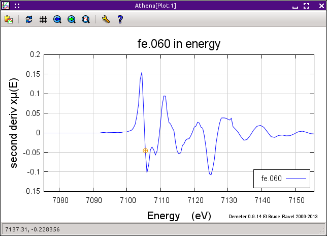
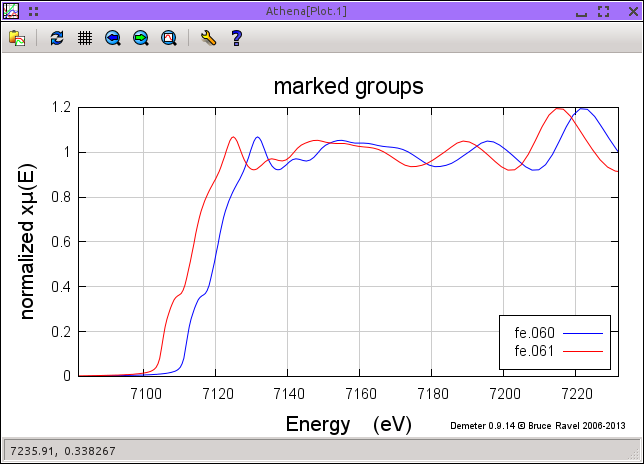
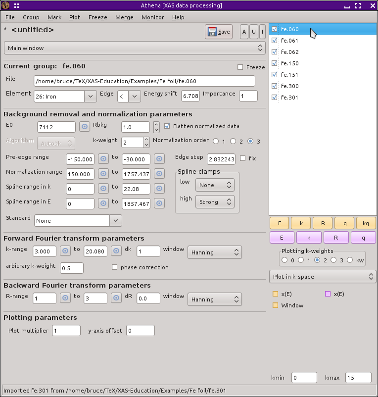

Basic data processing
=====================

This worked example will walk you through data import, demonstrate
calibration, alignment, and merging of data, and consider well chosen
parameter values for background removal and Fourier transform. This
example uses data collected on an iron foil at three temperatures.

The data used in this example can be found `at my Github
site <https://github.com/bruceravel/XAS-Education/tree/master/Examples/Fe%20foil>`__.
They include three scans on an iron foil measured at 60K, and two each
at 150K and 300K.

To begin, `import <../import/columns.html>`__ the first scan at 60K,
:file:`fe.060`. This is a relatively simple data file containing columns for
energy and the signals on the I0 and It detectors. Select columns to
form |mu| (E) data as shown in the image below.

.. _fig-fecol:

.. figure:: ../../_images/ex_data_col.png
   :target: ../_images/ex_data_col.png
   :width: 65%
   :align: center

   The column selection dialog with columns chosen correctly for the iron
   foil data.

When I collected these data, I purposefully miscalibrated the
monochromator so that I would have a data set for explaining the use of
:demeter:`athena`'s calibration tool. The first thing to do, then, is to correctly
calibrate these data.

Open the `calibration tool <../process/cal.html>`__ by selecting
:guilabel:`Calibrate energies` from the main menu. The derivative of
|mu| (E) for these data will be plotted, shown below on the left. The
choice of edge position, denoted by the little orange circle, is
reasonable in that it is close to the first peak of the first
derivative, as one expects. The monochromator calibration is obviously
wrong as the orange circle is at 7105.5 eV, while the tabulated value
for the iron K edge is 7112 eV.

.. subfigstart::

.. _fig-fedatacalib:

.. figure::  ../../_images/ex_data_calib.png
   :target: ../_images/ex_data_calib.png
   :width: 100%

   The iron foil data, as plotted in the calibration tool. 
   Derivative of |mu| (E). 

.. _fig-fedatasecond:

   Second derivative of |mu| (E).

.. subfigend::
   :width: 0.45
   :label: _fig-febegin

We want to select the peak of the first derivative and set that point
to 7112 eV. We can simply use the currently selected point -- it is
quite close to the peak. Alternately, we can click the :button:`Select
a point,light` button and try to click on the plot, selecting point even
closer to the peak.  To do that, it would be helpful to change the
value of emin and emax in the `energy plot tab <../plot/tabs.html>`__
the replot the data such that a tighter region around the peak is
displayed.

A third, highly accurate way of finding the exact peak of the first
derivative is to plot the second derivative of the data by selecting
:guilabel:`second deriv` from the :guilabel:`display` menu. The second
derivative of the data along with the currently selected value of edge
position are shown on the right of the figure above.

With the second derivative selected for display, the :button:`Find
zero-crossing,light` button becomes activated. clicking that button will
cause :demeter:`athena` to search in both directions for the nearest
energy value that hits the y=0 axis and select that as the new edge
position. The value should be about 7105.3 eV. Click the
:button:`Calibrate,light` button and return to the main window.

You will notice two things once the main window is displayed again:
the value of :procparam:`E0` is now 7112 and the value of the
:procparam:`eshift` parameter is now about 6.7. In :demeter:`athena`,
calibration works by simultaneously setting those two parameters such
that the selected point has the chosen energy value.

Now, import the second scan at 60K, :file:`fe.061`. `Mark <../ui/mark.html>`__
both groups by clicking on their little purple buttons and plot them in
energy by clicking on the :button:`E,purple` button.

.. subfigstart::

.. _fig-fedatamisaligned:

   Misaligned iron foil |mu| (E) data.

.. _fig-fedataalign:

.. figure::  ../../_images/ex_data_align.png
   :target: ../_images/ex_data_align.png
   :width: 100%

   The derivatives of the misaligned data, as plotted in the alignment
   tool.

.. _fig-fedatachik:

.. figure::  ../../_images/ex_data_chik.png
   :target: ../_images/ex_data_chik.png
   :width: 100%

   Aligned data plotted in k, but with :procparam:`E0` unconstrained.

.. _fig-fedataaligned:

.. figure::  ../../_images/ex_data_aligned.png
   :target: ../_images/ex_data_aligned.png
   :width: 100%

   Aligned data plotted in k after constraining :procparam:`E0`. Once
   aligned and constrained in :procparam:`E0`, these successive scans
   are quite consistent.

.. subfigend::
   :width: 0.45
   :label: _fig-fealign

The upper left of the image above shows that these data are not aligned.
Since they are successive scans on the same iron foil under the same
experimental conditions, we expect these data to be identical within
statistical noise. The reason that they are different is that the second
scan has not yet been calibrated.

Fixing this requires two steps. First, open the `alignment tool
<../process/align.html>`__ by selecting :guilabel:`Align scans` from
the main menu. The two scans are plotted as the derivative of |mu|
(E). The first scan in the list, :file:`fe.060`, is automatically selected
in the :guilabel:`Standard` menu. The second scan is highlighted in
the groups list and is displayed as the :guilabel:`Other`.

These are very clean data, so the automatic alignment algorithm should
work well. Click the :button:`Auto align,light` button. If you data is
noisy, the automated alignment might not work well, in which case you
can use the other buttons to adjust the energy shift until you are
satisfied that the data are well aligned.

Returning to the main window, we find that the :procparam:`eshift`
parameter for :file:`fe.061` is now about 6.7 eV. When plotted together in
energy, the data are well aligned. However when plotted together in
k-space by pressing the :button:`k,purple` button, there remains a
problem, as we see in the lower left of the figure above.

The :file:`fe.061` data have been aligned, but not calibrated. That is,
its :procparam:`E0` parameter has not been set to the same value as
for the :file:`fe.060` data.  Consequently, the position in the data where
k=0 is different for the two spectra and the |chi| (k) data from the
background removal are different.

To correct this, you can either enter the value for :procparam:`E0`
from :file:`fe.060` -- 7112 eV -- into the :procparam:`E0` text entry box
after clicking on :file:`fe.061` in the group list. Alternately, you can
select :file:`fe.060` in the group list, then right click on the
:procparam:`E0` parameter to raise its `context menu
<../params/constrain.html#constraining-individual-parameters>`__ and
select :guilabel:`Set all groups to this value of E0`. Once the
:procparam:`E0` parameters are set the same for these data sets, we
see above in the lower right that the data are quite consistent
between these two scans.

Now we need to import the remaining data measured on the iron foil.
Using the file selection dialog, select the remaining data files as
described in `the section on multiple file
import <../import/multiple.html>`__ and shown below.

.. _fig-datamany:

.. figure:: ../../_images/ex_data_many.png
   :target: ../_images/ex_data_many.png
   :width: 65%
   :align: center

   Importing the remaining iron foil data.

Clicking the :button:`Open button,light` will import all those data files
and list them in the group list. Once they are imported, `mark
<../ui/mark.html>`__ all of the groups either by typing
:button:`Alt`-:button:`a` or by clicking the :button:`A,light` mark button
above the group list. Finally select the :file:`fe.060` group by clicking
on it in the group list. Once you have done all of that,
:demeter:`athena` will look like this.

.. _fig-datamarked:

	
   All of the iron foil data have been imported and marked.

At this point, only :file:`fe.061` has been aligned to :file:`fe.060` and had
its value of :procparam:`E0` properly constrained. We need to do so
for the remaining data groups.

Processing all 5 of the remaining data groups would be quite tedious
if we had to handle each one individually. Fortunately
:demeter:`athena` has lots of tools to help process large quantities
of data. To `align <../process/align.html#align>`__ the remaining data
to :file:`fe.060`, choose :guilabel:`Align data` from the main
menu. :demeter:`athena` chooses the first item in the group list as
the data alignment standard and selects the second group as the one to
align. These selections are shown at the top of this.

Of course, :file:`fe.061` has already be aligned. If you select any other
group by clicking on it in the group list, you will see that it it is
not yet aligned. You can align the remaining groups by selecting each
on in turn and clicking the :button:`Auto align,light` button --- but that
seems tedious. Much better to click the :button:`Align marked groups,light`
button. Since all the groups are aligned, the automated alignment
algorithm will be applied to each one in turn.

.. _fit-dataalignmarked:

.. figure:: ../../_images/ex_data_alignmarked.png
   :target: ../_images/ex_data_alignmarked.png
   :width: 65%
   :align: center

   All of the iron foil data are marked and waiting to be aligned.

Once finished, you can click on groups to check on the quality of the
alignment. Since these are very good data, the automated alignment
should have worked well. Click on the :button:`Return to the main
window,light` button to continue with the data processing.

Each of the data groups has now been aligned, but only :file:`fe.061`
has the same value of :procparam:`E0` as :file:`fe.060`. Again,
clicking through the groups list and editing the :procparam:`E0`
values seems horribly tedious. Here we see the true value of the
:guilabel:`Set all groups to this value of E0` in the :procparam:`E0`
`context menu
<../params/constrain.html#constraining-individual-parameters>`__.

The |chi| (k) data for the aligned and constrained data are shown below.

.. _fig-dataallchik:

.. figure:: ../../_images/ex_data_allchik.png
   :target: ../_images/ex_data_allchik.png
   :width: 45%
   :align: center

   The |chi| (k) spectra for all the iron foil data.

There is another, perhaps quicker, way of doing everything that is
described above. To start, import the :file:`fe.060` data and calibrate it
as explained at the start of this section. Then use the file selection
dialog to select all of the remaining data. Click to the
:guilabel:`Preprocess` tab, select the :file:`fe.060` data as the
standard, then click the :guilabel:`Mark`, :guilabel:`Align`, and
:guilabel:`Set parameters` checkbuttons.

.. _fig-datapreproc:

.. figure:: ../../_images/ex_data_preproc.png
   :target: ../_images/ex_data_preproc.png
   :width: 65%
   :align: center
	
   Using the preprocessing features of the column selection dialog to align
   and constrain data on the fly as it is imported.

Now click the :button:`Open,light` button. As the remaining data are
imported, the alignment and :procparam:`E0` constraint will happen on
the fly and the new group will be marked. Once the file selection
dialog using these preprocessing features is finished,
:demeter:`athena` should look just like it did in the screenshot
above.

As a final chore in this section, we will `merge
<../process/merge.html>`__ the data measured at each temperature.
Since the data are properly aligned and calibrated, this is a fine
time to perform the merge. First mark each data group that should be
merged together. As we see in the screenshot below, the two groups
measured at 300K are marked. Select :menuselection:`Merge --> Merge
mu(E)`. This will perform the merge then insert a new group in the
group list. Then select :menuselection:`Group --> Rename current
group` or type :button:`Alt`-:button:`l` to give the merged group a more
suggestive name. Repeat this process for the data at each temperature.

Now you are ready to begin analysis on the iron foil data!

.. _fig-datamerge:

.. figure:: ../../_images/ex_data_merge.png
   :target: ../_images/ex_data_merge.png
   :width: 45%
   :align: center

   Merging the data at each temperature and renaming the merged groups.
