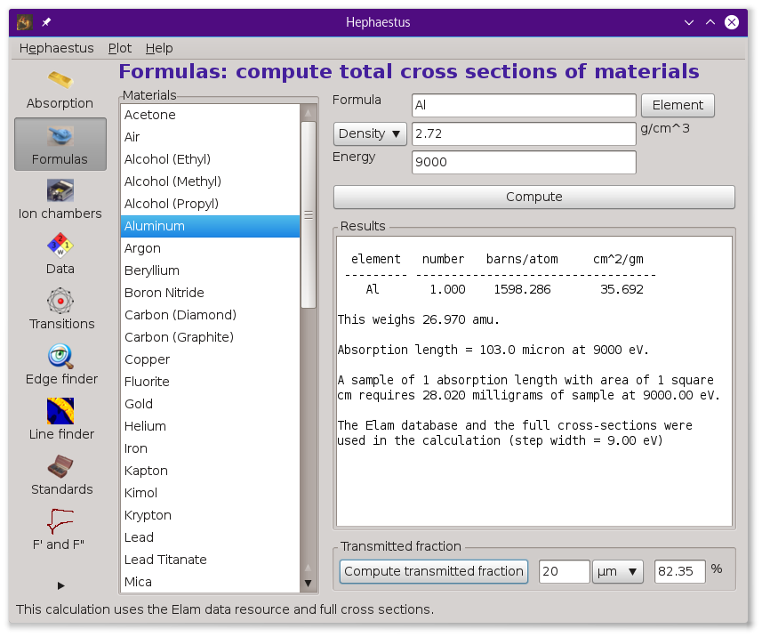
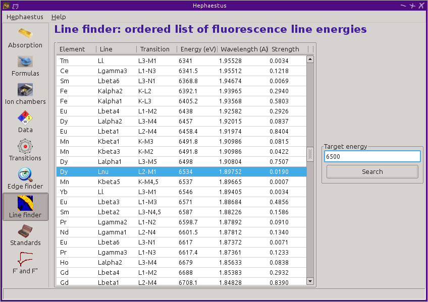

Hephaestus
==========

::

        In his workshop he has handmaidens he has forged out of gold
        who can move and who help him in his work. ...  With Athena,
        [Hephaestus is] important in the life of the city.  The two
        [are] the patrons of handicrafts, the arts which along with
        agriculture are the support of civilization.
                                     Mythology, Edith Hamilton

:demeter:`hephaestus` is a program for making calculations useful to the XAS
experimentalist using a periodic table, tables of X-ray absorption
coefficients, and other elemental data.

On the left of the :demeter:`hephaestus` window is a stack of icons which are used
to select the different tools. Clicking on one of the icons enables that
tool.

At the bottom of the :demeter:`hephaestus` window is a status bar which :demeter:`hephaestus`
uses to convey information during the course of operation. Along with
information about the most recently completed calculation, the status
bar shows topical information. As the mouse passes over an element in
the periodic table, the element name, symbol, and Z number are
displayed. In the Absorption tool, clicking on an edge or line energy
will display that energy in wavelength units in the status bar. In the
Standards tool, some information about the plotted data is displayed in
the status bar.

The :quoted:`Hephaestus` menu in the menu bar provides another way of
navigating between the tools. The mouse can be used, as can the
keyboard. :kbd:`Alt`-:kbd:`e` and :kbd:`Alt`-:kbd:`h` post the
:quoted:`Hephaestus` and :quoted:`Help` menus. :kbd:`Control`-:kbd:`1`
through :kbd:`Control`-:kbd:`9` change the display the various
tools. :kbd:`Control`-:kbd:`m` displays the document in a web browser,
while :kbd:`Control`-:kbd:`c` changes the display to the configuration
tool.

Absorption
----------

This is the start page for :demeter:`hephaestus` and is used to display information
about edge and line energies for the elements.

A periodic table is displayed atop three lists that will be filled in
with data associated with an element. Clicking on an element in the
periodic table displays data about that element.

The data table will be filled with some basic information about the
element, including its name and Z number, its atomic weight, and bulk
density under standard temperature and pressure. Beneath this table are
two controls for determining the appropriate Z-1 or Z-2 filter to use in
a fluorescence experiment. The :quoted:`Filter` text box will be filled with the
likeliest candidate for the element selected from the periodic table.
This can be edited by hand. Clicking the :quoted:`Plot filter` button will
display a plot showing the relative locations of the edge energy, the
dominant fluorescence lines, and the filter edge energy.

The :quoted:`edges` table shows the value in eV of each edge associated with the
element selected from the periodic table and the core-hole lifetime in
eV of each edge. Clicking on a line in this table will display a message
in the status bar giving the edge energy expressed in wavelength units
and the core-hole lifetime expressed in approximate time units. Double
clicking on a line will highlight all fluorescence lines associated with
that edge in the :quoted:`lines` table.

The :quoted:`lines` table shows the transitions and emission energies in eV of
every line associated with the element selected from the periodic table.
Also shown is the approximate strength, or branching ratio, of each
line. The strengths for all lines associated with a particular edge will
sum to 1. Clicking on a line in this table will display a message in the
status bar giving the emission energy expressed in wavelength units.

.. _fig-hephabsorption:

.. figure:: ../_images/Hephaestus_absorption.png
   :target: _images/Hephaestus_absorption.png
   :width: 65%
   :align: center

   The absorption tool.

Filters
~~~~~~~

The rules for the selection of the filter elements are:

#. For elements below Z=38, assume the K edge is being measured and use
   the Z-1 element.

#. For elements between Z=39 and Z=57, assume the K edge is being
   measured and use the Z-2 element.

#. Use Br for a Rb absorber because Kr is a silly filter material.

#. Use Rh for a Ru absorber because nobody wants a Tc filter!

#. Use I for a Ba absorber because Xe is also a silly filter material.

#. For elements above Z=57, assume the L3 edge is being measured. Use
   the first element whose K edge is more than 90 eV above the Lalpha1
   line of the absorber.

#. Use Rb for a U or Np absorber because Kr is still a silly filter
   material.

#. For elements below Z=24 (chromium), no filter choice is given.
   Filters for lower-Z elements are not used because no element exists
   with a K-edge between the line and absorption energies of the
   absorber.

.. _fig-hephfilterplot:
   
.. figure:: ../_images/Hephaestus_filterplot.png
   :target: _images/Hephaestus_filterplot.png
   :width: 45%
   :align: center

   A filter plot showing why manganese is a good choice for an iron
   absorber – it passes the fluorescence, which is below the Mn K edge, but
   preferentially absorbes the elastically scattered radiation.

Beamline customization
~~~~~~~~~~~~~~~~~~~~~~

When beamline customization is enabled, the two buttons labeled
:quoted:`Show K edges` and :quoted:`Show L edges` will be visible. These are
both toggle buttons. When pressed, they will disable all elements that
cannot be measured by that edge at the beamline.

.. _fig-hephbeamline:

.. figure:: ../_images/Hephaestus_beamline.png
   :target: _images/Hephaestus_beamline.png
   :width: 65%
   :align: center

   The absorption tool with beamline customization for the NSLS-II BMM
   (6BM) beamline showing the elements whose K edges can be measured at the
   beamline.

To enable beamline customization, set the
:configparam:`Hephaestus,enable\_beamline` `configuration parameter
<other/prefs.html>`__ to true.

You will want to set the :configparam:`Hephaestus,beamline\_name`
parameter to the name of your beamline. Keep it short – it needs to
fit on the button!  Finally, set the
:configparam:`Hephaestus,beamline\_emin` and
:configparam:`Hephaestus,beamline\_emax` parameters to the lower and
upper energy bounds of your beamline.

Formulas
--------

This tool is used to compute approximate absorption lengths for common
or user-specified materials. To the left is a list of materials commonly
found at synchrotron beamlines. Clicking one of those items inserts its
stoichiometric formula into the :quoted:`Formula` box and the density into the
:quoted:`Density` box.

At the top of the right hand part of this tool are controls for entering
the parameters of the absorption length calculation. The formula must be
a stoichiometric formula using a few simple rules.

#. Element symbols must be first letter capitalized.

#. White space is unimportant -- it will be removed from the string. So
   will dollar signs, underscores, and curly braces (in an attempt to
   handle TeX). Also a sequence like this: :quoted:`/sub 3/` will be converted
   to :quoted:`3` (in an attempt to handle INSPEC).

#. Numbers can be integers or floating point numbers. Things like 5,
   0.5, 12.87, and .5 are all acceptable, as is exponential notation
   like 1e-2. Note that exponential notation must use a leading number
   to avoid confusion with element symbols. That is, 1e-2 is OK, but e-2
   is not.

#. Uncapitalized symbols or unrecognized symbols will flag an error.

#. An error will be flagged if the number of open parentheses is
   different from the number of close parentheses.

#. An error will be flagged if any unusual symbols are found in the
   string.

The density is entered in units of specific gravity or grams per cubic
centimeter. Alternately, units of molarity can be used by selecting that
from the choice menu.

Finally, an energy in eV is required at which to make the calculation.

.. _fig-hephformulas:

   The formulas tool.

Here is an example of the results printed for BN, with a specific
gravity of 2.29 and at energy of 7800 eV:

::

          element   number   barns/atom     cm^2/gm
         --------- ----------------------------------
            B        1.000  30.084        1.676
            N        1.000     123.417        5.306
        
        This weighs 24.819 amu.
        
        Absorption length = 0.077 cm at 7800 eV.
        
        A sample of 1 absorption length with area of 1 square
        cm requires 175.278 milligrams of sample at 7800.00 eV.
        
        The Elam database and the full cross-sections were
        used in the calculation.

This reports on an important physical parameter, the
:quoted:`absorption length`. This is defined as the length of sample
over which the intensity of the incident beam will be attenuated by
1/e, or about 63%, at the specified energy. Note that absorption
length is an energy dependent parameter and that it changes
significantly across an absorption edge.

Here we see that 9000 eV photons will be e-fold attenuated in just over
1 millimeter of packed BN. To make a sample with an area of 1 square
centimeter facing the beam and which has an absorption length of 1, one
must weigh out about 175 milligrams of BN. In practice, this is quite a
lot of BN and will make a rather thick pellet. One might weigh out a
fraction of the 175 milligrams for a real sample, giving the matrix that
much less than 1 absorption length.

As another example, here is the calculation on cobalt ferrite, CoFe2O4,
which has a specific gravity of about 5. Computing the cross section at
7800 eV will trigger a calculation of the sample depth corresponding to
a unit edge step at the Co K edge. This additional calculation is
triggered because the calculation energy, 7800 eV, is within 100 eV of
the Co K edge energy of 7709 eV.

::

          element   number   barns/atom     cm^2/gm
         --------- ----------------------------------
            Co       1.000   33808.991      345.519
            Fe       2.000   30183.487      325.464
            O        4.000     333.532       12.553
        
        This weighs 234.633 amu.
        
        Absorption length = 8.2 micron at 7800 eV.
        
        A sample of 1 absorption length with area of 1 square
        cm requires 4.079 milligrams of sample at 7800.00 eV.
        
        Unit edge step length at Co K edge (7709.0 eV) is 28.3
        microns
        
        The Elam database and the full cross-sections were
        used in the calculation.

Here we introduce a second important physical parameter, the
:quoted:`unit edge step length`. This is defined as the length over
which the total absorption will change by a factor of 1/e as the
incident beam energy is scanned over the absorption edge. To say that
another way, the absorption will be e-fold greater just above the edge
than just below the edge. With that length of sample, the edge step of
a transmission XAS scan will be 1.

Suppose you wanted to mix some cobalt ferrite with 35 milligrams (i.e.
an amount that will contribute 0.2 to the total absorption of the
sample) of boron nitride measured above in order to make a good
transmission XAS sample. That amount of BN contributes 0.2 absorption
lengths to the total thickness of the sample at this energy. Weighing
out 4 milligrams of ferrite, then, gives the sample a total absorption
of 1.2. That is, the beam passing through the sample will attenuate to
the level of exp(-1.2), or about 30%, of the intensity of the incident
beam.

Note that this sample has more Fe than Co and that the calculation
energy is above the Fe K edge energy. The Fe part of the sample is
rather absorbing at this energy. As a result, a relatively small mass of
sample constitutes an absorption length.

The 4 milligrams of sample required for one absorption length is
distributed over 8.2 microns. The unit edge step calculation tells us
that the edge step will be one with 28.3 microns of sample. Thus, the
sample with one absorption length of ferrite will have an edge step of
8.2/28.3 = 0.34.

A sample with an edge step of 1 is made by mixing 28.3 milligrams of
ferrite with the BN. This sample, however, will be rather thick around
the Co K edge. 28.3 milligrams represents 2.9 (= 1/0.34) absorption
lengths of ferrite. The ferrite in BN will, therefore, attenuate the
beam passing through the sample to the level of exp(-3.1), or about
4.5%.

In an early XAS paper by Stern and Kim, it was shown that the
edge step of a sample should not exceed 1.5. Using a simple
statistical argument that presumes that measurement uncertainty is
dominated by shot noise, the authors show that a sample is optimized
when the total absorption is 2.6. In this case, the sample of ferrite
in BN can be made such that both total absorption and edge step are
close to optimal. For instance, making the sample with 2 absorption
lengths (i.e. 8 milligrams or 16.4 microns) of ferrite will result in
an edge step of 0.68 -- an excellent sample! Not all materials --
particularly those for which a minority dopant is the target of the
XAS experiment -- work out so well. In practice, sample preparation is
an exercise in compromise between total absorption and size of edge
step.

    .. bibliography:: athena.bib
       :filter: author % "Stern"
       :list: bullet

Two final notes:

#. The calculation of absorption length in units of length, in this case
   8.2 microns, is another useful metric for high quality sample
   preparation. To mix ferrite powder with BN to obtain a nicely
   homogeneous sample, it is necessary that the ferrite powder be
   composed of grains that are small compared to the absorption length.
   In this, you would want micron-sized or smaller grains. Note that a
   stack of laboratory metal meshes are not adequate for separating out
   powders for this sample. A 400 mesh -- usually the finest one in a
   common stack of sieves -- has openings of 37 microns. That is vastly
   too large for your ferrite XAS samples!

#. Transmission XAS samples are often made with 10s of milligrams of
   material. That is true for the example given above and, indeed, for
   many materials science problems. 10s of milligrams of sample is a
   very small quantity. That material must be distributed in the beam
   uniformly and packaged in a manner that can be readily handled.
   What's more, the sample may need to survive placement in a cryostat,
   a furnace, or some other in situ environment. In the example given
   above, reference is made to boron nitride. BN is often used a sample
   matrix by mixing the sample thoroughly in the BN and pressing the
   mixed powders into a pellet using a hydrolic press. This results in a
   sample which is thick enough to manage by hand and sturdy enough for
   a cryostat or furnace. Other materials are commonly used for this
   purpose, such as graphite, polyethylene glycol, and sucrose.

Ion Chambers
------------

This tool is used to determine appropriate contents of ion chambers at a
given energy. The calculation requires several parameters, including

#. The length in centimeters of the ion chamber. This can be selected
   from a list of common lengths or supplied by the user.

#. The relative fractions of two gasses mixed together in the ion
   chambers. Each can be selected from a list which includes H2, N2, Ar,
   Ne, Kr, and Xe.

#. The pressure of the gas inside the ion chamber, in Torr. Atmospheric
   pressure is 760 Torr.

The percentage absorbed by the ion chamber will usually auto-update as
you change the parameters. Clicking the :quoted:`Compute` button forces an
update. Clicking the :quoted:`Reset` button returns all the parameters to their
initial values.

As a rule of thumb, 10% is a good amount of absorption for the I0
chamber. This will allow for a good measurement of incidence flux while
leaving most photons for the rest of the measurement. 66 percent is a
good amount for the It, Ir, and If chambers. This distributes the
absorption over the entire length of the ion chamber. In the case of It,
this leaves enough photons passing through to the reference chamber to
allow for a reasonable measurement on Ir.

If you know the amplifier gain and voltage signal coming from your
current-to-voltage amplifier (such as a Keithley 427 or 428), specifying
these will compute a crude calculation of photon flux incident upon the
chamber.

::

               e * energy * flux * gain
          V = --------------------------
                  IonizationEnergy

The ionization energy is about 32 volts for most gasses and the electron
charge ``e`` is about 1.6E-19 Coulombs.

.. _fig-hephion:

.. figure:: ../_images/Hephaestus_ionchambers.png
   :target: _images/Hephaestus_ionchambers.png
   :width: 65%
   :align: center

   The ion chambers tool.

Data
----

This tool is used to display a number of useful physical and chemical
properties of the elements. Selecting an element from the periodic table
will fill in a table with the data for that element.

Beneath the periodic table is a tabbed notebook. Each tab contains a
different data table. The :quoted:`Elemental data` tab contains a variety of
general information. The :quoted:`Ionic radii` tab contains the Shannon ionic
radii. The :quoted:`Neutron data` tab conatins data on thermal neutron
scattering lengths and cross sections for the major isotopes.

.. _fig-hephdata:

.. figure:: ../_images/Hephaestus_data.png
   :target: _images/Hephaestus_data.png
   :width: 65%
   :align: center

   The data tool.

Data sources:

**General data**
    Swiped from http://edu.kde.org/kalzium/
**Mossbauer data**
    List of Mossbauer active isotopes is from http://mossbauer.org,
    which does not seem to be about Mossbauer spectroscopy anymore.
**Ionic radii**
    .. bibliography:: athena.bib
       :filter: author % "Shannon"

    Conversion of data to JSON at `Electronic Table of Shannon Ionic
    Radii, J. David Van Horn, 2001, downloaded
    10/13/2015. <http://v.web.umkc.edu/vanhornj/shannonradii.htm>`__
**Neutron data**
    .. bibliography:: athena.bib
       :filter: author % "Sears"

    See also https://www.ncnr.nist.gov/resources/n-lengths/list.html 
    Scattering lengths are in femtometers, cross sections are in barns
    (10E-24 cm), scattering lengths and cross sections in parenthesis
    are uncertainties, and for radioisotopes the half-life is given
    instead of the natural abundance.

Transitions
-----------

This tool displays a non-interactive chart explaining the transitions
for each of the emission lines. The initial and final states for each
named K and L transition is shown. The chart follows Figure 1.1 in the
Center for X-Ray Optics X-Ray Data Booklet.

.. _fig-hephtransitions:

.. figure:: ../_images/Hephaestus_transitions.png
   :target: _images/Hephaestus_transitions.png
   :width: 65%
   :align: center

   The transitions tool.

Edge Finder
-----------

This tool displays a table, ordered by increasing edge energy, of all
edge energies on the periodic table. The table also shows the edge
energies in wavelength units and the core-hole lifetimes.

The purpose of this tool is to aid in identifying edges observed during
measurements. To search the list, enter an energy in the text box on the
right and click search (or hit return). The list will be recentered
around that energy. Hopefully this will help you identify the mysterious
feature in your measured data!

You can also search for edges at the second or third harmonic of the
energy. This can be useful in the case of poor harmonic rejection in the
incident beam and the excitation of a much higher energy edge.

.. _fig-hephedgefinder:

.. figure:: ../_images/Hephaestus_edgefinder.png
   :target: _images/Hephaestus_edgefinder.png
   :width: 65%
   :align: center

   The edge finder tool.

Line Finder
-----------

This tool displays a table, ordered by increasing emission energy, of
all emission line energies on the periodic table. The table also shows
the emission energies in wavelength units and the strength (or branching
ratio) of each line relative to the other lines arising from the same
absorption edge.

The purpose of this tool is to aid in identifying emission lines
observed during measurements. To search the list, enter an energy in the
text box on the right and click search (or hit return). The list will be
recentered around that energy. Hopefully this will help you identify the
mysterious line in your fluorescence data!

.. _fig-hephlinefinder:

   The line finder tool.

Standards
---------

Demeter is distributed with a small library of data on standard
materials. These XANES spectra can be access via this tool. You will
find that this library is quite tiny at this time. The hope is that a
future effort in an XAS standards library will take off. When that
happens, this will be :demeter:`hephaestus`' interface to that effort.

Clicking on an element in the periodic table displays a list of all the
standards in the library measured for that element. The disabled
elements in the periodic table are ones for which the library has no
entries.

The XANES data can be plotted as normalized mu(E) or as the derivative
of mu(E). The data present have all been annotated so that interesting
points are marked on the plots.

The :quoted:`Save` button will prompt for a file name and save the mu(E) data to
a file.

One point of this tool is to make obsolete the :quoted:`Reference Spectra`
printout from EXAFS Materials that is found at many beamlines.
http://exafsmaterials.com/Ref_Spectra_0.4MB.pdf

.. _fig-hephstandards:

.. figure:: ../_images/Hephaestus_standards.png
   :target: _images/Hephaestus_standards.png
   :width: 65%
   :align: center

   The standards tool.

.. _fig-hephstandardsplot:

.. figure:: ../_images/Hephaestus_standards_plot.png
   :target: _images/Hephaestus_standards_plot.png
   :width: 45%
   :align: center

   An anotated standards plot for manganese oxalate.

F' and F"
---------

This tool plots the complex anomalous scattering data from the
Cromer-Liberman tables as a function of energy. The start and end
energies for the plot are entered, as well as the energy grid spacing.
When an element is selected from the periodic table, it's f' and f"
values are plotted.

Anomalous scattering for elements can be plotted alone or over-plotted
with other elements. You can also select to plot either f', f", or both.

The f' and f" data can be saved to a file.

.. _fig-hephf1f2:

.. figure:: ../_images/Hephaestus_f1f2.png
   :target: _images/Hephaestus_f1f2.png
   :width: 65%
   :align: center

   The f' and f" tool.
	   
.. _fig-hephf1f2plot:

.. figure:: ../_images/Hephaestus_f1f2_plot.png
   :target: _images/Hephaestus_f1f2_plot.png
   :width: 45%
   :align: center

   An f' and f" plot for vanadium.

Preferences
-----------

The behavior of :demeter:`hephaestus` can be configured via the
preferences tool.  This uses the same preferences tool as Athena and
Artemis, although only those preference groups relevant to
:demeter:`hephaestus` and to plotting are presented.

Click on a group in the :quoted:`Parameters` list to open a
group. Click on a parameter to display it in the controls on the
right. You will be given controls appropriate to each parameter's data
type for setting the parameter value. The :quoted:`Your value` and
:quoted:`Demeter s value` buttons can be used to restore a parameter's
value. A description of the displayed parameter will be written in the
large text box.

Parameters can be applied for the current session or applied and saved
to your configuration file.

Credits
-------

- The layout of :demeter:`hephaestus` -- with its button bar on the
  left side which changes the mode of the main part of the program --
  was inspired by the personal information management program I use
  on my KDE systems, Kontact. I found it effective so I swiped it for
  this program.

- The pictures used on the buttons were cropped from images I found
  using Google. The picture of the ion chamber is from the Advanced
  Designed Consulting web site. Their ion chambers are quite
  nice. The edge finder icon was swiped from the find.png icon in the
  kid's icon theme for KDE. The line finder icon is from a web page
  by the Alberta Synchrotron Institute and depicts a fluorescence map
  of some rock.  The documentation icon was found under a Creative
  Commons license at http://battellemedia.com/archives/001952.php

- The formulas utility owes much to Gerry Roe, who pointed out a bug,
  and Erik Gullikson, whose similar utility on the web set me
  straight.

- The information used in the chemical data utility is from the
  kalziumrc file, which was swiped from the Kalzium package. See
  http://edu.kde.org/kalzium/ for more details. The data for
  Mossbauer active isotopes was taken from http://www.mossbauer.org

- The ion chamber and edge finder utilities were inspired by the
  similar utilities in the data acquisition program by Lars Fuerenlid
  and Johnny Kirkland that was widely used at NSLS. Lars and Johnny
  seem to have a deeper love of pastel than do I.

- The electronic transitions chart was created from scratch but
  slavishly following Figure 1.1 in the `Center for X-Ray Optics X-Ray
  Data Booklet <http://xdb.lbl.gov/>`_.

- :demeter:`hephaestus` makes use of several things from
  http://www.cpan.org

- And, of course, the users of my various software efforts deserve all
  the credit for kind praise and useful feedback over these many
  years.

The absorption data resources all have literature references.

**The Elam tables**
    .. bibliography:: athena.bib
       :filter: author % "Elam"
       :list: bullet

    This is the source of data for the
    edge and line finders and for the filter plot.
    
**The McMaster tables**
    .. bibliography:: athena.bib
       :filter: author % "McMaster"
       :list: bullet

    These data were originally
    compiled in machine readable form by Pathikrit Bandyopadhyay.

**The Henke tables**
    .. bibliography:: athena.bib
       :filter: author % "Henke"
       :list: bullet

    The data is available at
    http://www-cxro.lbl.gov/optical_constants.

**The Chantler tables**
    .. bibliography:: athena.bib
       :filter: author % "Chantler" and year == "1995"
       :list: bullet

    The data files can be found
    at http://physics.nist.gov/PhysRefData/FFast/html/form.html

**The Cromer-Liberman tables**
    .. bibliography:: athena.bib
       :filter: author % "Brennan"
       :list: bullet

**The Shaltout tables**
    .. bibliography:: athena.bib
       :filter: author % "Shaltout"
       :list: bullet

Bugs and limitations
--------------------

Every calculation at high energy is inaccurate in :demeter:`hephaestus`.
Xray::Absorption does not correctly handle the mass-energy absorption
coefficients at high energy, although the ion chamber utility does
attempt a (very) crude correction.

More types of information can be added to the chemical data utility. If
there is something you would like to see, you should send the data in an
easily readable format (i.e. plain text is lovely). Merely suggesting
new data types is unlikely to have any effect. Supplying the data is
highly likely to have an effect.

My wish list includes auger/fluorescence branching ratios in one of
the periodic table utilities and providing the Berger/Hubble XCOM
tables and :demeter:`feff`'s optical calculations as
data resources.

    .. bibliography:: athena.bib
       :filter: author % "Berger"
       :list: bullet
