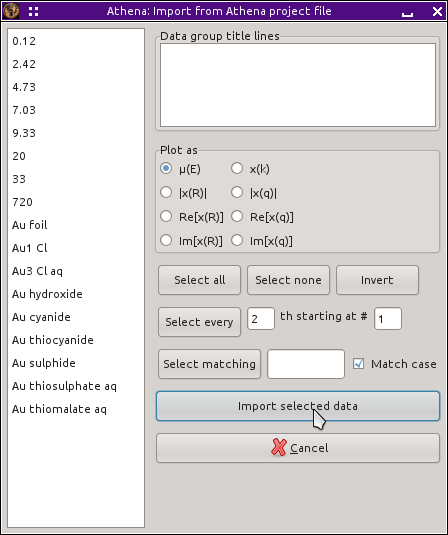

.. _project_selection_sec:

Project selection dialog
========================

The project selection dialog is used to importing data from
:demeter:`athena` project files.  `Project files
<../output/project.html>`__ are :demeter:`athena`'s mechanism for
saving the state of an analysis project. The project selection dialog,
shown below, provides a way of selectively importing part or all of
the contents of the project file.

.. _fig-projsel:

   The project selection dialog.

Project files, like any other files are imported using the file
selection dialog (:numref:`Fig. %s <fig-importfiledialog>`). :demeter:`athena`
will recognize a project file and present the project selection dialog.
Alternately, you can drag one or more project files from your computer's
file manager and drop them onto the group list.

The contents of the project file are listed on the left side of the
dialog. The contents of the `journal <../other/journal.html>`__ are
listed in the box at the top right. When you click on one of the data
groups in the list on the left, it gets plotted and its title lines are
inserted into the box at the lower right. Using these parts of the
dialog, you can examine the contents of your project file before
importing them into :demeter:`athena`.

The plot that is made when you select a data group is controlled by
the :guilabel:`Plot as` box of radio buttons.  These buttons have no
impact on how the data imported into :demeter:`athena`.  They are only
used to determine how the data are displayed to you as you select data
groups for import.

By selecting some of the projects from the list, you can import a subset
of the project file. The group listing uses extended selection:

-  Click on an item in the list to select one group

- :button:`Control`-:button:`Left` (i.e. hold down the
  :button:`Control` key while clicking the left mouse button) on an
  item in the list to add it to the selection

- :button:`Shift`-:button:`click` to on a group to select all groups
  between it and the previously selected group.

The buttons labeled :button:`Select all,light` and :button:`Select
none,light` can be used to select all groups or to clear the
selection. The :button:`Invert,light` button will invert the selection
of each group.

Below those three buttons are a series of controls allowing somewhat
finer grained control over how items from the group list are selected.
The :button:`Select every,light` line allows selection by a regular
pattern.  :button:`Select matching,light` allows you to select groups
that match a specified pattern using the full strength of perl's
`regular expressions
<../ui/mark.html#using-regular-expressions-to-mark-groups>`__.

Once you have selected the groups you want to import, click the
:button:`Import selected data,light` button.  

.. note:: If no groups are selected then *all* the groups will be
	  imported.  The :button:`Select all,light` button is not,
	  strictly speaking, necessary.

