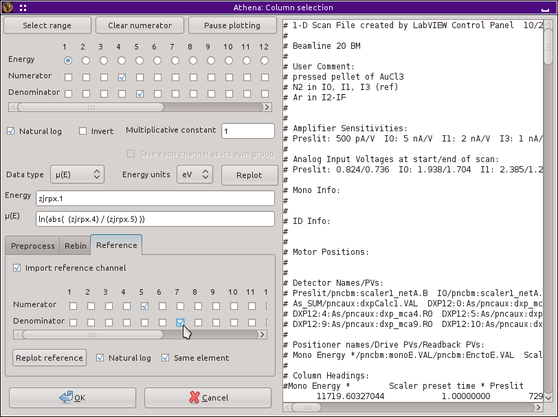

..
   Athena document is copyright 2016 Bruce Ravel and released under
   The Creative Commons Attribution-ShareAlike License
   http://creativecommons.org/licenses/by-sa/3.0/

.. _reference_sec:

Reference channel
=================

A reference spectrum is used by :demeter:`athena` as a data alignment
standard.  It is common to place a third ionization chamber in line
after the transmission chamber and to place a good transmission
standard between the two. The point of measuring the standard is that
it is measured in parallel with your real sample. This standard can
then be used to align the actual data using the `data alignment tool
<../process/align.html>`__.

The standard often is a zero-valent foil, but the most important thing
is that it is an excellent standard which will yield consistently
high-quality data. The other most important thing is that you always
use the same sample as your reference standard for every experiment
you make at a particular edge. To this end, it is wise to make a
library of reference standards and carry them with you to the
synchrotron. By using the same standard for every experiment at an
edge, you can align any data, even data measured years apart or at
different synchrotrons.

.. _fig-importref:

   Importing a reference channel with the column selection dialog.

The reference channel selection works almost the same as column
selection for the data except that you don't need to specify the energy
column again |nd| the same column is used. When a reference channel after
the transmission channel is used, you should use the transmission
channel as the numerator and the reference channel as the denominator.
Another common solution to measuring a reference channel is measure
elastically scattered radiation through the standard with a PIN diode.
In that case, I0 is the numerator and the diode is the denominator.

You can plot the reference channel to make sure that you have selected
the correct channels with the :guilabel:`Plot reference` check
button. If your reference standard is of an element with a nearby edge
energy, uncheck the button labeled :guilabel:`Same element`. If you use
some other kind of reference measurement that is not a transmission
measurement, you can uncheck the :guilabel:`Natural log` button.

When you click the :button:`OK,light` button, the data are imported and
inserted into the group list. The reference channel is placed in the
group list below its data. The reference channel is just like any
other group, with one distinction. The data and its reference channel
are *tied* together in the sense that the values for their
:procparam:`energy shift` parameters will always be the same.

This relationship is shown visually by the change in color of the text
in the box for :procparam:`energy shift`, as seen in this screenshot.

.. _fig-refimported:

.. figure:: ../../_images/import_refimported.png
   :target: ../_images/import_refimported.png
   :width: 65%
   :align: center

   Data imported with a reference channel.

When you change the value of :procparam:`energy shift` for the
reference, the value of :procparam:`energy shift` for the data changes
as well. (And vice versa!) This feature of reference channels is put
to good use `in data alignment <../process/align.html>`__.

Occasionally, it is useful to tie two data groups together in this
way.  This can be done by marking the two groups you want to tie
together as data and reference, then selecting :menuselection:`Group
--> Tie reference channel`.

.. todo:: :demeter:`athena` is missing the ability to tie together
   three or more data groups in a reference relationship |nd| that would
   be useful for multi-element detector data and some other
   situations.
