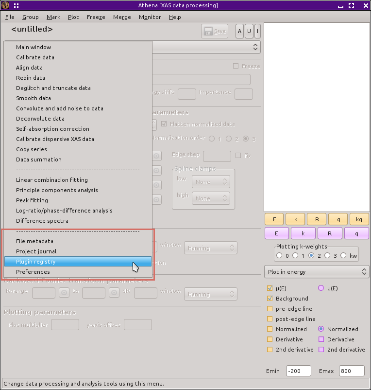

..
   Athena document is copyright 2016 Bruce Ravel and released under
   The Creative Commons Attribution-ShareAlike License
   http://creativecommons.org/licenses/by-sa/3.0/

Other main window chores
========================

:demeter:`athena` has several other tools which are not specifically
related to data processing or analysis chores.

.. _fig-other:

   The main menu is used to access various features of the program not directly
   related to data processing or analysis.

----------------

.. toctree::
   :maxdepth: 2

   meta
   journal
   plugin
   prefs
