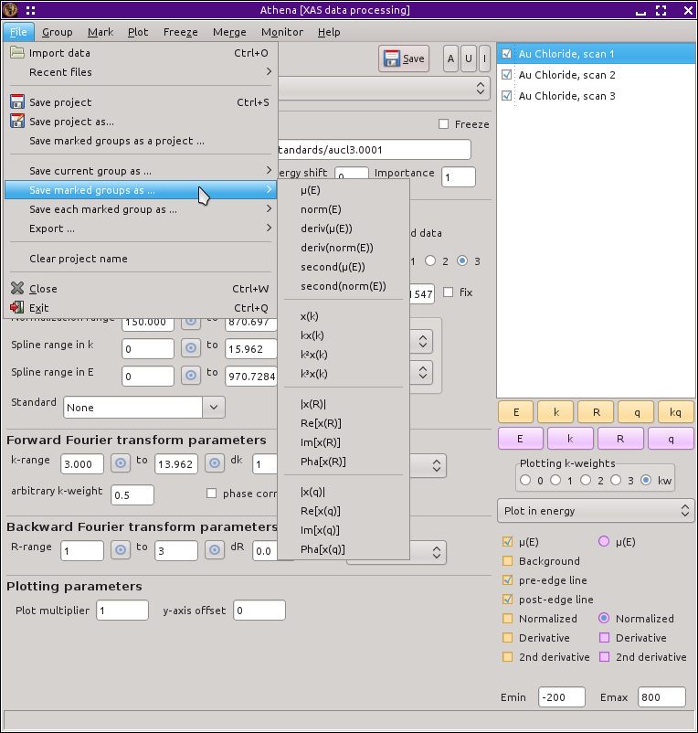

Column output files
===================

Writing output for your favorite plotting program
-------------------------------------------------

After doing a lot of analysis, you will eventually need to make
beautiful pictures for publication. As a glance at any of the
screenshots in this document will attest, the graphical output of
:demeter:`athena` is adequate but far from beautiful. Fortunately,
:demeter:`athena` can export your data in a variety of ways and in a
format that can be imported easily into almost any other program, such
as a spreadsheet or a graphics package such as Origin or Kaleidegraph.

The current data set -- the one marked in red in the group list and the
one whose parameters are displayed in the main window -- can be saved in
a number of ways. The various choices are listed under the File menu, as
seen in the figure below. Note that |chi| (k) data can be saved with various
k-weightings using the entries in the submenu.

.. _fig-exportsingle:

.. figure:: ../../_images/export_single.png
   :target: ../../_images/export_single.png
   :width: 65%
   :align: center

   Exporting a column data file for a group.

The columns in the |mu| (E) output file are:

#. energy

#. |mu| (E)

#. background

#. pre-edge line

#. post-edge line

#. derivative of |mu| (E)

#. second derivative of |mu| (E)

#. I0

If the data group is marked as being XANES data, then the background
column will be all zeros.

The columns in the norm(E) output file are:

#. energy

#. normalized |mu| (E)

#. normalized background

#. flattened |mu| (E)

#. flattened background

#. derivative of normalized |mu| (E)

#. second derivative of normalized |mu| (E)

If the data group is marked as being XANES data, then the normalized and
flattened background columns will be all zeros.

The columns in the |chi| (k) output files are:

#. k

#. unweighted |chi| (k)

#. k-weighted |chi| (k)

#. k-squared-weighted |chi| (k)

#. k-cubed-weighted |chi| (k)

#. Fourier transform window

#. Energy in absolute units

The |chi| (R) output file contains both parts of the complex Fourier
transform, as well as the magnitude and phase. That is, of course,
redundant, but it's also convenient. The columns are:

#. R

#. real part of |chi| (R)

#. imaginary part of |chi| (R)

#. magnitude of |chi| (R)

#. phase of |chi| (R)

#. back transform window

For the sake of clarity, we use the letter :quoted:`q` to represent Fourier
filtered wavenumber. The |chi| (q) output file also contains both parts of
the complex back transform, as well as the magnitude and phase.

#. q

#. real part of |chi| (q)

#. imaginary part of |chi| (q)

#. magnitude of |chi| (q)

#. phase of |chi| (q)

#. Fourier transform window

#. |chi| (k) with the k-weighting used in the FT

In certain situations, it is much more convenient to write column data
files containing data from many groups. This is done with the help of
the mark buttons. The data from each of the marked groups can be saved
in a variety of forms using the :quoted:`saved marked groups` submenu, as shown
below.

.. _fig-exportmarked:

   Exporting column data files for the set of marked groups.

The output file will contain the x-axis value (i.e. energy, k, R, or q)
in the first column. The remaining columns will contain each of the
marked data groups, in the order they appear in the group list.

The final column output option is to export each of the marked groups as
a single data column file of the sort described above. When you select
one of the output file types shown below you are prompted to select a
directory. Each marked group will be exported to a file in that
directory with a file name formed from the group label.

.. _fig-exporteach:

.. figure:: ../../_images/export_each.png
   :target: ../../_images/export_each.png
   :width: 65%
   :align: center

   Exporting column data files for each of the marked groups.

The standard folder selection dialog is used for exporting each marked
group. Select a folder and each file will be recorded there.

The output files discussed on this page have a header of the form
shown below. The first line identifies the version of
:demeter:`athena` used to write the file. 

::

   # XDI/1.0 Athena/0.9.24
   # Element.edge:                  K
   # Element.symbol:                Fe
   # Column.1:                      energy eV
   # Column.2:                      xmu
   # Column.3:                      bkg
   # Column.4:                      pre_edge
   # Column.5:                      post_edge
   # Column.6:                      der
   # Column.7:                      sec
   # Column.8:                      i0
   # Athena.e0:                     7105.50673
   # Athena.eshift:                 0
   # Athena.rbkg:                   1.0
   # Athena.importance:             1
   # Athena.standard:               None
   # Athena.bkg_kweight:            2
   # Athena.edge_step:              2.8319775
   # Athena.fixed_step:             no
   # Athena.pre_edge_range:         -150.000 -30.000
   # Athena.pre_edge_line:          3.299290 - 0.000471541 * E
   # Athena.normalization_range:    150.000 1757.437
   # Athena.post_edge_polynomial:   33.632797 - 0.00697211 * E + 3.70151752e-07 * E^2 + 0 * E^3
   # Athena.spline_range_energy:    0.000 1857.468
   # Athena.clamps:                 0 24
   # Athena.spline_range_k:         0.000 22.080
   # Athena.kweight:                2
   # Athena.window:                 hanning
   # Athena.phase_correction:       no
   # Athena.k_range:                3.000 20.080
   # Athena.dk:                     1
   # Athena.r_range:                1 3
   # Athena.dr:                     0.0
   # Athena.window:                 hanning
   # Athena.plot_multiplier:        1
   # Athena.y_offset:               0
   # ///
   #------------------------
   #   e         xmu        bkg        pre_edge        post_edge        der        sec        i0

