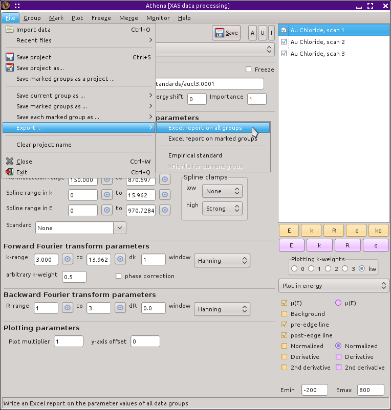
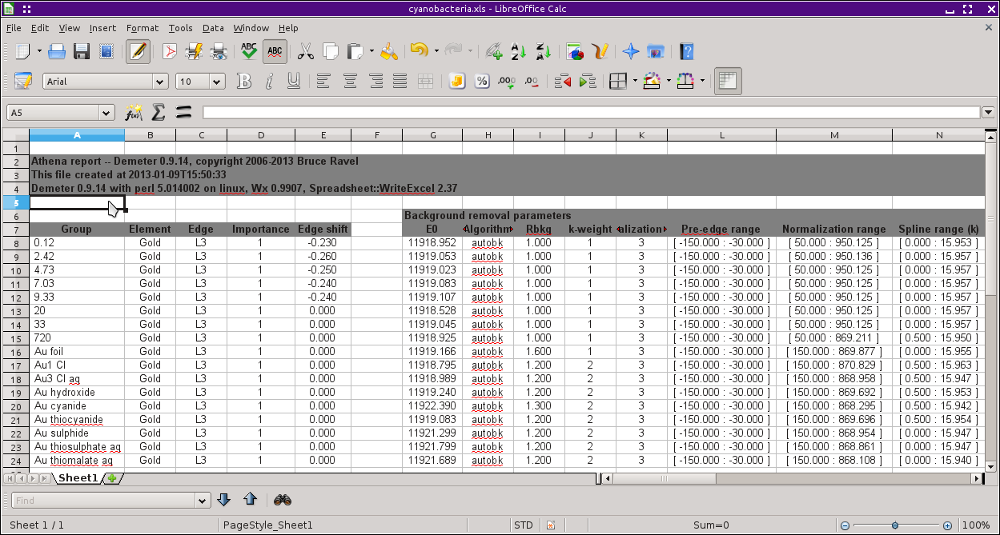

Parameter report files
======================

Athena output for spreadsheet programs
--------------------------------------

The final kind of output file is a parameter report. In the Edit menu,
you will find a submenu labeled :quoted:`Write a report`, shown below. The
various options in that submenu write out files containing the
parameters from the main window.

.. _fig-expoertreport:

   Writing a report on data groups.

The first two options in that submenu write all the parameters to an
Excel file. You can choose to save parameters from all groups or only
the marked groups.

.. _fig-exportexcel:

   An example of the Excel spreadsheet output displayed in Libre Office.

