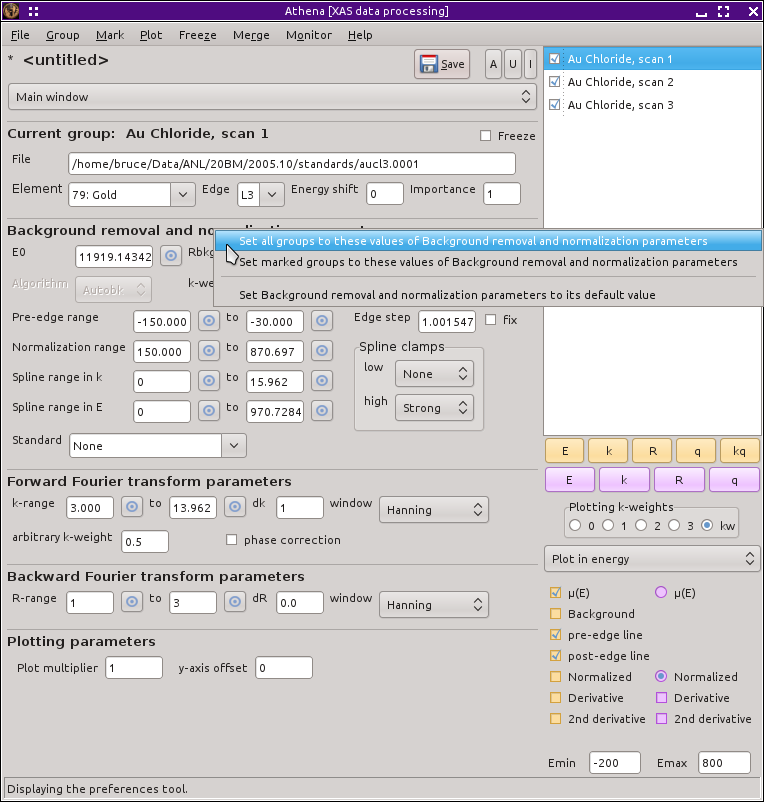

|Essential topic| Constraining parameters between data groups
===============================================================

In :demeter:`athena`, a *constraint* is the setting of a parameter to
be the same for two or more data groups. (That word is used in a
different context in :demeter:`artemis`.) :demeter:`athena` gives you
a high level of control over the values of the parameters used to
process your data. This control is very fine-grained in the sense that
every group can have its own values for any parameters, thus allowing
you to customize the data processing for each individual data group.

Often, however, your data groups are sufficiently similar that it is
expedient to use identical values for some or all parameters. Were you
forced to click through the data groups setting each parameter value
for each group individually, then :demeter:`athena` would be very
tedious to use.  Fortunately, there are a number of tools dedicated to
the problem of constraining parameter values.

Constraining individual parameters
----------------------------------

The first such tool is used to constrain individual parameters. A *right
mouse click* on any of the parameter labels on the main window will post
a context menu, as shown in this figure.

.. _fig-paramparam:

.. figure:: ../../images/param_param.png
   :target: ../../images/param_param.png
   :width: 65%
   :align: center

   Posting a context menu for an individual parameter.

The first two items in this context menu are used to set the values of
this parameter for other groups to its value for the current group. The
current group is, of course, the one whose values are currently
displayed in the main window and the one which is highlighted in the
group list. This parameter value can be applied to all groups or to the
set of marked groups. The set of marked groups are the ones with their
little purple buttons in the group list checked. So here we see again
one of the many uses of the mark buttons.

The last options involves resetting a parameter to its default value.
This is handy if you have changed a parameter and found yourself in a
place where the data processing is obviously wrong. By resetting the
parameter to its default, you can return to a sensible place

Several of the parameter context menus have a few more entries in their
context menus:

- The :procparam:`energy shift` context menu has entries related to
  reference groups and options for displaying energy shift values for
  all or marked groups.

- The :procparam:`importance` context menu has entries for resetting
  the :procparam:`importance` of all groups or marked groups to 1.

- The :procparam:`E0` context menu has several options for changing
  the value of :procparam:`e0`. All of the options will be explained
  in `the next section <../params/e0.html>`__.

- The :procparam:`Edge step` context menu as options for displaying
  edge step values for all or marked groups. There is also an option
  for approximating the uncertainty in the edge step value. When
  selected, the pre- and post-edge line parameters will be varied
  randomly a number of times. Each normalization will be plotted. The
  standard devaition of the edge steps will be computed and displayed
  in the echo area.

- The Fourier transform :procparam:`krange` context menu has an option
  for setting the upper bound to :demeter:`ifeffit`'s suggestion,
  which is based on the level of noise in the data.

Constraining groups of parameters
---------------------------------

In the main window, the parameters are grouped into sets of related
parameters. All of the parameters associated with background removal are
in one box, all the Fourier transform parameters are in another box, and
so on. The labels at the top of each box are sensitive to mouse clicks
much like the entry box labels. A left click posts a helpful message in
the echo area, while a right click posts a context menu, as shown in the
picture below.

.. _fig-paramgroup:

   Posting a context menu for a group of parameters.

The various options behave much the same as in the individual parameter
context menus, except that all of the parameters in the box are
effected. This, then, gives you a way of constraining all background
removal parameters or all Fourier transform parameters between groups.
It also provides a way of restoring default values for a set of
parameters.

Constraining all parameters
---------------------------

The functionality which allows you to constrain parameter values between
groups operates at three levels. We have seen the finest level of
granularity, allowing individual parameters to be constrained. We have
also seen how sets of parameters can be constrained. It is also possible
to perform the same constraining operations on all parameters at once.
These all-parameter operations are found in the Group menu, as shown in
this picture.

.. _fig-paramall:

.. figure:: ../../images/param_all.png
   :target: ../../images/param_all.png
   :width: 65%
   :align: center

   The Group menu, which contains the options for constraining all
   parameters at once.

Again, these operations work identically to the explanation above,
except that every parameter is effected, with the exceptions of
:procparam:`file` and :procparam:`energy shift`, which would not be sensible to
constrain.

