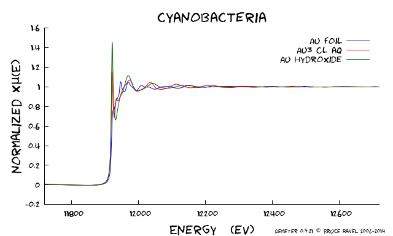

Other plotting features
=======================

Zooming and cursor position
---------------------------

Zooming on a region of a plot is done using Gnuplot's own capabilities.
In the plot window, a zoom is initiated by a right click. The mouse is
then dragged to cover a rectangular area on the plot. Right-clicking a
second time will cause the plot to be redisplayed on the zoomed region.

Gnuplot displays the position of the cursor in the bottom part of the
plot window. This is continuously updated as the mouse moves over the
plot window.

Special plots for the current group
-----------------------------------

.. _fig-specialplot:

.. figure:: ../../_images/plot_special.png
   :target: ../_images/plot_special.png
   :width: 65%
   :align: center

   A number of special plots and other plotting features are provided
   for visualizing particular aspects of your data. The plot types
   described below are all available from the Plot menu.

**Quad plot**
    The quad plot is the default plot that gets made when data are first
    imported. Using the current set of processing parameters, the data
    are displayed in energy, k, R, and back-transform k all in the same
    plot window. This plot can also be made by right-clicking on the q
    button.

    .. _fig-quadplot:

    .. figure:: ../../_images/plot_quad.png
       :target: ../_images/plot_quad.png
       :width: 55%
       :align: center

       Quad plot of Fe foil.
       
**Normalized data and derivative**
    This plot type shows the normalized |mu| (E) spectrum along with its
    derivative. The derivative spectrum is scaled by an amount that
    makes it display nicely along with the normalized data.

    .. _fig-ndplot:

    .. figure:: ../../_images/plot_nd.png
       :target: ../_images/plot_nd.png
       :width: 55%
       :align: center

       Norm and deriv of Fe foil
       
**Data + I0 + signal**
    I₀ can be plotted along with |mu| (E) and the signal as shown below. The
    I₀ and signal channel is among the data saved in `a project
    file <../output/project.html>`__. This example shows |mu| (E) of Au
    chloride along with the signal and I₀ channels.This plot can also be
    made by right-clicking on the E button. (The norm+deriv plot can be
    configured for right-click use with the :configparam:`Artemis,right\_single\_e`
    `configuration parameter <../other/prefs.html>`__.)

    .. _fig-mui0plot:

    .. figure:: ../../_images/plot_mui0.png
       :target: ../_images/plot_mui0.png
       :width: 55%
       :align: center

       mu(E) of Au chloride along with the signal and I0 channels.
       
**k123 plot**
    A k123 plot is a way of visualizing the effect of k-weighting on the
    |chi| (k) spectrum. The k¹-weighted spectrum is scaled up to be about the
    same size as the k²-weighted spectrum. Similarly, the k³-weighted
    spectrum is scaled down. This plot can also be made by
    right-clicking on the k button.

    .. _fig-k123plot:

    .. figure:: ../../_images/plot_k123.png
       :target: ../_images/plot_k123.png
       :width: 55%
       :align: center

       k123 plot of Fe foil
       
**R123 plot**
    A R123 plot is a way of visualizing the effect of k-weighting on the
    |chi| (R) spectrum. The Fourier transform is made with k-weightings of 1,
    2, and, 3. The FT of the k¹-weighted spectrum is scaled up to be
    about the same size as the FT or the k²-weighted spectrum.
    Similarly, the FT of the k³-weighted spectrum is scaled down. The
    current setting in the `R tab <tabs.html#plotting-in-r-space>`__ is
    used to make this plot. For this figure, the magnitude setting was
    selected. This plot can also be made by right-clicking on the R
    button.

    .. _fig-r123plot:

    .. figure:: ../../_images/plot_r123.png
       :target: ../_images/plot_r123.png
       :width: 55%
       :align: center

       R123 plot of Fe foil

Special plots for the marked groups
-----------------------------------

The :quoted:`Marked groups` submenu offers two special kinds of plots relating
to the set of groups in the group list that have been
`marked <../ui/mark.html>`__.

**Bi-Quad plot**
    This special plot is like the quad plot described above, but is used
    to compare two marked groups. To make this plot you must have two –
    and only two – groups selected from the group list. It is helpful

    .. _fig-biquadplot:

    .. figure:: ../../_images/plot_biquad.png
       :target: ../_images/plot_biquad.png
       :width: 55%
       :align: center

       A quad plot comparing two marked groups.

**Plot with E0 at 0**
    This special plot is used to visualize |mu| (E) spectra measured at
    different edges. Each spectrum, Cu and Fe in this example, is
    shifted so that its point of E₀ is displayed at 0 on the energy
    axis.

    .. _fig-e00plot:

    .. figure:: ../../_images/plot_e0_0.png
       :target: ../_images/plot_e0_0.png
       :width: 55%
       :align: center

       Plot of Fe and Cu foils with E0 at 0.
       
**Plot I0 of marked groups**
    This plot allows examination of the I₀ signals of a set of marked
    groups. This plot can also be made by right-clicking on the E
    button. (The other two special marked groups plots can be configured
    for right-click use with the :configparam:`Artemis,right\_marked\_e`
    `configuration parameter <../other/prefs.html>`__.)

    .. _fig-i0plot:

    .. figure:: ../../_images/plot_marked_i0.png
       :target: ../_images/plot_marked_i0.png
       :width: 55%
       :align: center

       The I0 signals of three marked groups
       
**Plot scaled by edge step**
    The marked groups can be plotted as normalized |mu| (E), but scaled by
    the size of the edge step. Without flattening, this is identical to
    plotting the |mu| (E) data with the pre-edge line subtracted. Otherwise,
    it is different in that the post-edge region will be flattened and
    will oscillate around the level of the edge step size.

    .. _fig-scaledplot:

    .. figure:: ../../_images/plot_scaled.png
       :target: ../_images/plot_scaled.png
       :width: 55%
       :align: center

       Plot of normalized data scaled by edge step.

Special plots for merged groups
-------------------------------

When data are merged, the standard deviation spectrum is also computed
and saved in `project files <../output/project.html>`__. The merged
data can be plotted along with its standard deviation as shown in the
merge section (Figure :num:`fig-mergestddev`) in a couple of
interesting ways.

**Merge + standard deviation**
    In this plot, the merged data are displayed along with the standard
    deviation. The standard deviation has been added to and subtracted
    from the merged data. This is the plot that is displayed by default
    when a merge is made. This behavior is controled by the
    :configparam:`Athena,merge\_plot` `configuration
    parameter <../other/prefs.html>`__.

    .. _fig-stddevplot:

    .. figure:: ../../_images/merge_stddev.png
       :target: ../_images/merge_stddev.png
       :width: 55%
       :align: center

       A plot of merged data +/- the standard deviation for Au hydroxide
       data
	
**Merge + variance**
    In this plot, the standard deviation spectrum is plotted directly.
    It is scaled to plot nicely with the merged data. The point of this
    plot is to see how the variability in the data included in the merge
    is distributed in energy.

    .. _fig-varianceplot:

    .. figure:: ../../_images/merge_variance.png
       :target: ../_images/merge_variance.png
       :width: 55%
       :align: center

       A plot of merged data and the variance for Fe foil data

Special plotting targets
------------------------

The Plot menu provides a few more ways to control how your data are
displayed. The :quoted:`Save last plot as` submenu allows you to send the most
recent plot to a PNG or PDF file. You will be prompted for a filename,
then the most recent plot will be written to that file in the format
specified. Currently, only PNG and PDF are supported. Saving to a file
does not work for quad plots – you'll have to rely on a screen-capture
tool for that.

Finally, you have the option of directing the on-screen plot to one of
four terminals. The selected terminal, number 1 by default, is updated
as new plots are made. When you switch to a new terminal, other active
terminals will become unchanging. This means you can save a particular
plot on screen while continuing to make new plots.

.. todo:: Consider other file types. SVG and EPS should
	  work. Gnuplot's GIF and JPG terminals are not sufficiently
	  featureful to replicate all the details of :demeter:`athena`'s plots.
	  Consider making the number of terminals a configuration
	  parameter.

Phase corrected plots
---------------------

When the :quoted:`phase correction` button is clicked on, the Fourier
transform for that data group will be made by subtracting the central
atom phase shift. This is an incomplete phase correction – in
:demeter:`athena` we know the central atom but do not necessarily have
any knowledge about the scattering atom.

Note that, when making a phase corrected plot, the window function in R
is not corrected in any way, thus the window will not line up with the
central atom phase corrected |chi| (R).

Also note that the phase correction propagates through to |chi|
(q). While the window function will display sensibly with the central
atom phase corrected |chi| (q), a :quoted:`kq` plot will be somewhat
less insightful because phase correction is not performed on the
original |chi| (k) data.

XKCD-style plots
----------------

:demeter:`athena` can make plots in a style that resembles the famous
`XKCD comic <http://xkcd.com/>`__.

To make use of this most essential feature, you should first download
and install the `Humor-Sans
font <http://antiyawn.com/uploads/humorsans.html>`__ onto your computer.

Once you have installed the font, simply check the :quoted:`Plot XKCD style`
button in the Plot menu. Enjoy!

.. _fig-xkcd:

   A plot sort of in the XKCD style.

