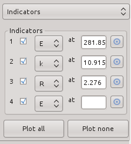
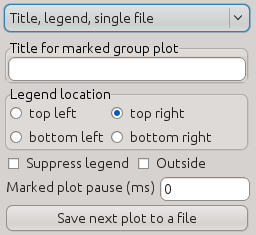
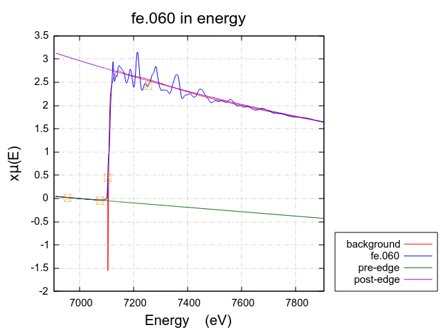

..
   Athena document is copyright 2016 Bruce Ravel and released under
   The Creative Commons Attribution-ShareAlike License
   http://creativecommons.org/licenses/by-sa/3.0/

Other plotting options
======================

Zooming and cursor position
---------------------------

Zooming on a region of a plot is done using :program:`Gnuplot`'s own
capabilities.  In the plot window, a zoom is initiated by a right
click :mark:`rightclick,..`. The mouse is then dragged to cover a rectangular
area on the plot. Right-clicking :mark:`rightclick,..` a second time will cause
the plot to be redisplayed on the zoomed region.

:program:`Gnuplot` displays the position of the cursor in the bottom
part of the plot window. This is continuously updated as the mouse
moves over the plot window.

Special plotting targets
------------------------

The Plot menu provides a few more ways to control how your data are
displayed. The :menuselection:`Plot --> Save last plot as` submenu
allows you to send the most recent plot to a PNG or PDF file. You will
be prompted for a filename, then the most recent plot will be written
to that file in the format specified. Currently, only PNG and PDF are
supported. Saving to a file does not work for quad plots |nd| you'll have
to rely on a screen-capture tool for that.

Finally, you have the option of directing the on-screen plot to one of
four terminals. The selected terminal, number 1 by default, is updated
as new plots are made. When you switch to a new terminal, other active
terminals will become unchanging. This means you can save a particular
plot on screen while continuing to make new plots.

.. todo:: :demeter:`athena` should offer other vector output images,
   like SVG or EPS.  Also should make the number of terminals a
   configurable parameter.

Stacked plots
-------------

When marked group plots are made using the purple plot buttons, the
default behavior is to overplot the various data groups. At times, it
might be preferable to place an offset between the plots. This is done
in general by setting the :procparam:`y-axis offset`
parameter. Stacking plots in a systematic manner is done using the
stack tab. Stacking is done by setting the :procparam:`y-axis offset` parameters
of the marked groups sequentially.

This tab contains two text entry boxes. The first is used to set the
:procparam:`y-axis offset` parameter of the first marked group. Subsequent marked
groups have their :procparam:`y-axis offset` parameters incremented by the amount
of the second text entry box. Clicking the :button:`Apply to marked,light` button
sets these values for each marked group.

.. subfigstart::

.. _fig-stacktab:
.. figure::  ../../_images/plot_stack.png
   :target: ../_images/plot_stack.png
   :width: 50%

   The plot stacking tab.

.. _fig-stacked:
.. figure::  ../../_images/plot_stacked.png
   :target: ../_images/plot_stacked.png
   :width: 100%

   An example of a stacked plot. Note that the stacking increment is
   negative so that that order of the colors is the same in the legend
   as in the plot.

.. subfigend::
   :width: 0.45
   :label: _fig-stack

Indicators
----------

Indicators are vertical lines drawn from the top to the bottom of the
plot frame. They are used to draw attention to specific points in plots
of your data. This can be useful for comparing specific features in
different data sets or for seeing how a particular feature propagates
from energy to k to q.

Points to mark by indicators are chosen using `the pluck buttons
<ui/pluck.html>`__ in the indicators tab. Click on the pluck button
then on a spot in the plot. That value will be inserted into the
adjacent text entry box. When the check button is selected, that
indicator lines will be plotted (if possible) in each subsequent plot.

Points selected in energy, k, or q are plotted in any of those spaces.
Points selected in R can only be plotted in R. Points outside the plot
range are ignored.

.. subfigstart::

.. _fig-indictab:

   The indicator tab.

.. _fig-indicplot:
.. figure::  ../../_images/plot_indicplot.png
   :target: ../_images/plot_indicplot.png
   :width: 100%

   An example of a plot with indicators.  Note that plots made in E,
   k, or q will plot indicators selected in any of those three spaces.

.. subfigend::
   :width: 0.45
   :label: _fig-indic

The following `preferences <../other/prefs.html>`__ can be set to
customize the appearance of the indicators.

#. :configparam:`Plot,nindicators`: the maximum number of indicators that can be set

#. :configparam:`Plot,indicatorcolor`: the color of the indicator line

#. :configparam:`Plot,indicatorline`: the line type of the indicator

Title and legend
----------------

Fine grained control over the title and legend of the plot is
available in the :guilabel:`Title, legend, single file` tab.

.. _fig-plottlsf:

   The tab with controls for the title and legend of the plot as well
   as plot pausing and single file output.

Normally the title of a marked group plot is determined from the name
of the project file.  If there is not yet a name for the project file,
then the title of a marked groups plot (i.e. one made with a purple
plot button) will be :quoted:`marked groups`.

This behavior can, however, be overridden by specifying a title in
the text box labeled :guilabel:`Title for marked group plot`.  The
text specified there will be used as the title.  The title for a
marked group plot can be suppressed by specifying one or more spaces
in that text box.

The plot legend is place, by default, near the inner, top, right
corner of the plot.  This sometimes interferes with the display of the
data.  The corner can be selected using the radio buttons in the
:guilabel:`Legend location` box.  The placement of the legend inside
or outside of the frame of the plot is controlled by the
:guilabel:`Outside` check button.  Checking the :guilabel:`Suppress
legend` button causes the legend not to be displayed.

.. _fig-plotlegendoutside:

   Plot of Fe metal showing the legend outside the plot frame and in
   the lower right corner.

Pausing display of data during import
-------------------------------------

When examining a sequence of XAS scans, it can be instructive to
focus on the scan-to-scan changes in the data,  When the text box next
to :guilabel:`Marked plot pause` in :numref:`Fig. %s
<fig-plottlsf>` is set to a non zero value, there
will be a pause introduced between the display of the groups included
in a marked group plot. 

For example, consider a sequence of data in the reduction of
hexavalent chromium to trivalent chromium.  Standards for these two
forms of chromium are shown below.  

.. _fig-plotcr:
.. figure:: ../../_images/Cr.png
   :target: ../_images/Cr.png
   :align: center

   Hexavalent chromium, with its large pre-edge peak, plotted with
   trivalent chromium.

As the reduction progresses, the size of the pre-edge peak diminishes
and the main rising edge shifts to the right.  A pause introduced to
the marked group plot serves to animate the spectral change during
this reduction.

The value of this pause is in milliseconds.  A value of 250 or 500 is
good starting point.  The value of zero turns off this animation
feature and the plot will be made as quickly as possible.

Single file output
------------------

:demeter:`athena` has some `fancy plots <etc.html>`_ hardwired.
reproducing these plots in another plotting program using 
:demeter:`athena`'s `column output files <../output/columns.html>`_
can be tricky.

To make it easier to reproduce plots made by :demeter:`athena`, there
is an option to export the content of a plot to a single column data
file.  This is enabled by toggling the :button:`Save next plot to a
file,light` button shown in :numref:`Fig. %s <fig-plottlsf>`.

When toggled on, the next plot made will directed to a file rather
than to the screen and you will be prompted for the name of the output
file.  Any y-axis shifts or scaling factors will be included in the
data written to that column data file.  Using the data from that file,
stacked plots like :numref:`Fig. %s <fig-stacked>`, k123 plots like
:numref:`Fig. %s <fig-k123plot>`, and others can be reproduced easily.

Once the single file output is written, the :button:`Save next plot to
a file,light` button will toggle off. The nextplot that is made will
be directed again to the screen.

Note that single file output will not include `plot markers
<../bkg/norm.html#the-normalization-algorithm>`_ or `indicators
<#indicators>`_, nor can it be used to reproduce all four panels at
once of a quad (:numref:`Fig. %s <fig-quadplot>`) or bi-quad
(:numref:`Fig. %s <fig-biquadplot>`) plot.
