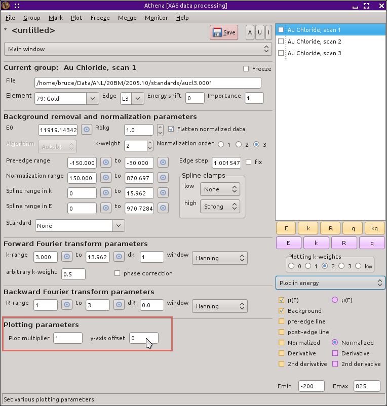

..
   Athena document is copyright 2016 Bruce Ravel and released under
   The Creative Commons Attribution-ShareAlike License
   http://creativecommons.org/licenses/by-sa/3.0/

Group specific plot parameters
==============================

At the bottom of the main window are a pair of parameters which affect
how that group is plotted. The :procparam:`plot multiplier` parameter
is a multiplicative factor for the group when it gets plotted. The
:procparam:`y-axis offset` is a number added to the group when it is
plotted so that it is offset in the vertical direction. Both of these
are parameters that are set for each group individually.

`Stacked plots <../plot/stack.html>`__ are made by setting the
:procparam:`y-axis offset` parameters for many groups.

Like most other parameters in the main window, `context
menus <../params/constrain.html>`__ accessed by right clicking on the
labels can be used to constrain these parameters across data groups.

.. _fig-plotparams:

   The plot parameters group in the main window.

