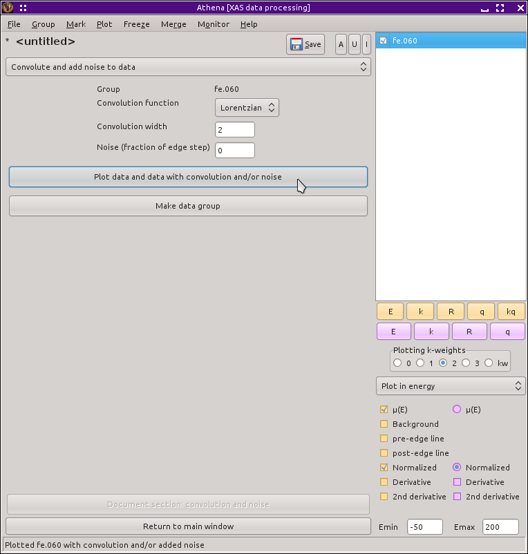

Convoluting data groups
=======================

Adding artificial broadening and artificial noise to your data
--------------------------------------------------------------

This is one of :demeter:`athena`'s odder tools. It takes perfectly
fine normalized |mu| (E) data and makes it worse by adding artificial
broadening, artificial noise, or both. The broadening can be a
Gaussian or a Lorentzian convolution by the selected width in
energy. The noise is randomly generated using an epsilon that is
chosen as a fraction of the size of the edge step.

Like other tools, there is a button for plotting the data along with its
modification and another for turning the modified data into a data group
listed in the group list. These are shown in this screenshot. An example
of broadened data is shown in on the left in the next figure and an
example of data with artificial noise is shown on the right.

.. _fig-convolution:

   The convolution tool.

.. subfigstart::

.. _fig-convconv:

.. figure::  ../../_images/convolution_conv.png
    :target: ../_images/convolution_conv.png
    :width: 100%

.. _fig-convnoise:

.. figure::  ../../_images/convolution_noise.png
    :target: ../_images/convolution_noise.png
    :width: 100%

.. subfigend::
    :width: 0.45
    :label: fig_convoluting

    (Left) Iron foil data broadened by 1 eV. (Right) Iron foil data
    with a bit of artificial noise added.

