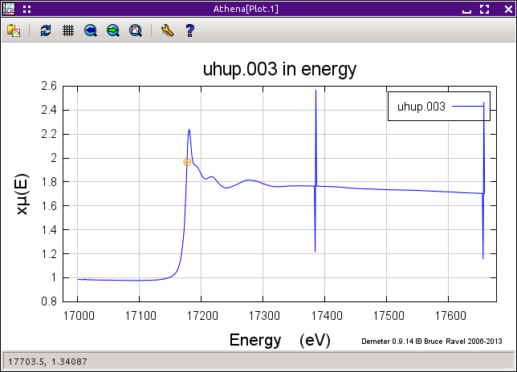

Deglitching and truncating data
===============================

Deglitching
~~~~~~~~~~~

Occasionally your data has spurious points that are obviously different
from the surrounding points. These so-called glitches can be caused by a
variety of issues involving the monochromator, the electronics, or the
sample itself. In principle, it should not be necessary to do anything
at all about glitches. A feature in the data that is only one or two
points wide necessarily contributes a high frequency signal to the data.
Since the data are treated using Fourier techniques, these high
frequency additions to the data should have scant impact on the data.

In practice, there are a variety of ways that glitches like those shown
on the right in the figure below can impact the processing of the data.
Certainly, large glitches are unsightly and have an aesthetic impact on
the presentation of your data.

The process by which glitchy points are removed from the data is called
deglitching. Yes, I also think that's a funny sounding word.

.. _fig-deglitch:

.. figure:: ../../_images/deglitch.png
   :target: ../../_images/deglitch.png
   :width: 65%
   :align: center

   The deglitching tool.

:demeter:`athena`'s approach to deglitching involves simply removing
the points from the data. No effort is made to interpolate from the
surrounding points in an effort to replace that point with a
presumably more appropriate value. The reason that no interpolation is
done is that EXAFS data are typically measured on a grid that is
oversampled. When the data are converted from |mu| (E) to |chi| (k) as
part of the background removal, the data are rebinned onto the
standard k-grid. Since a rebinning is performed later in the data
processing, there is no reason to interpolate at the time of
deglitching.

Deglitching only removes points from the data in :demeter:`athena`'s
memory. The data on disk are never altered.

There are two methods of deglitching offered by :demeter:`athena`'s
deglitching tool, shown above. The first involves selecting and
removing the glitches one by one. The points are selected by clicking
the :kbd:`Choose a point,light` button then clicking on the glitch in
the plot. After clicking on the plot window, the selected point is
indicated with an orange circle, as on the left of the next
figure. Clicking the :kbd:`Remove point,light` button removes that
point from the data, shown in the bottom panel.

.. subfigstart::

.. _fig-degplot:

   This is an example of data the needs deglitching. In this case,
   there was a problem with data channels not arriving at the
   measurement computer in the proper sequence. This timing problem
   resulted in occasionally spikes in the data.

.. _fig-degpoint:

.. figure::  ../../_images/deglitch_point.png
   :target: ../_images/deglitch_point.png
   :width: 100%

   A point has been selected for removal. The point flagged for
   removal is indicated with a little orange circle.

.. _fig-degpointremoved:

.. figure::  ../../_images/deglitch_pointremoved.png
   :target: ../_images/deglitch_pointremoved.png
   :width: 100%

   The selected point has been removed from the data. The deglitching
   margins are displayed along with the data.

.. subfigend::
   :width: 0.45
   :label: _fig-deglicthpoints

The second method for removing glitches is more automated. In the figure
above, the deglitching margins are shown by the pink lines. Those
margins are drawn between the specified minimum and maximum energy
values. The lines are drawn a set amount above and below the post-edge
line used to normalize the data. The separation between the post-edge
line and the margins is given by the value in the tolerance box.

When you click the :kbd:`Remove glitches,light` button, and points
that within the energy range of the margins but which lie above the
upper margin or below the lower margin are removed from the
data. These margins can also be drawn in the pre-edge region using the
pre-edge line. There is no way to use margins in an energy region that
includes the edge.

This technique is handy in that it quickly removes many glitches in a
situation like the one shown. It is very dangerous, however, if not used
with care. If the margins extend into the white line region or are so
tight around the post-edge line that the oscillatory structure crosses
the margins, this technique will happily remove good points from the
data. Set your margins well!

A useful variation of the point-by-point technique involves plotting
the |chi| (E) data. This can only be done for glitches above the edge,
but it can be a very useful technique for removing small glitches from
the data. In this figure we see |mu| (E) data for U\ :sub:`3`\ O\
:sub:`8` that appear fine.

.. subfigstart::

.. _fig-degchiemu:

.. figure::  ../../_images/deglitch_chie_mu.png
   :target: ../_images/deglitch_chie_mu.png
   :width: 100%

   |mu| (E) data for U\ :sub:`3`\ O\ :sub:`8` that have a tiny glitch
   hidden in the high energy region.

.. _fig-degchiek:

.. figure::  ../../_images/deglitch_chie_k.png
   :target: ../_images/deglitch_chie_k.png
   :width: 100%

   Plotted as |chi| (k), the glitch at about 12 |AA|\ :sup:`-1` in
   these |chi| (k) data is clearly seen.

.. _fig-degchie:

.. figure::  ../../_images/deglitch_chie.png
   :target: ../_images/deglitch_chie.png
   :width: 100%

   With potting as |chi| (E) selected. The spurious point at about 12
   |AA|\ :sup:`-1` has been chosen.

.. subfigend::
   :width: 0.45
   :label: _fig-deglitchchie

When the |chi| (E) is displayed, the k-weight value specified by the
k-weight controls is used. From there, the point-by-point technique is
identical to how it used with |mu| (E) data. The advantage is that
small glitches might be easier to see and to pluck from the data when
the data is plotted as |chi| (E). The point-by-point deglitching
algorithm works on the |chi| (E) data in the same manner as for
|mu| (E) data. Points are selected by clicking on the plot, then
removed by clicking the :kbd:`Remove point,light` button.

Truncation
~~~~~~~~~~

If your data does something odd at one end of the scan, the easiest
solution might be to simply trim it away. The truncation tool allows you
to chop data before or after a selected value.

The radiobox is used to tell :demeter:`athena` whether points should
be trimmed from before or after the selected point. The point can be
chosen by typing in the box or by using `the pluck button
<../ui/pluck.html>`__.

.. _fig-trunplot:

.. figure:: ../../_images/truncate_plot.png
   :target: ../_images/truncate_plot.png
   :width: 45%
   :align: center

   Tin oxide data with some spurious points near the end of the scan.

When you select a point, it is indicated with a vertical line, as shown
in the plot above. To remove the data before or after that line, click
the :kbd:`Truncate data,light` button.

Sometimes the issue is not simply that the data are unreliable after a
certain point. Sometimes your sample has elements with nearby edges,
thus limiting the range over which you can actually measure the data. An
example is shown in the next plot, the Ti K edge is at 4966 eV and the
Ba L\ :sub:`III` edge is at 5247 eV. A careless choice of spline and
normalization range will lead to a data processing disaster.

.. _fig-trunbto:

.. figure:: ../../_images/truncate_batio3.png
   :target: ../_images/truncate_batio3.png
   :width: 45%
   :align: center

   The Ti K and Ba L\ :sub:`III` edges of BaTiO\ :sub:`3`.

Of course, truncation is not the only way of dealing with this issue. A
careful choice of the spline, pre-edge, and normalization ranges is
usually sufficient to treat any strange features at the beginning or end
of the data set. So which is better? I think it's a matter of
preference. As long as you understand what you are doing and process all
your data in a consistent, defensible manner, you can use either
approach.

