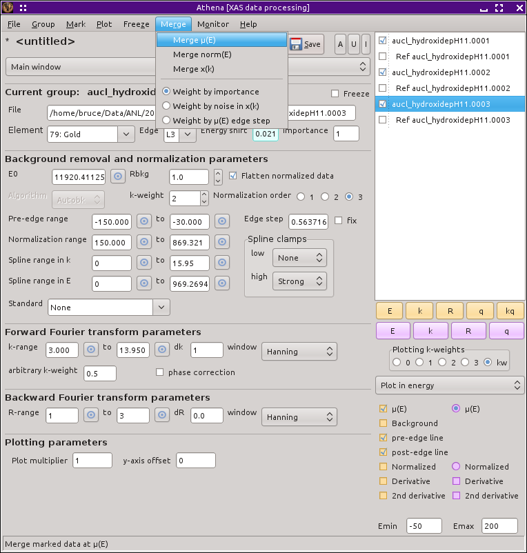
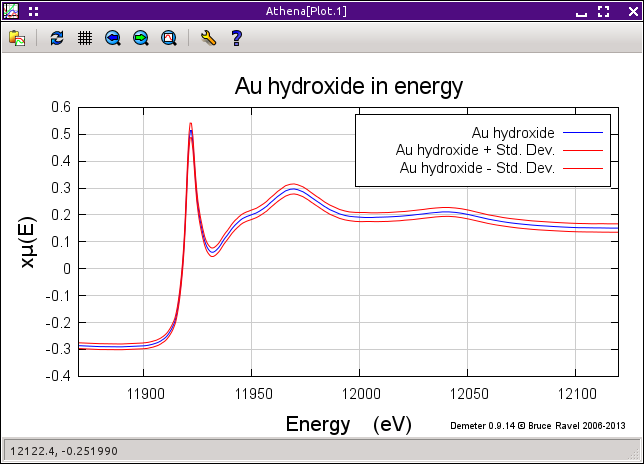

Merging data groups
===================

Averaging scans and computing their standard deviation
------------------------------------------------------

Sadly, most data that we measure is, frankly, kind of crappy. A single
scan typically ranges from noisy to so dominated by noise that it's hard
to recognize it as oscillatory. Fortunately, `the central limit
theorem <https://speakerdeck.com/bruceravel/the-central-limit-theorem-in-exafs>`__
works every single time. If you add up enough noisy scans, it eventually
turns into real data!

All entries in the group list which are marked will be included in the
merge. Make sure that the marked groups really are the ones you want to
include in the merge!

Data can be merged as |mu| (E), normalized |mu| (E), or |chi| (k). In
most cases, it makes little difference which one you choose. |chi| (R)
will be the same regardless. (This can be tested, in fact, I encourage
you to do so.) The standard deviation in the merged data is also
computed and stays with the data in project and certain output files,
although :demeter:`athena` does nothing else with the standard
deviation other than plotting it, which is shown below. By default,
each data set is weighted the same in the merge.

.. _fig-mergemenu:

   The contents of the Merge menu, showing the various ways that data can
   merged.

After a merge is made, a plot is displayed showing the merge in some
manner. The type of merge plot is controled by the
:configparam:`athena,merge\_plot` `configuration parameter
<../other/prefs.html>`__. The default is to show the data along with
the data ± the standard devaition, as shown below. The other options
are the `the variance plot
<../plot/etc.html#special-plots-for-merged-groups>`__ or a plot with the
merge and all the data that entered the merge.

.. _fig-mergestddev:

   Data merged as |mu| (E) plotted with its standard deviation.

The data merging feature is one of :demeter:`athena`'s most
important. My typical work pattern is to carefully align the scans
measured on a sample, merge them, then further work with the merged
data in :demeter:`athena` and :demeter:`artemis`.

.. caution:: It is **essential** that your data be well-aligned before
	     merging. Merging poorly aligned data has the effect of
	     significantly attenuating the fine structure.

When merging as |mu| (E) or normalized |mu| (E), if every data group included in
the merge has a reference channel, the reference channels will also be
merged and these two merged spectra will be tied together as `a
reference channels <../import/ref.html>`__. Thus the merge of the
reference channels can serve as the alignment standard for the merge of
the data.

There is one situation where merging as |mu| (E) will be substantively
different from the other two options. If something happens to change the
values of the signals on the detectors in such a way that |mu| (E) for
subsequent scans is of very different sizes but the normalized |mu| (E) data
is consistent for all the data, then the merge in |mu| (E) will be dominated
by the scans with larger absolute values while the merge in normalized
|mu| (E) will treat all the data with similar weights. One way of having
this happen is to change amplifier gains between scans. In that
situation, you probably should choose to merge normalized or |chi| (k) data.

Merging options
---------------

**Weighting options**
    There are three ways to weight the spectra which go into the
    merge.  The default is to merge by the value of the :procparam:`importance`
    parameter.  Since the :procparam:`importance` is by default 1, this choice
    usually means to weight the spectra equally in the merge. Because
    :procparam:`importance` is a user-definable parameter, the weighting can be
    made in any way by setting those values appropriately. The other
    two options are attempts to weight according to quality of
    data. The :quoted:`noise` option uses :demeter:`ifeffit`'s measure of
    noise in |chi| (k), thus giving more weight to data with less shot
    noise. The :quoted:`edge step` uses the value of :procparam:`edge step` determined
    form the normalization, thus giving more weight to data with
    larger edge steps. The idea for the edge step option is that, for
    data measured in fluorescence, a more concentrated sample has a
    larger edge step and is likely to give higher quality data.  The
    choice between the three weighting options is made using the radio
    buttons in the Merge menu.

**Preferences**
    There are `preferences <../other/prefs.html>`__ which have some
    influence on how the merge happens. :configparam:`Merge,exclude\_short\_data`
    allows you to choose whether to exclude data sets with far fewer
    data points into the merge. The default to exclude short data sets.
    :configparam:`Merge,short\_data\_margin` defines how many fewer data points
    triggers that exclusion for a data set. :configparam:`Merge,weightby` sets the
    default choice of weighting option between the three options
    explained above.

Keyboard shortcuts
------------------

There are keyboard shortcuts for merging:

-  :kbd:`Control`-:kbd:`shift`-:kbd:`m` : merge as |mu| (E)

-  :kbd:`Control`-:kbd:`shift`-:kbd:`n` : merge as normalized |mu| (E)

-  :kbd:`Control`-:kbd:`shift`-:kbd:`c` : merge as |chi| (k)

