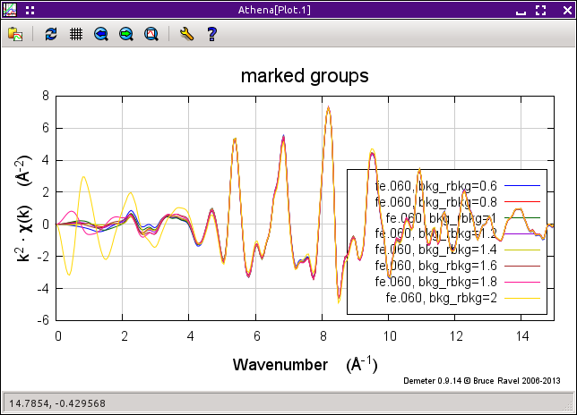

Copy series
===========

Examining systematic trends in a data set
-----------------------------------------

This tool allows you to examine systemic trends in a measurement by
varying a single processing parameter over a specified range. The
:quoted:`Parameter` menu contains many of the parameters on the main window. You
give an initial value, an increment, and a number of copies, thus
specifying the range over which the parameter is examine.

Clicking the :kbd:`Make series,light` button creates copies of the
current data group with the examined parameter set incrementally. The
set of copied groups are marked and plotted in the space most
appropriate for the examined parameter.

For parameters, line the pre- and post-edge line parameter, which affect
the edge step, the average edge step value and its standard devaition
are calculated and displayed in the text control that is nortmally
disabled.

.. _fig-series:

.. figure:: ../../_images/series.png
   :target: ../_images/series.png
   :width: 65%
   :align: center

   The copy series tool.

.. _fig-seriesplot:

   The plot made from the series of :procparam:`Rbkg` values with the Fe foil data.
