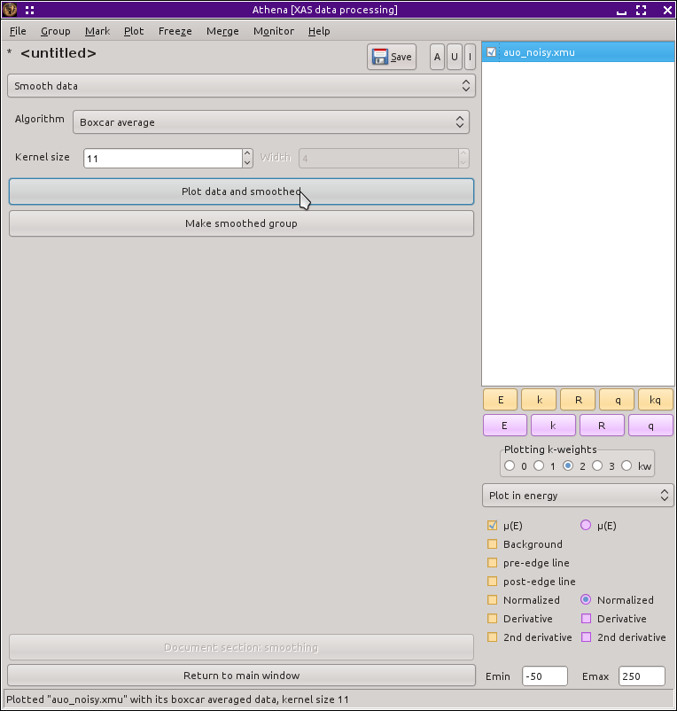

Smoothing data
==============

Smoothing data is usually a bad idea. The best way to improve noisy data
is to rethink your samle preparation or measurement procedure whenever
possible. The second best way is to measure more of it and rely upon the
`central limit
theorem <https://speakerdeck.com/bruceravel/the-central-limit-theorem-in-exafs>`__
to work its magic. Smoothing is usually little more than an aesthetic
fix and it introduces distortions to your data that become serious
sources of systematic uncertainty in any later attempts to interpet the
smoothed data.

The default smoothing algorithm is a boxcar average, implemented as a
generic linear filter using a flat, symetric kernel. The width in data
points of this kernel is the specified parameter. An odd kernel size is
enforced. If you set the size parameter to, say, 12, a value of 13 will
be used.

There is an option for a Gaussian filter, which is also implemented as a
generic linear filter. In this case, you must specify both the kernel
size and the |sigma| of the Gaussian.

The final smoothing option is :demeter:`ifeffit`'s three-point
smoothing algorithm repeatedly to your data. The number of repetitions
is set using the number selection control used to set the kernel size
of the other two options..

One of these days, I intend to implement a `Savitsky-Golay
filter <http://en.wikipedia.org/wiki/Savitzky%E2%80%93Golay_smoothing_filter>`__.

You can overplot the data and the smoothed data using the button on the
left, as shown below. The other button makes a group out of the smoothed
data and places it in the group list.

.. _fig-smooth:

   The smoothing tool.

.. _fig-smoothplot:

.. figure:: ../../images/smooth_plot.png
   :target: ../../images/smooth_plot.png
   :width: 45%
   :align: center

   Some noisy gold oxide data that has been smoothed using the boxcar
   average.

