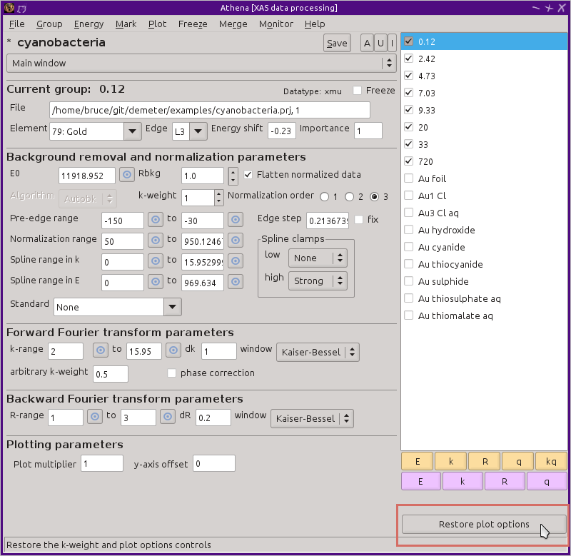

Using the group list
====================

The group list is the primary mechanism for accessing and interacting
with your data. As data files are imported in :demeter:`athena`, each
gets an entry in the group list. Data generated during the course of
using :demeter:`athena`, such as copied or merged groups, also get
placed in the group list.

Each group list entry consists of two parts, the label and the check
button. The label contains text identifying the group. The default is
for the label to be the same as the file name. Clicking with the left
mouse button on a label makes that group the *current* group. The
current group's label is highlighted with a light red color and its
parameters are displayed in the main window. The current group is the
one that gets plotted when the red plotting buttons are pressed.

The check button is used to mark the group. Marking, explained in
detail `in the next section <../ui/mark.html>`__, is one of the
fundamental user interface features in :demeter:`athena`. Any feature
of :demeter:`athena` that involves more than one group uses the mark
buttons.

File can be dragged from your computers file manager (e.g. Windows
File Explorer, KDE Dolphin, or GNOME Nautilus) and dropped onto the
group list. These files, which can be `data
<../import/columns.html>`__ or `project <../import/projsel.html>`__
files will be appended to the group list. You cannot drop folders onto
the group list.

Copying groups
--------------

You can copy a group by hitting Shift-y or by selecting :quoted:`Copy group`
from the Group menu. This makes an identical copy of the current group
and places it at the end of the groups list. All parameters are
identical and the data arrays in :demeter:`ifeffit` are all copied --
only the :demeter:`ifeffit` group name in different.

Copying is very useful for examining how changes in parameter values
propagate through the data processing. You can make one or more copies,
change particular data values, and overplot the results.

The process of comparing parameter values can be automated using the
`copy series tool <../process/series.html>`__.

Reorganizing the group list
---------------------------

When a file is imported into :demeter:`athena`, the name of the file
is used as the label in the group list. That's fine, but you can
change the label by selecting :quoted:`Rename group` from the Group menu,
typing Shift-l, or double clicking on an item in the group list. This
posts a dialog for entering the new label for the group, shown here.

.. _fig-renaming:

.. figure:: ../../images/ui_renaming.png
   :target: ../../images/ui_renaming.png
   :width: 65%
   :align: center

   Renaming a group list entry.

Hitting Return or clicking the OK button renames the group, shown here.

.. _fig-renamed:

.. figure:: ../../images/ui_renamed.png
   :target: ../../images/ui_renamed.png
   :width: 65%
   :align: center

   After renaming a group list entry.

We have `already seen <../bkg/rbkg.html>`__ how groups can be copied.
Making one or more copies is an excellent tool for exploring the effects
of the various parameters in the main window.

There are several other useful tools for modifying the contents of the
group list. You can reorder the items in the groups list using ``Alt-k`` or
``Alt-j`` to move the current group up or down in the list.

Hitting ``Control-k`` or ``Control-j`` changes the current group to the one
above or below.

.. caution:: As of version 0.9.20, ``Control-drag-and-drop`` is no longer
	     available for reorganizing group list items. That feature
	     has been discontinued in favor of file drag and drop.

Items can be removed from the list. The current group or the marked
groups can be removed from the project by selecting :quoted:`Remove group` or
:quoted:`Remove marked groups` from the Group menu. You can remove all the
groups from the list by selecting :quoted:`Close project` from the File or Group
menu or by hitting ``Control-w``.

Information about items in the group list
-----------------------------------------

In the Group menu, the option for :quoted:`Show structure of current group`
displays the dialog shown here.

.. _fig-about:

.. figure:: ../../images/ui_about.png
   :target: ../../images/ui_about.png
   :width: 35%
   :align: center

   The dialog containing information about the data group.

This presents all of the parameter values of the current group as well
as the contents of the data arrays associated with the group. This way
of presenting the information is, admittedly, rather cryptic. But it is
very useful for developing and debugging the software.

.. _fig-changetype:

.. figure:: ../../images/import_changetype.png
   :target: ../../images/import_changetype.png
   :width: 30%
   :align: center

   Change type dialog

If you mistakenly import a data group as the wrong record type, you
can change it by selecting :quoted:`Change record type` from the Group
menu. You can only change between the various record types in energy,
though. If you import a |chi| (k) file as |mu| (E) by accident, you will have
to remove the group and re-import it.

.. versionadded:: 0.9.20 there is a label on the main window
   displaying the data type. You can toggle between |mu| (E) and XANES
   data by ``Control-Shift left`` clicking on that label.

Using the mouse in the group list
---------------------------------

You can turn on automated replotting when you select a new group by
clicking on it in the group list. This is done by setting
:configparam:`Athena,select\_replot` with the `preferences
tool <../other/prefs.html>`__.

If you right click on any item in the group list, a context menu is
posted, as shown below, displaying the Group menu.

.. _fig-groupcontext:

.. figure:: ../../images/ui_groupcontext.png
   :target: ../../images/ui_groupcontext.png
   :width: 45%
   :align: center

   Clicking the right mouse button on a group list entry pops up this
   context menu.

As mentioned above, double clicking on a group list item will post the
dialog for renaming that group.

Shrinking and expanding the group list
--------------------------------------

The last item in the plotting options tabs, labeled :quoted:`Shrink`,
causes the k-weight buttons and plot options tabs to be hidden,
causing the group list to expand, and allowing the display of more
data groups. When the plot options tabs is shrunk, it is replaced by a
button labeled :quoted:`Restore plot options`. Clicking this will
return the k-weight buttons and the group list to their original
places and the group list to its original original size.

.. _fig-shrink:

   Restore the shrunken k-weight buttons and plot options tabs.

