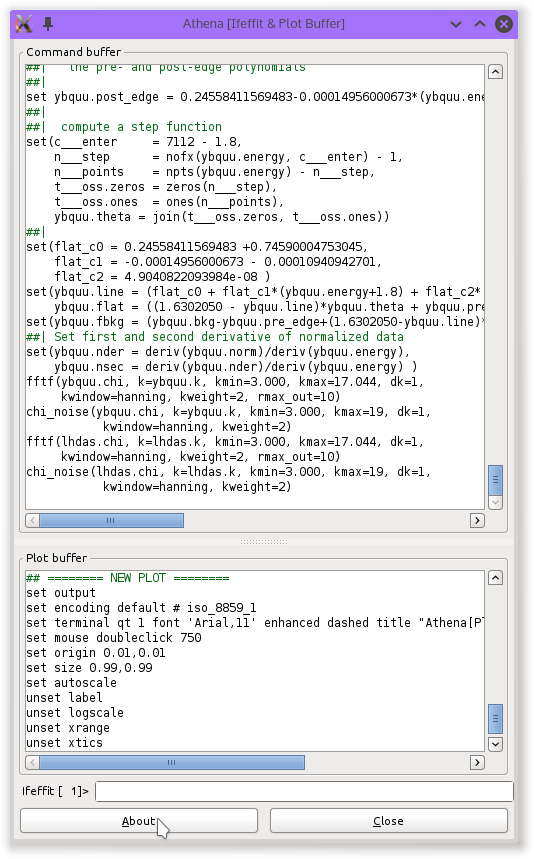
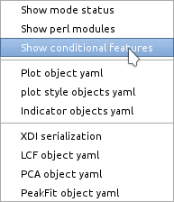

..
   Athena document is copyright 2016 Bruce Ravel and released under
   The Creative Commons Attribution-ShareAlike License
   http://creativecommons.org/licenses/by-sa/3.0/

The Monitor menu
================

The :guilabel:`Monitor` menu has several features that allow you to
examine the current state of :demeter:`athena`.

:demeter:`athena` is, at heart, a code generator.  When you press
buttons, this triggers the creation of commands that tells
:demeter:`ifeffit` (or :demeter:`larch`) what sequence of actions are
necessary to process the data using the set of parameters currently
displayed in the program.  These commands are sent off to
:demeter:`ifeffit` (or :demeter:`larch`).  The same commands are also
copied into the command buffer, which is the top part of Figure
:numref:`Fig. %s <fig-monitorcommand>`.

The command buffer serves a few purposes.  It is used extensively
whenever new features are added to :demeter:`athena` to make sure that
the correct command are being generated when buttons are pressed.  It
is also useful to teach you, the user, the syntax of
:demeter:`ifeffit` (or :demeter:`larch`), which can be useful if you
would like to learn to use those tools for other purposes.

Plotting is handled slightly differently.  The commands for actually
making plots on screen are sent to the :program:`gnuplot` program.
The syntax of :program:`gnuplot` is different, so the nature of the
commands generated is different.  These plot-related commands are
copied into the bottom part of Figure :numref:`Fig. %s
<fig-monitorcommand>`.

.. _fig-monitorcommand:

   The processing and plotting command buffers

At the bottom of the windows containing the command and plot buffer is
a sort of command line, which can be used to send hand-typed commands
directly to underlying :demeter:`ifeffit` (or :demeter:`larch`)
engine.

The messages that are printed into the echo area at the bottom of the
:demeter:`athena` window are copied into the status bar buffer.  This
serves as a loose record of the actions taken during this session with 
:demeter:`athena`.

.. _fig-monitorstatus:
.. figure:: ../../_images/monitor_status.png
   :target: ../_images/monitor_status.png
   :align: center

   The status bar buffer

When using the :demeter:`ifeffit` backend, the :guilabel:`Monitor`
menu has a couple items that facilitate certain interactions with
:demeter:`ifeffit`.  The items in the submenu will display certain
useful things in the command buffer.  The menu entry for estimating
the memory use in :demeter:`ifeffit` may be helpful to avoid
over-running its memory capacity.  However, the method for estimating
memory use is not especially reliable.

Finally, there is a submenu that displays a variety of data structures
that give information about the current state of :demeter:`demeter`.
Most of these present some kind of serialization of :demeter:`demeter`
data structures n a way that is very helpful to Bruce when adding new
features or debugging problems.  A :quoted:`yaml` is a way of
`serializing data <http://www.yaml.org/>`_ into readable text.

.. _fig-monitordebug:

   The debugging submenu

If you set the :configparam:`athena,debug_menus` `configuration
parameter <../other/prefs.html>`_ to false, the debug menu will not be
shown.

