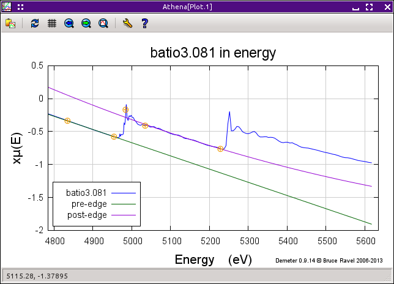

Pluck buttons
=============

Almost every text entry box that takes an energy or wavenumber value as
its parameter has a little button next to it which is decorated with a
small blue X, one of which is highlighted in the figure below. These are
the *pluck* buttons and their purpose is to grab a value directly from
the plot. When you click one of these buttons, a message in the echo
area prompts you to select a point from the plot, demonstrated in the
next figure. When you click on the plot, the x-axis value of the point
you clicked on gets inserted in the associated entry box.

Along with the pluck buttons in the main window, several data processing
and data analysis tools use pluck buttons, as does the
`indicator <../plot/indic.html>`__ plot options tab.

.. _fig-pluck:

.. figure:: ../../_images/ui_pluck.png
   :target: ../_images/ui_pluck.png
   :width: 65%
   :align: center

   Using the pluck button for the upper edge of the normalization range.

.. subfigstart::

.. _fig-pluckpoint:

.. figure:: ../../_images/ui_pluckpoint.png
   :target: ../_images/ui_pluckpoint.png
   :width: 100%

.. _fig-plucked:

.. subfigend::
   :width: 0.45
   :label: _fig-plucking

   (Left) After clicking on the pluck button, the program waits for
   you to click on the plot, which shows |mu| (E) for BaTiO\
   :sub:`3`. Only the x-axis value of the click on the plot is used by
   the pluck button. (Right) After clicking on the point shown in the
   previous figure, the value of about 243 is inserted as the value of
   the upper edge of the normalization range – clearly a better value
   for that parameter.

