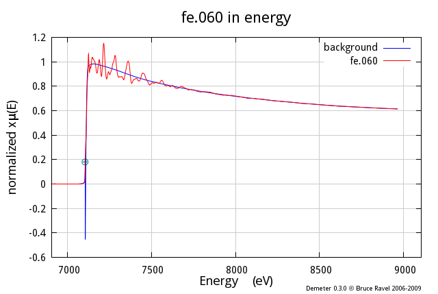
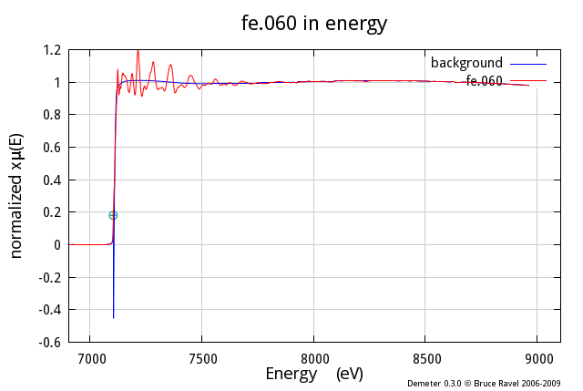
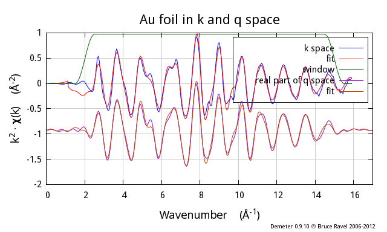

..
   Athena document is copyright 2016 Bruce Ravel and released under
   The Creative Commons Attribution-ShareAlike License
   http://creativecommons.org/licenses/by-sa/3.0/

Plot object
===========

The Plot object is used to control the details of how plots are made and
displayed by :demeter:`demeter` programs. It is useful to consider how :demeter:`athena` works
in order to understand the relationship of the Plot object to the rest
of :demeter:`demeter`. In :demeter:`athena`, the plot controls are separate from the controls
for the parameters of any individual data set. For example, the range
over which data are plotted in energy or R-space is, in some, sense, a
global parameter not associated with a particular data set. The Plot
object serves this role. The details of the plot in :demeter:`demeter` are global.
To plot a plottable object (Data, Path, or any of the Path-like
objects), :demeter:`demeter` consults the Plot object for those details.

To make the Plot object readily accessible at all times in your program,
the ``po`` method is a method of the base class and is inherited by all
:demeter:`demeter` objects. Thus, given any object, you can :quoted:`find` the Plot object
like so:

.. code-block:: perl

   $the_plot_object = $any_object -> po;

Any method of the plot object is easily called by chaining with the
``po`` method. For example to start a new plot (as opposed to
overplotting), you do this

.. code-block:: perl

   $any_object -> po -> start_plot;

The ``start_plot`` method reinitializes the Plot object to begin a new
plot. Along with clearing the plotting display, this restarts the trace
colors and resets the plot title.

Plotting in energy
------------------

 
Data, background, pre-edge, & post-edge
~~~~~~~~~~~~~~~~~~~~~~~~~~~~~~~~~~~~~~~

.. code-block:: perl

    my @eplot = (e_mu      => 1,     e_bkg     => 1,
                 e_norm    => 0,     e_der     => 0,
                 e_pre     => 1,     e_post    => 1,
                 e_i0      => 0,     e_signal  => 0,
                 e_markers => 1,
                 emin      => -200,  emax      => 2000,
                 space     => 'E',
                );  $data -> po -> set(@eplot);
    $data -> po -> start_plot;
    $data -> plot;

.. _fig-ploteprepost:
.. figure:: ../../_images/plot_e_prepost.png
   :target: ../_images/plot_e_prepost.png
   :align: left

   This example demonstrates the common and useful plot showing the data
   along with the background function and the regressed polynomials used
   to normalize the data.  Note that the Plot object has a number of
   boolean attributes which turn features of the energy plot on and
   off. Also note that the range of the plot is set by the values of the
   ``emin`` and ``emax`` attributes of the Plot object.
                        
Also note that, as was discussed in `the chapter on the Data object
<../data/index.h tml>`__, there is no need to explicitly perform the
data normalization or background removal.  :demeter:`demeter` knows
what needs to be done to bring the data up to date for plotting and
will perform all necessary chores before actually generating the
plot. This allows you to focus on what you need to accomplish.

One final point about this example. I have created the ``@eplot`` array
to hold the attributes of the Plot object. I then pass that array as the
argument of the ``set`` method of the Plot object. Those attributes
could be listed as explicit arguments of the ``set`` method. As always
in perl, `there's more than one way to do
it <http://en.wikipedia.org/wiki/There's_more_than_one_way_to_do_it>`__.

Normalized data & background
~~~~~~~~~~~~~~~~~~~~~~~~~~~~

.. code-block:: perl

    my @eplot = (e_mu      => 1,     e_bkg     => 1,
                 e_norm    => 1,     e_der     => 0,
                 e_pre     => 0,     e_post    => 0,
                 e_i0      => 0,     e_signal  => 0,
                 e_markers => 1,
                 emin      => -200,  emax      => 2000,
                 space     => 'E',
                );  $data -> po -> set(@eplot);
    $data -> bkg_flatten(0);
    $data -> po -> start_plot;
    $data -> plot;

.. _fig-plotenorm:

   This example shows how to plot data and background function after
   normalization.

.. linebreak::

Flattened data & background
~~~~~~~~~~~~~~~~~~~~~~~~~~~

.. code-block:: perl

    my @eplot = (e_mu      => 1,     e_bkg     => 1,
                 e_norm    => 1,     e_der     => 0,
                 e_pre     => 0,     e_post    => 0,
                 e_i0      => 0,     e_signal  => 0,
                 e_markers => 1,
                 emin      => -200,  emax      => 2000,
                 space     => 'E',
                );  $data -> po -> set(@eplot);
    $data -> bkg_flatten(1);
    $data -> po -> start_plot;
    $data -> plot;

.. _fig-ploteflat:

   This example shows how to plot the flattened data and background
   function, that is, the normalized data with the difference in slope
   and quadrature between the pre- and post-edge lines subtracted out
   after the edge. 

Note that the switch for turning flattening on and off is an attribute
of the Data object **not** the Plot object. This allows the option of
overplotting one data set that is normalized with another that is
flattened.

Derivative of mu
~~~~~~~~~~~~~~~~

.. code-block:: perl

    my @eplot = (e_mu      => 1,     e_bkg     => 0,
                 e_norm    => 0,     e_der     => 1,
                 e_pre     => 0,     e_post    => 0,
                 e_i0      => 0,     e_signal  => 0,
                 e_markers => 0,
                 emin      => -20,   emax      => 120,
                 space     => 'E',
                );  $data -> po -> start_plot;
    $data -> set(name=>'derivative') -> plot;
    $data -> po -> e_norm(1);
    $data -> set(name=>'norm. deriv.') -> plot;

.. _fig-plotederiv:
.. figure:: ../../_images/plot_e_deriv.png
   :target: ../_images/plot_e_deriv.png
   :align: left

   This example shows two interesting features we haven't yet seen. This
   shows how things get overplotted, in this case the derivative of
   |mu| (E) and the derivative of normalized |mu| (E). The overplotting
   happens simply by calling the ``plot`` mthod a second time without
   calling ``start_plot``. In this way, any number of things can be
   overplotted.
                         
Also note the use of chained method calls to set the Data object's
``name`` attribute appropriately before plotting. The ``name`` method
always returns the object that called it, which allows for this sort
of chaining magic to happen. There is no advantage to chained method
calls |nd| you could rename the Data object and then plot it in the
subsequent line. The cahined calls are a bit more concise.

Data, I0 channel, & signal channel
~~~~~~~~~~~~~~~~~~~~~~~~~~~~~~~~~~

.. code-block:: perl

    my @eplot = (e_mu      => 1,     e_bkg     => 0,
                 e_norm    => 0,     e_der     => 0,
                 e_pre     => 0,     e_post    => 0,
                 e_i0      => 1,     e_signal  => 1,
                 e_markers => 0,
                 emin      => -20,   emax      => 120,
                 space     => 'E',
                );  $data -> po -> start_plot;
    $data -> plot;

.. _fig-plotei0signal:
.. figure:: ../../_images/plot_e_i0signal.png
   :target: ../_images/plot_e_i0signal.png
   :align: left

   :demeter:`demeter` saves arrays containing I\ :sub:`0` and the
   signal channel, which can then be plotted along with the data.
   :demeter:`demeter` takes care to scale these arrays so that they
   plot nicely with the data.

.. linebreak::

Data at two different edges with E0 subtracted
~~~~~~~~~~~~~~~~~~~~~~~~~~~~~~~~~~~~~~~~~~~~~~

.. code-block:: perl

    my @common = (bkg_rbkg    => 1.5,
                  bkg_spl1    => 0,    bkg_spl2    => 18,
                  bkg_nor2    => 1800,
                  bkg_flatten => 1,
                 );
    my @data = (Demeter::Data -> new(),
                Demeter::Data -> new(),
               );
    foreach (@data) { $_ -> set(@common) };
    $data[0] -> set(file => "$where/data/fe.060.xmu",
                    name => 'Fe 60K', );
    $data[1] -> set(file => "$where/data/cu010k.dat",
                    name => 'Cu 10K', );

    ## decide how to plot the data
    $plot -> set(e_mu    => 1,   e_bkg   => 0,
                 e_norm  => 1,
                 e_pre   => 0,   e_post  => 0,
                 e_zero  => 1,
                 emin    => -30, emax    => 150,
                );
    $data[0] -> po -> start_plot;
    foreach (@data) { $_ -> plot('E') };

.. _fig-ploteezero:
.. figure:: ../../_images/plot_e_ezero.png
   :target: ../_images/plot_e_ezero.png
   :align: left

   :demeter:`demeter` offers an easy way to plot |mu| (E) data with
   the E\ :sub:`0` value subtracted. This places the edge at 0 on the
   x-axis, allowing you to overplot data from different edges.  When
   the ``e_zero`` attribute of the Plot object is set to 1, each Data
   object's ``bkg_eshift`` attribute is temporarily set so that the
   edge will show up at 0 in the plot.

.. linebreak::

Plotting in k
-------------

 
Plotting in k-space
~~~~~~~~~~~~~~~~~~~

.. code-block:: perl

    $data -> po -> start_plot;
    $data -> po -> kweight(2);
    $data -> plot('k');

.. _fig-plotk:
.. figure:: ../../_images/plot_k.png
   :target: ../_images/plot_k.png
   :align: left

   Again, :demeter:`demeter` will take care of the background removal
   when you request a plot in k-space. Note that the k-weight to use for
   plotting is an attribute of the Plot object.

.. linebreak::

Plotting in chi(k) in energy
~~~~~~~~~~~~~~~~~~~~~~~~~~~~

.. code-block:: perl

    $data -> po -> start_plot;
    $data -> po -> set(kweight=>2, chie=>1);
    $data -> plot('k');

.. _fig-plotchie:
.. figure:: ../../_images/plot_chie.png
   :target: ../_images/plot_chie.png
   :align: left

   Here the x-axis of the |chi| (k) plot has been converted to
   absolute energy.

.. linebreak::

 
k-space with all three k-weights
~~~~~~~~~~~~~~~~~~~~~~~~~~~~~~~~

.. code-block:: perl

    $data -> po -> start_plot;
    $data -> plot('k123');

.. _fig-plotkk123:
.. figure:: ../../_images/plot_k_k123.png
   :target: ../_images/plot_k_k123.png
   :align: left

   :demeter:`demeter` has several types of interesting, pre-defined
   plots. One of these, the :quoted:`k123 plot`, will overplot the data
   three times, once each with k-weight values of 1, 2, and 3. The copy
   of the data with k-weight of two is plotted normally.  The other two
   copies are scaled up or down to be about the same size as the k-weight
   of 2 copy. The data are analyzed and the scaling and offset constants
   are chosen to be appropriate to the data.

 

.. linebreak::

Plotting in R
-------------

Magnitude in R-space & R-space window
~~~~~~~~~~~~~~~~~~~~~~~~~~~~~~~~~~~~~

.. code-block:: perl

    $data -> po -> set(kweight => 2, r_pl => 'm', space => 'r', );
    $data -> po -> start_plot;
    $data -> plot -> plot_window;

.. _fig-plotrmagwin:
.. figure:: ../../_images/plot_r_magwin.png
   :target: ../_images/plot_r_magwin.png
   :align: left

   This example shows a common kind of plot, |chi| (R) data with the
   back-Transform windowing function, which is also used by
   :demeter:`demeter` as the fitting range when a fit is evaluated in
   R-space. The ``r_pl`` attribute of the Plot object is set to ``m``,
   indicating that the magnitude of |chi| (R) should be plotted.
                   
Note that the ``plot_window`` method was indicated in a chained method
call. This is not required, but is possible because the ``plot``
method returns the calling object.
                   
The ``plot_window`` method observes the value of the Plot object's
``space`` attribute. That is, if the plot s being made in k or q, the
k-space window will be plotted. If the plot is being made in R, the
R-space window will be plotted.

Data in R-space as envelope, real part, & imaginary part
~~~~~~~~~~~~~~~~~~~~~~~~~~~~~~~~~~~~~~~~~~~~~~~~~~~~~~~~

.. code-block:: perl

    $data -> po -> set(kweight => 2, r_pl => 'e', space => 'r');
    $data -> po -> start_plot;
    $data -> plot;

    $data -> set(name=>'Real part');
    $data -> po -> set(r_pl => 'r', );
    $data -> plot;

    $data -> set(name=>'Imaginary part');
    $data -> po->set(r_pl => 'i', );
    $data -> plot;

.. _fig-plotrmri:
.. figure:: ../../_images/plot_r_mri.png
   :target: ../_images/plot_r_mri.png
   :align: left

   Multiple parts of the complex |chi| (R) are overplotted by
   repeatedly plotting data in R-space without calling the
   ``start_plot`` method.  The value of ``r_pl`` is set between each
   part of the plot.  Note that the :quoted:`envelope` is the magnitude
   plotted twice, multiplied by -1.

.. linebreak::

R-space with all three k-weights
~~~~~~~~~~~~~~~~~~~~~~~~~~~~~~~~

.. code-block:: perl

    $data -> po -> start_plot;
    $data -> plot('r123');

.. _fig-plotrr123:
.. figure:: ../../_images/plot_r_r123.png
   :target: ../_images/plot_r_r123.png
   :align: left

   The :quoted:`R123 plot` is the second of the pre-packaged specialty
   plot types.  This one, is just like the k123 plot in that three copies
   of the data are overplotted using each of the three k-weights with
   scaling and offset computed automatically. This R123 plot was plotted
   as the magnitude of |chi| (R). The R123 plot respects the value of the
   ``r_pl`` attribute of the Plot object.

.. linebreak::

Magnitude and real part in R space
~~~~~~~~~~~~~~~~~~~~~~~~~~~~~~~~~~

.. code-block:: perl

    $data -> po -> start_plot;
    $data -> po -> kweight(2);
    $data -> plot('rmr');

.. _fig-plotrrmr:
.. figure:: ../../_images/plot_r_rmr.png
   :target: ../_images/plot_r_rmr.png
   :align: left

   The :quoted:`Rmr plot` is the third of the pre-packaged specialty plot
   types.  This one plots the magnitude and real part of |chi| (R) with
   an appropriate offset between them.  This is the default plot type
   made after a fit finishes. In that case, the data and fit are
   overplotted as magnitude and real.

.. linebreak::

 

Plotting in q
-------------

Plotting in back-transform k-space
~~~~~~~~~~~~~~~~~~~~~~~~~~~~~~~~~~

.. code-block:: perl

    $data -> po -> set(kweight => 2, q_pl => 'r');
    $data -> po -> start_plot;
    $data -> plot('q');

.. _fig-plotq:
.. figure:: ../../_images/plot_q.png
   :target: ../_images/plot_q.png
   :align: left

   Plotting the back-transformed |chi| (q) is specified by plotting
   in q. The part of the complex |chi| (q) is specified using the
   ``q_pl`` attribute of the Plot object.

.. linebreak::

k-space & the real part of back-transform k-space
~~~~~~~~~~~~~~~~~~~~~~~~~~~~~~~~~~~~~~~~~~~~~~~~~

.. code-block:: perl

    $data -> po -> start_plot;
    $data -> po -> kweight(2);
    $data -> plot('kq');

.. _fig-plotkq:

   The final specialty plot type in :demeter:`demeter` is the
   :quoted:`kq plot`. This overplots |chi| (k) with the real part of
   |chi| (q).

.. linebreak::

