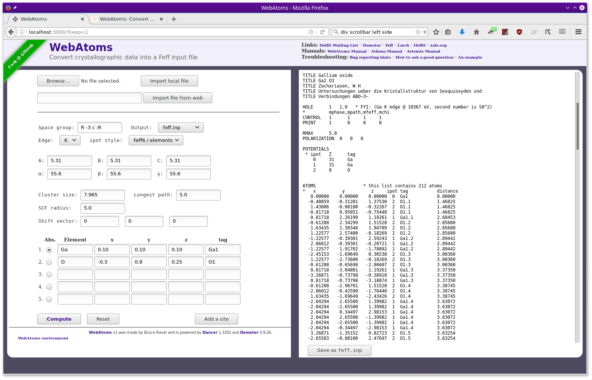

.. Athena document is copyright 2016 Bruce Ravel and released under
   The Creative Commons Attribution-ShareAlike License
   http://creativecommons.org/licenses/by-sa/3.0/

Using WebAtoms
==============

.. note:: This manual is incomplete.  Let me know what you'd like to
	  see here.

:demeter:`WebAtoms` is a web application which can be hosted locally
or on a web server.  It is `available at GitHub
<https://github.com/bruceravel/WebAtoms>`_ and information about
running or hosting the web application can be `found here
<https://metacpan.org/pod/Dancer2::Manual::Deployment>`_.

:demeter:`WebAtoms` is built using `the Dancer web framework
<http://perldancer.org/>`_ and `Demeter
<http://bruceravel.github.io/demeter/>`_.

When run in your browser, :demeter:`WebAtoms` (like `Gaul
<http://www.thelatinlibrary.com/caesar/gall1.shtml>`_) is in three
parts.  Across the top of the window are a bunch of useful links,
including the link in the upper left back to the empty application.
On the left is a form to be filled in with crystallographic data.  On
the right is the response area, which will (hopefully!) be filled with
a :file:`feff.inp` file or some other useful crystallographic
calculation.

   :demeter:`WebAtoms`, running locally, after importing a CIF file for Ga\ :sub:`2`\ O\ :sub:`3`

The sort of data expected by :demeter:`WebAtoms` is the same as the
command line and desktop versions of :demeter:`atoms` and is explained
in some detail in the :demeter:`artemis` manual in the chapters `on
the Atoms window
<http://bruceravel.github.io/demeter/documents/Artemis/feff/index.html>`_
and `on crystallography for EXAFS
<http://bruceravel.github.io/demeter/documents/Artemis/atoms/index.html>`_.

As an aid to using :demeter:`WebAtoms`, hint text will appear when the
mouse lingers over the different elements of the form.  For instance,
when the mouse lingers over the text box for entering the cluster
size, the hint text will read :quoted:`The radial extent of the
cluster written to the feff.inp file`.

The shift vector is used to recenter a crystal from a non-standard
setting into a setting that will be recognized by :demeter:`WebAtoms`'
crystal engine.  This often causes confusion and is `discussed here in
some detail
<http://bruceravel.github.io/demeter/documents/Artemis/atoms/space.html#multiple-origins-and-the-shift-keyword>`_.

Once you are done entering crystal data, click the :guilabel:`Compute`
button.  The corresponding :file:`feff.,inp` file will be displayed in
the response area on the right.

To save the contents of the response area, click the :guilabel:`Save
as` button.  You will be prompted for the name and location of the
save file on your computer.

Entering crystallographic data
------------------------------

There are several ways of importing crystallographic data in this
application:

#. You can import from a CIF or :file:`atoms.inp` file which resides
   locally on your computer.  To do this, click the :guilabel:`Browse`
   button to post a file selection dialog, then select a file from
   your computer.  Then click the :guilabel:`Import local file`
   button.

#. Enter a URL to a CIF or :file:`atoms.inp` file in the text box
   below the :guilabel:`Browse` button.  Click the :guilabel:`Import
   file from web` button to fetch that file from the internet.

#. Use the ``url?url=`` syntax in the URL for the :demeter:`WebAtoms`
   application,
   e.g. ``http://webatoms.server/url?url=http://www.crystallography.net/cod/1535967.cif``.
   In this way, you can hook :demeter:`WebAtoms` up to other web or
   desktop applications.

#. Manually enter your the crystal data into the form.

.. todo:: 
   #. Need to streamline file import this so that the second
      button click is not necessary
   #. Upload directly from a file,
      i.e. ``http://webatoms.server/file?file=http://www.crystallography.net/cod/1535967.cif``
      or some such

Output options
--------------

There are a number of kinds of output that can be generated by
:demeter:`WebAtoms`.  While a :file:`feff.inp` is the most common,
there are other options:

* A :demeter:`feff6` input file
* A :demeter:`feff8` input file, also suitable for :demeter:`feff9`
* An :demeter:`atoms` input file
* An :demeter:`atoms` input file using the ``P1`` space group and with
  the fully decorated unit cell
* A file detailing absorption calculations made using tables of X-ray
  cross-sections
* A file detailing the space group of the crystal
* A file with the same cluster of atoms as the :file:`feff.inp` file,
  but in the `XYZ format
  <http://openbabel.org/docs/2.3.0/FileFormats/XYZ_cartesian_coordinates_format.html>`_
* A file with the same cluster of atoms as the :file:`feff.inp` file,
  but in the `alchemy format
  <http://paulbourke.net/dataformats/alc/alc3/>`_
* An :quoted:`overfull` file, which has the fully decorated unit cell
  expressed in Cartesian coordinates and includes all of the atoms
  that sit near cell walls and corners
* A diagnostic file with the state of the application

Issues with CIF files
---------------------

**Multi-record CIF files**

  A single CIF file can contain more than one crystal structures.
  Currently :demeter:`WebAtoms` has no way to prompt you to choose which
  record from a CIF file you want to import.  :demeter:`WebAtoms` will
  always import the first record.

**Partial occupancy**

  :demeter:`WebAtoms` simply refuses to import CIF files with partial
  occupancy of crystallographic sites.  `Read this for more
  information the topic of dopants
  <http://bruceravel.github.io/demeter/documents/Artemis/extended/dopants.html>`_.

**Imperfect parsing of CIF files**

  It is certainly possible that you might come across a valid CIF file
  which is not parsed correctly by the tool used by
  :demeter:`WebAtoms`.  In this situation, submit `an issue at the
  github site <https://github.com/bruceravel/WebAtoms/issues>`_ and
  include the CIF file in question (or a link to where that CIF file
  can be found).

**Imperfect recognition of CIF files**

  Currently a CIF file is recognized only if it's file name ends in
  :file:`.cif`.  That's dumb and easily confused, but that's how it
  works right now.

Troubleshooting
---------------

**You have N unique potentials, but Feff only allows 7.**

  This happens when you have a lengthy list of unique sites and are
  using the ``tags`` or ``sites`` ipot style.  You can `find a
  discussion of this ipot styles in the Artemis manual
  <http://bruceravel.github.io/demeter/documents/Artemis/extended/ipots.html>`_.

**Sites generate one or more common positions and their occupancies sum to more than 1.**

  This is likely to happen when importing a CIF file with partial
  occupancy of lattice sites.  :demeter:`webatoms` is not able to
  generate a :file:`feff.inp` file with consideration of partial
  occupancy.  You can `find a discussion of dopants in the Artemis
  manual
  <http://bruceravel.github.io/demeter/documents/Artemis/extended/dopants.html>`_.
  The need for a `shift vector
  <http://bruceravel.github.io/demeter/documents/Artemis/atoms/space.html#multiple-origins-and-the-shift-keyword>`_
  is another possible culprit.

